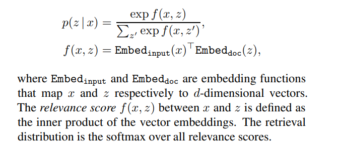
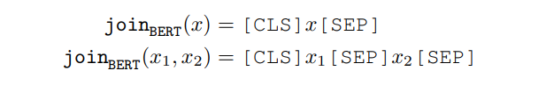
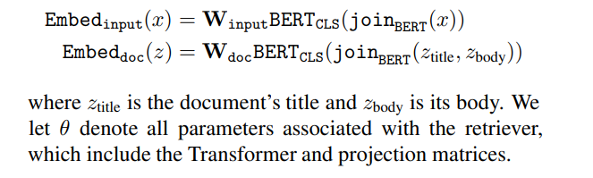
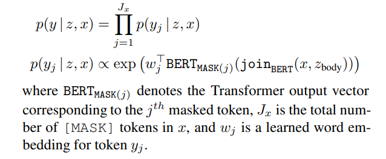
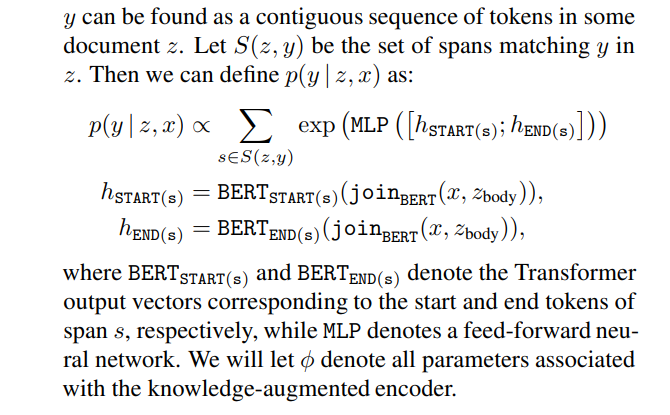
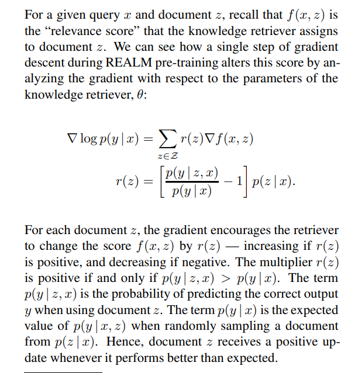
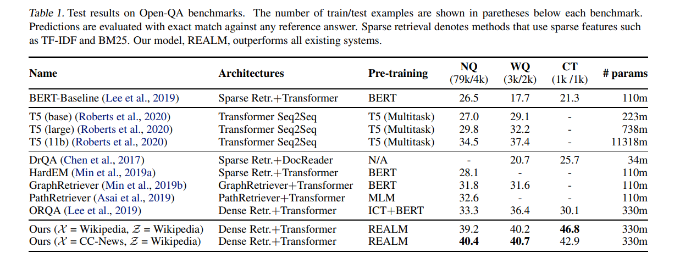
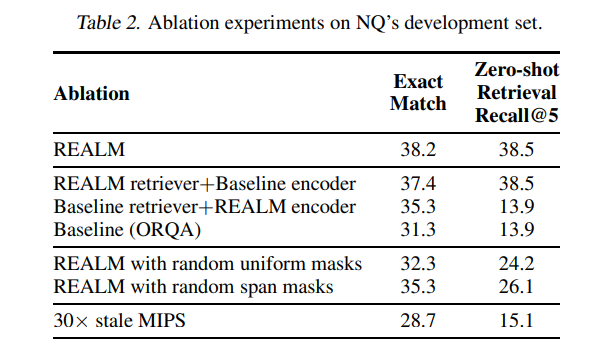
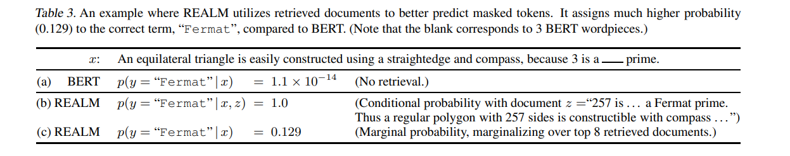

# REALM: Retrieval-Augmented Language Model Pre-Training
[toc]

- https://arxiv.org/abs/2002.08909

## Abstract
- 预训练语言模型将知识隐式存储在神经网络的参数中，需要更多知识则需要更大的网络
- 使用knowledge retriever来加强预训练语言模型的学习能力

## 1. Introduction
- 预训练模型有知识存储的功能
  - 如：预测　“The is the currency of the United　Kingdom” (answer: “pound”)
  - 隐式，因此不知道学习到何种知识以及存储在哪里
  - 知识量与模型的大小相关
- Retrieval-Augmented Language Model (REALM) pre-training
  - 学习知识：可解释，模块化
  - 在预测前先查询到相关的文档用以帮助预测
- 思路： train the retriever using a performance-based signal from unsupervised text
  - 如何判断　文档与预测　是否相关？
- 性能
  - 将每个文档先计算并保存起来，选择最佳文档即是计算最大内积　Maximum Inner Product Search (MIPS)
- 比较
  - knn-LM未对下流任务进行调优，knn只能用于目标任务的标注数据
  - REALM可以用于迁移学习，其查询阶段只是文本，而不是标注数据
-  Opendomain Question Answering (Open-QA)　任务上 STOA

## 2. Background
Language model pre-training
: 目标是学习语言表示，然后针对具体任务进行微调

Open-domain question answering (Open-QA) 
: Open-QA models must retain knowledge from millions of documents

## 3. Approach

### 3.1. REALM’s generative process

### 3.2. Model architecture
#### neural knowledge retriever
models p(z | x)

#### knowledge-augmented encoder
models p(y | z, x)
预训练阶段

微调阶段

### 3.3. Training
最大似然 $\log p(y|x)$
使用梯度下降分别更新两个模型参数
问题点  $$ p(y | x) = \sum_{z∈Z} p(y | x, z) p(z | x)$$
只取前top-k个进行求和，因此大多数该概率值近似为0，由于每次更新参数会导致向量表示会有变换，因此这里采取了每训练几百步之后重新计算嵌入以及重新索引
在微调时不再更新embed计算的模型，一次索引即可

#### What does the retriever learn?

### 3.4. Injecting inductive biases into pre-training
能提高有意义见多的策略

Salient span masking
: salient spans such as “United Kingdom” or “July 1969”能避免只依靠局部上下文就能回答的问题
BERT-based tagger trained on CoNLL-2003 data to identify named entities
regular expression to identify dates

Null document
: 不是所有MASK都需要世界知识进行预测
在Top-K里面添加空文档允许不需要查询的情况

Prohibiting trivial retrievals
: 如果x来源于ｚ，则可以直接lookup没有ｍａｓｋ的ｘ版本得到答案，结果会产生很大一个梯度，如果出现次数太多，则最后会变成匹配x与ｚ是否字符串匹配，而不捕获其他相关性。因此去掉x与z完全相同的样本

Initialization
: 初始EMbed效果不好，可能导致将相关文档排除在外，这样梯度不是正确的，训练不起来
使用Inverse Cloze Task (ICT) 进行冷启动训练，判断一句话从那个文章而来

## 4. Experiments
### 4.1. Open-QA Benchmarks
- NaturalQuestions-Open
- WebQuestions
- CuratedTrec

### 4.2. Approaches compared
- Retrieval-based Open-QA 
  - DrQA (Chen et al., 2017), HardEM (Min et al., 2019a), GraphRetriever (Min et al., 2019b), and PathRetriever (Asai et al., 2019) 
  - ORQA (Lee et al., 2019)
- Generation-based Open-QA
  - GPT-2
  - T5 (Raffel et al., 2019)

### 4.3. Implementation Details
#### Fine-tuning
- Documents are greedily split into chunks of up to 288 BERT wordpieces, resulting in just over 13 million retrieval candidates
- top-5 candidates

#### Pre-training
- 200k steps on 64 Google Cloud TPUs, with a batch size of 512 and a learning rate of 3e-5, using BERT’s default optimizer
- 8 candidate documents, including the null document ∅

### 4.4. Main results

### 4.5. Analysis

Examples of retrieved documents

## 5. Discussion and Related Work
略

## 6. Future Work
-  (1) structured knowledge
-   (2) the multi-lingual setting
-    (3) the multi-modal setting