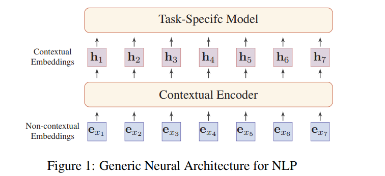
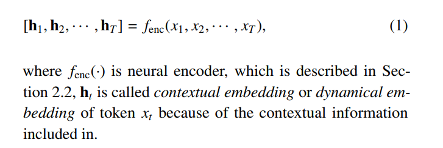
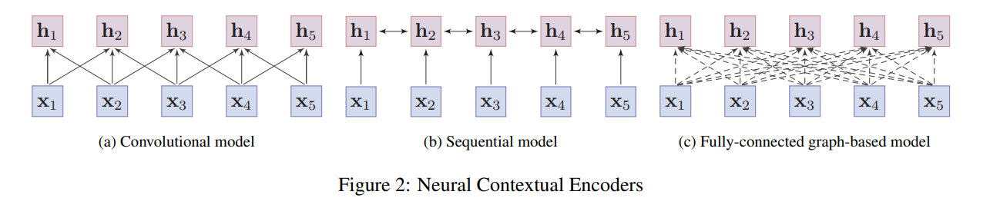

# Pre-trained Models for Natural Language Processing: A Survey
[toc]
- https://arxiv.org/pdf/2003.08271.pdf

## 1 Introduction
- 神经模型的优点之一是其减轻特征工程的能力问题
  - 神经方法通常使用低维和密集向量（又称为分布式表示）来隐式表示语言的句法或语义特征
- 大多数受监督的NLP任务的当前数据集很小（机器翻译除外）
  - 深度神经网络通常具有大量参数，这会使它们过度适合这些小的训练数据，并且在实践中不能很好地推广
- 大型语料库上的预训练模型（PTM）可以学习通用语言表示形式，这对下游NLP任务很有帮助，并且可以避免从头开始训练新模型

- **PTM的体系结构已从浅层发展到深层**
  - 第一代 学习好词的嵌入
    - Skip-Gram [ 116 ]和GloVe [ 120]。尽管这些经过预训练的嵌入可以捕获单词的语义，但它们不受上下文的限制，无法捕获更高层次的文本概念，例如句法结构，语义角色，回指
  - 第二代PTM专注于学习上下文词的嵌入
    - 例如CoVe  [ 113 ]，ELMo  [ 122 ]，OpenAI GPT  [ 130 ]和BERT  [ 32 ]
    - 需要这些学习的编码器来表示下游任务在上下文中的单词

- 总结
  - 全面的回顾
  - PTM分类法，该分类法从四个不同的角度对现有PTM进行了分类：1）单词表示的类型；2）PTM的体系结构；3）预培训任务的类型；4）特定类型的方案或输入的扩展
  - 资源丰富
  - 未来发展方向

## 2 Background
### 2.1 Language Representation Learning
- **一个好的表示应该表达通用的先验，它不是特定于任务的，但是对于学习解决AI任务可能很有用**
  - 在语言方面，一个好的表示法应该捕获隐藏在文本数据中的隐含语言规则和常识知识，例如词汇含义，句法结构，语义角色，甚至是语用学

- 分布式表示的核心思想是通过低维实值向量来描述一段文本的含义。向量的每个维度没有相应的意义，而整体则代表一个具体的概念
- 词嵌入有两种：非上下文嵌入和上下文嵌入。它们之间的区别在于，单词的嵌入是否根据出现的上下文而动态变化

非上下文嵌入
: 将离散的语言符号映射到分布式嵌入空间中, 在形式上，对于词汇表中的每个单词（或子字），我们把它映射到一个向量
嵌入和其他模型参数一起在任务数据上训练
嵌入有两个主要限制: 是静态的。单词的嵌入与上下文无关，始终是相同的。因此，这些非上下文嵌入无法建模多义词。第二个问题是词汇不足问题。为了解决这个问题，字符级单词表示或子单词表示被广泛用于许多NLP任务中，例如CharCNN [ 81 ]，FastText  [ 13 ]和Byte-Pair  Encoding（BPE）[ 141 ]

上下文嵌入
: 为了解决多义性和单词的上下文相关性质的问题，需要区分单词在不同上下文中的语义

### 2.2 Neural Contextual Encoders

可分为三类：卷积模型，序列模型和基于图的模型
- 卷积模型将单词嵌入到输入句子中，并通过卷积运算聚集来自邻居的局部信息，从而捕获单词的含义  [ 80 ]。
卷积模型通常易于训练，并且可以捕获本地上下文信息
- 常采用RNN（例如LSTM [ 60 ]和GRU [ 21 ]）来捕获单词的上下文表示。在实践中，双向RNN用于从单词的两侧收集信息，但是其性能通常受长期依赖问题的影响
- 基于图形的模型取词为节点，学习与字之间的预先定义的语言结构上下文表示，例如句法结构  [ 146，161 ]或语义关系  [ 111 ]
  - 尽管语言感知图结构可以提供有用的归纳偏差，但是如何构建良好的图结构也是一个具有挑战性的问题
  - 该结构在很大程度上取决于专家知识或外部NLP工具，例如依赖项解析器
  - 实践中，更直接的方法是使用完全连接的图来建模每两个单词的关系，并让模型自己学习结构
  - 连接权重是通过自我关注机制动态计算的，该机制会隐式指示单词之间的联系
  - **Transformer  [ 171 ]，它采用了完全连接的自我关注架构以及其他有用的设计，例如位置嵌入，层归一化和残差连接**

分析
: - 卷积模型和顺序模型都学习具有局部偏差的单词的上下文表示，并且很难捕获单词之间的远程交互
  - Transformer可以直接对序列中每两个单词之间的依赖关系进行建模，这更强大并且更适合于对语言进行建模
  - 由于Transformer笨重的结构和较少的模型偏差，变压器通常需要大的训练语料库并且容易过度拟合上小的或适度大小的数据集  [ 130，49 ]

### 2.3 Why Pre-training?
- 注释成本极其昂贵，因此对于大多数NLP任务而言，构建大规模的标记数据集是一项巨大的挑战，尤其是对于语法和语义相关的任务
- 大规模的未标记语料库相对容易构建。为了利用巨大的未标记文本数据，我们可以首先从它们中学习良好的表示形式，然后将这些表示形式用于其他任务

优点
: - 在庞大的文本语料库上进行预训练可以学习通用的语言表示形式，并帮助完成下游任务
  - 预训练提供了更好的模型初始化，通常可以带来更好的泛化性能并加快目标任务的收敛速度
  - 可以将预训练视为一种正则化，以避免对小数据过度拟合  [ 39 ]

### 2.4 A Brief History of PTMs for NLP
- 2006年，深度学习的突破就出现了贪婪的逐层无监督预训练，然后是有监督的微调  [ 58 ]
- CV中，实际上已经在庞大的ImageNet语料库上对模型进行了预训练，然后针对不同的任务在较小的数据上进一步进行微调。这比随机初始化要好得多，因为该模型可以学习一般的图像特征，然后将其用于各种视觉任务

#### 2.4.1 First-Generation PTMs: Pre-trained Word Embeddings
- 将单词表示为密集的矢量已有很长的历史  [ 56 ]。在神经网络语言模型（NNLM）的开创性工作中引入了“现代”词嵌入  [ 11 ]
- 将未训练的词嵌入到未标记的数据上可以显着改善许多NLP任务
- 为了解决计算复杂性，他们使用成对排名任务而不是语言建模来学习单词嵌入 。他们的工作是从未标记的数据中获得对其他任务有用的通用词嵌入的首次尝试
- Mikolov[ 116 ]表明没有必要使用深度神经网络来构建良好的单词嵌入。他们提出了两种浅层架构：连续词袋（CBOW）和Skip-Gram（SG）模型。尽管所提出的模型既简单又浅薄，但是它们仍然可以学习有效的词嵌入，从而捕获潜在的句法和语义相似性
- GloVe  [ 120 ]也是一种广泛使用的模型，用于获取预训练词嵌入，该词嵌入是根据语料库中的全局词-词共现统计来计算的
- 与上下文无关，并且大多由浅层模型训练。当用于下游任务时，整个模型的其余部分仍需要从头开始学习
- 许多研究人员还尝试学习段落，句子或文档的嵌入，例如d2v[ 89 ]，skip-thought向量  [ 82 ]，Context2Vec  [ 114 ]等。这些句子嵌入模型与其现代的继承者不同，它们尝试将输入的句子编码为固定维的矢量表示形式，而不是每个标记的上下文表示形式

#### 2.4.2 Second-Generation PTMs: Pre-trained Contextual Encoders
- 由于大多数NLP任务都超出单词级别，因此很自然地将神经编码器预训练为句子级别或更高级别。神经编码器的输出向量也称为上下文词嵌入，因为它们根据其上下文表示单词语义
- McCann[ 113 ]从带有机器翻译（MT）的注意力序列到序列模型中预先训练了一个深LSTM编码器。预训练编码器输出的上下文向量（CoVe）可以提高各种常见NLP任务的性能
- Peters[ 122 ]具有双向语言模型（BiLM）的预训练2层LSTM编码器，由前向LM和后向LM组成。预训练的BiLM ELMo（语言模型的嵌入）输出的上下文表示显示出对各种NLP任务都带来了很大的改进
- Akbik[ 1 ] 通过字符级LM预训练的上下文字符串嵌入捕获单词的含义
- # TODO

## 3 Overview of PTMs

### 3.1 Pre-training Tasks

#### 3.1.1 Language Modeling (LM)

#### 3.1.2 Masked Language Modeling (MLM)

#### 3.1.3 Permuted Language Modeling (PLM)

#### 3.1.4 Denoising Autoencoder (DAE)

#### 3.1.5 Contrastive Learning (CTL)

#### 3.1.6 Others

### 3.2 Taxonomy of PTMs

### 3.3 Model Analysis

#### 3.3.1 Non-Contextual Embeddings

#### 3.3.2 Contextual Embeddings

## 4 Extensions of PTMs

### 4.1 Knowledge-Enriched PTMs

### 4.2 Multilingual and Language-Specific PTMs

#### 4.2.1 Multilingual PTMs

#### 4.2.2 Language-Specific PTMs

### 4.3 Multi-Modal PTMs

#### 4.3.1 Video-Text PTMs

#### 4.3.2 Image-Text PTMs

#### 4.3.3 Audio-Text PTMs

### 4.4 Domain-Specific and Task-Specific PTMs

### 4.5 Model Compression

#### 4.5.1 Model Pruning

#### 4.5.2 Quantization

#### 4.5.3 Parameter Sharing

#### 4.5.4 Knowledge Distillation

#### 4.5.5 Module Replacing