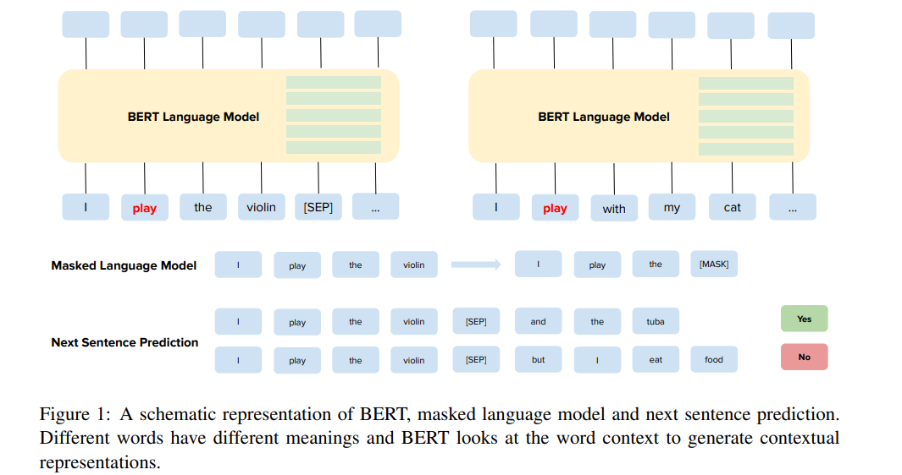
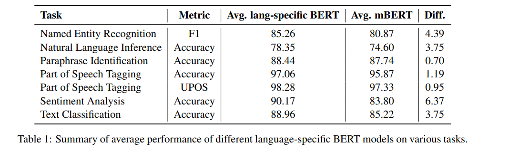

# What the [MASK]? Making Sense of Language-Specific BERT Models

[toc]

### Abstract
- 本文主要比较mBert(multi language Bert)与单语BERT之间的区别
- https://bertlang.unibocconi.it

### 1 Introduction
- w2v基于词共现，不能学习到上下文相关的表示
- BERT基于上下文的
- 在下游任务上可以进行微调
- mBERT在100种语言上进行训练，展示了zero-shot cross-lingual能力
- 当前不同的BERT类型不止数据集不一样，甚至使用不同的配置以及结构微调
- 比较30个不同语言与训练模型，18种语言，29个任务
- 贡献
  - 特定语言模型的全局观点
  - 与mBERT进行比较
  - 建立一个网站进行展示

### 2 Bidirectional Encoder Representations from Transformers
#### 2.1 BERT

#### 2.2 Multilingual BERT, ALBERT and RoBERTA

### 3 Making-Sense of Language-Specific BERT Models
#### 3.1 BertLang
https://bertlang.unibocconi.it

#### 3.2 Language-Specific BERT Models
Languages Covered
:  covering 18 languages

Architectures
: BERT, ALBERT, RoBERTA, 

NLP tasks
: 29 NLP tasks

Domains
: 数据来源： : (i) Wikipedia, (ii) OPUS Corpora (Tiedemann, 2012) and (iii) OSCAR (Ortiz uarez et al., 2019).

#### 4 Conclusions
略
