# Don’t Stop Pretraining: Adapt Language Models to Domains and Tasks

[toc]

- https://arxiv.org/abs/2004.10964
- https://github.com/allenai/dont-stop-pretraining

## Abstract
- 研究将预训练的模型定制为目标任务的领域是否仍然有帮助
- 领域内进行预训练的第二阶段（领域自适应性预训练）可在高和低两个条件下提高性能
- 适应任务的未标记数据（适应任务的预训练）即使在进行域自适应的预训练后也可以提高性能
- **使用简单的数据选择策略适应于扩充的任务语料库是一种有效的替代方法，尤其是在可能没有适用于域的预训练资源时**

## 1 Introduction
- 一个任务的文本域（通常用于表示表征给定主题或体裁（例如“科学”或“神秘小说”）的语言的分布）是否仍然有意义。最新的大型预训练模型可以通用吗？还是为特定领域构建单独的预训练模型仍然有帮助？
- 虽然一些研究表明对特定领域的未标记数据进行持续预训练的好处，但这些研究一次只考虑一个单一领域，而且使用在比最新的语言模型少的语料库上的预训练模型
- 尚不知道持续预训练的好处如何随诸如可用标记任务数据的数量或目标域与原始预训练语料库的接近度等因素而变化

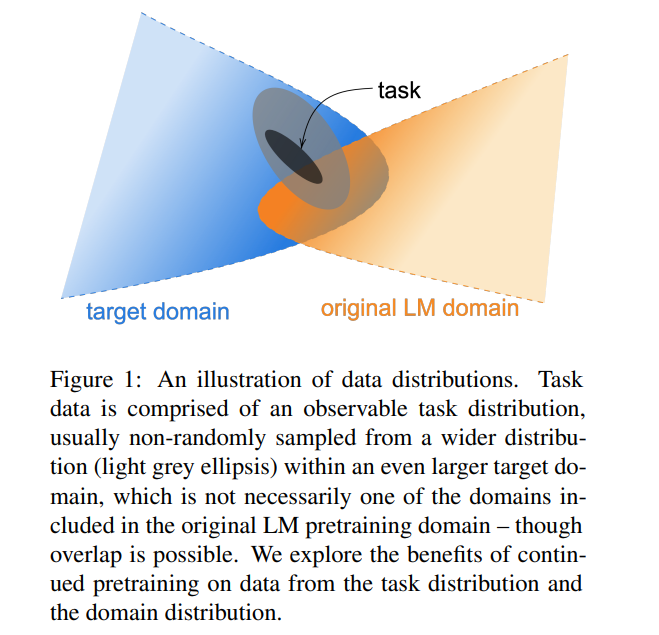

- 考虑了四个领域: 生物医学和计算机科学出版物，新闻和评论
- 八个分类任务: 每个领域两个

- 无论有没有域自适应(domain-adaptive pretraining )的预训练，TAPT(task-adaptive pretraining 规模较小，但直接与任务相关的文集：未标记的任务数据集)都能为RoBERTa带来巨大的性能提升
- 从任务分发中获得 由任务设计者或注释者手动策划的其他未标记数据时，任务自适应预训练的好处就会增加。受此成功的启发，我们提出了自动选择其他与任务相关的未标记文本的方法，并展示了如何在某些资源匮乏的情况下提高性能

## 2 Background: Pretraining
- 尽管RoBERTa的预训练语料来自多个来源，但尚未确定这些来源是否足够多样化以推广到英语的大多数变体
- 探索进一步适应继续这个大LM的训练前两类标签数据组成
  - 大语料库域特定的文本
  - 与给定任务相关联的可用的未标记的数据

## 3 Domain-Adaptive Pretraining
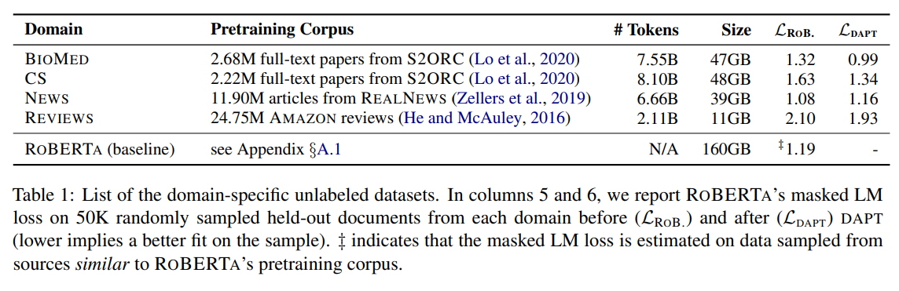
- 域自适应预训练（dapt）的方法很简单-继续在大量未标记域特定文本的语料库上对RoBERTa进行预训练

### 3.1 Analyzing Domain Similarity
- 量化目标域与RoBERTa的预训练域的相似性
  - 考虑在每个域语料库中大小相近的随机保留样本随机样本中包含前10K个最常见的字母组合词（不包括停用词）的领域词汇表。
  - 将每个域（而不是评论）使用50K个保留文档，而在Reviews中使用15万个保留文档(因为它们要短得多)
  - 从与RoBERTa的预训练语料库（即BookCorpus，Stories，Wikipedia和RealNews）相似的来源中抽取了5万份文档），以构建预训练领域词汇，因为原始的预训练语料库没有发布
- RoBERTa的预培训领域与新闻和评论有很强的词汇重叠性，而CS和BioMed与其他领域相去甚远。这个简单的分析表明，通过RoBERTa适应不同的域，可以预期受益的程度- 域越不相似，通过dapt收益的可能性就越大。

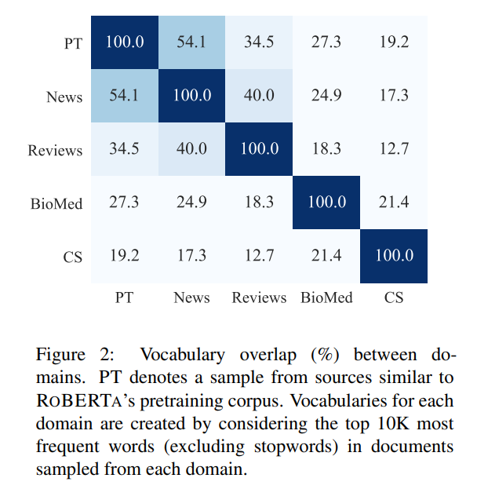

### 3.2 Experiments
- 在每个域上训练12.5K步的RoBERTa
- Mask LM损失，所有域降低，新闻略有增加

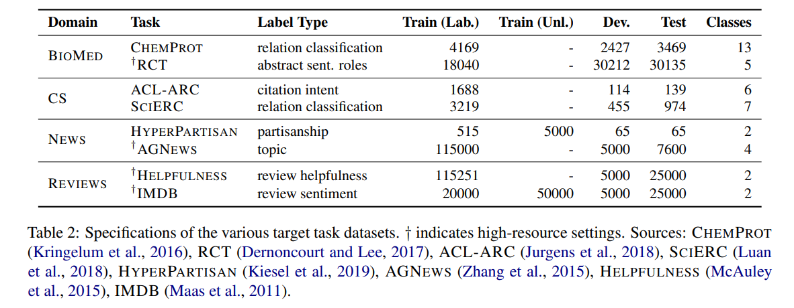

- 在所有领域中，dapt都优于RoBERTa

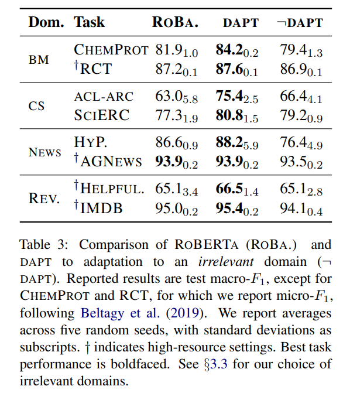

### 3.3 Domain Relevance for DAPT
- 对于每个任务，我们将LM调整为目标域之外的域
- 对RoBERTa的改进可能仅归因于暴露于更多数据而与域无关
- 对于News，我们使用CS LM；进行评论，请使用BioMed LM；对于CS，是新闻 LM；对生物医学，一个评论 LM
  - 使用图2中的词汇重叠统计信息来指导这些选择
- dapt明显优于适应无关域的性能，这表明对域相关数据进行预训练的重要性
- ¬ DAPT导致甚至比RoBERTa更糟糕的表现最终任务。综上，这些结果表明，在大多数情况下，在不考虑域相关性的情况下暴露更多数据对最终任务性能是有害的
- SciERC和ACL-ARC，其中¬ DAPT与RoBERTa相比轻微提高了性能

### 3.4 Domain Overlap
- 为了对HELPFULNESS分类，则使用AMAZON数据集而不是REALNEWS数据集
- 门限有一些模糊，举例来说REVIEWS和NEWS有４０％的一元组一样
- 通过数据分析评论与新闻的相似性
  - 使用ＮＥＷＳ在HELPFULNESS数据集上能达到６５．５％和IMDB达到９５．０
  

## 4 Task-Adaptive Pretraining
- 假设任务数据是较广域的狭窄定义子集的情况下，对任务数据集本身或与任务相关的数据进行预训练可能会有所帮助
- 任务自适应预训练（TAPT）指的是针对给定任务对未标记的训练集进行预训练
- 采用的是远小于训练前语料，而且是一个更加任务相关（假设训练集下很好地代表了任务的各个方面）的语料。这使得TAPT比运行DAPT便宜得多，表现TAPT与DAPT相当

### 4.1 Experiments
- 100 epochs
- 0.15 Mask

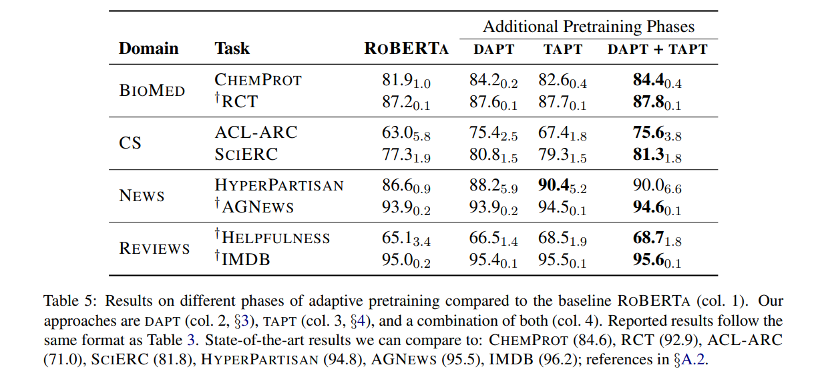

- TAPT一些任务，结果甚至超过那些DAPT，突出更便宜的适应技术的功效。
- 结合dapt和tapt: 结合领域和任务自适应的预训练可以在所有任务上实现最佳性能
- 推测tapt后接dapt可能会使与任务相关的语料库灾难性地忘记
- 跨任务转移
  - 使用RCT未标记的数据对LM进行预训练，并使用ChemProt标记的数据对其进行微调，然后观察其效果。我们将此设置称为Transfer- tapt
  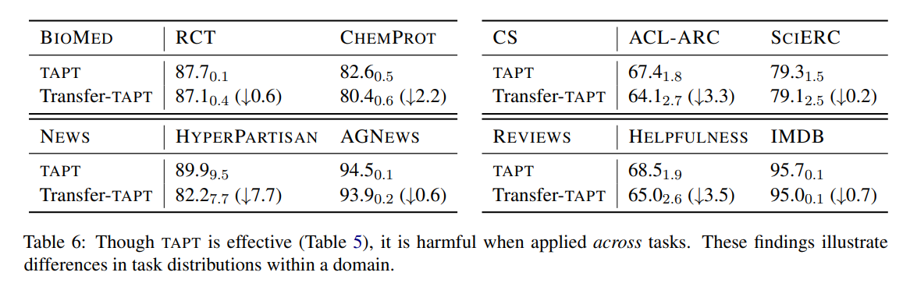
  - TAPT针对单个任务的性能进行了优化，从而不利于跨任务传输
  - 这些结果表明，给定域中任务的数据分布可能有所不同
  - 可以解释为什么仅DAPT是不够的，以及在适应后再进行TAPT是有效的

## 5 Augmenting Training Data for Task-Adaptive Pretraining
- 研究另一种设置，其中存在来自任务分发的大量未标记数据
- 对于三个任务（RCT，HyperPartisan和IMDB），使用来自人类组织语料库的较大的未标记数据池

### 5.1 Human Curated-TAPT
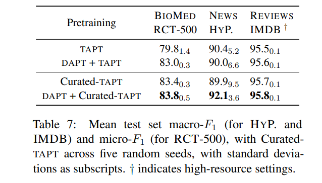
- 数据集创建通常涉及从已知来源收集大量未标记的语料库。然后根据注释预算对该语料库进行降采样以收集注释
- 较大的未标记语料库与任务的训练数据具有相似的分布
- 数据
  - 将RCT数据集的训练数据下采样到500个示例（可用的180K样本）来模拟资源稀少的RCT -500，并将其余训练数据视为未标记
  - HyperPartisan 5K文档用作Curated- tap未标记数据，并使用原始的低资源文档进行任务微调
  - IMDB 使用由任务注释者手动管理的额外未标记数据

- 结果
  - 应用Curated- tapt可以最大程度地提高所有任务的性能
  - 建议任务设计者为其任务释放大量未标记的任务数据，以通过预训练来帮助模型自适应

### 5.2 Automated Data Selection for TAPT
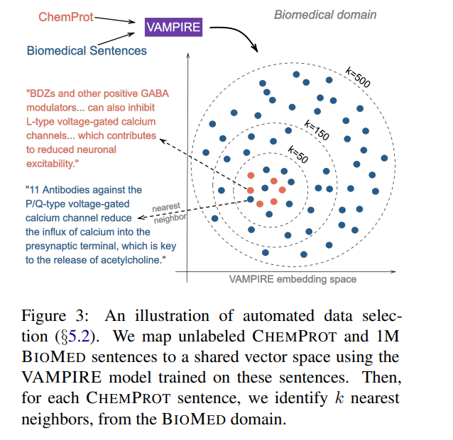
- 考虑一个资源贫乏的场景，该资源无法访问大量未标记的数据以充分利用tapt带来的好处, 并且缺少dapt所需的计算资源
- 提出了简单的无监督方法来从大型域内语料库中检索与分配任务一致的未标记文本
- 法是通过将来自任务和域的文本嵌入到共享空间中，从域中查找与任务相关的数据，然后根据使用任务数据的查询从域中选择候选对象
  - 重要的是，嵌入方法必须足够轻巧，可以在合理的时间内嵌入数百万个句子
  - VAMPIRE, 轻量级的词袋语言模型
  - 嵌入空间中从领域样本中选择每个任务句子的k个候选
    - 最近的邻居选择（k nn-tapt）选择候选
    - 随机（rand-tapt）

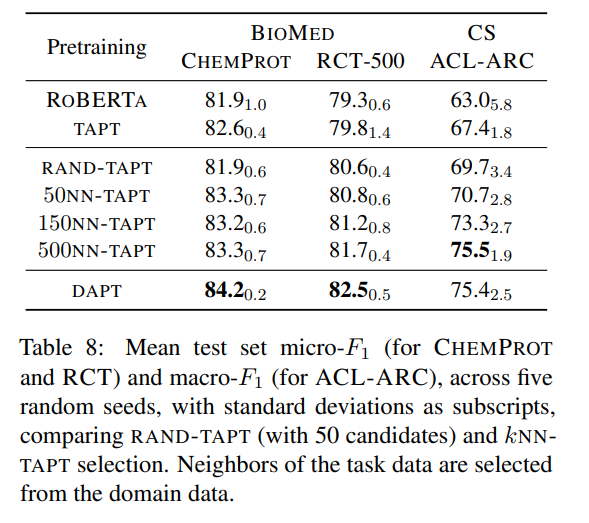
- 结果
    - 在所有情况下，k nn-tapt的性能均优于tapt
    - 随着k的增加，k nn-tapt的性能稳定增加，并接近dapt

### 5.3 Computational Requirements
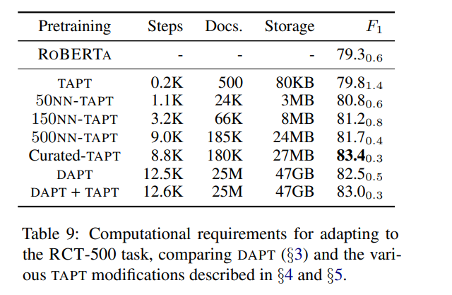
- dapt + tapt的最佳设置是预训练的三个阶段, 似乎很昂贵, 但是可以进行重用，将其进行dapt后存储使用
- Curated- TAPT往往会在此比较中获得最佳的成本效益比

## 6 Related Work

## 7 Conclusion
- 针对特定任务或小型语料库对模型进行预训练可以带来巨大的好处
- 未来的方向:  例如更好的Tapt数据选择，有效地将大型的预训练语言模型适应到遥远的领域，以及适应后建立可重用的语言模型