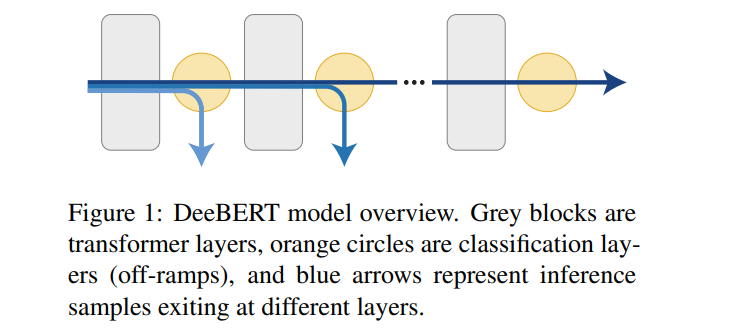
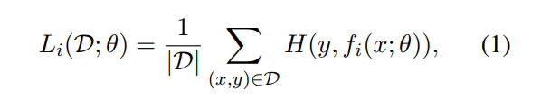
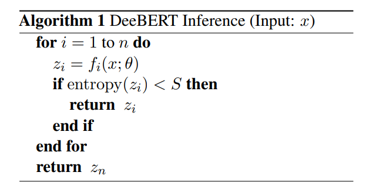
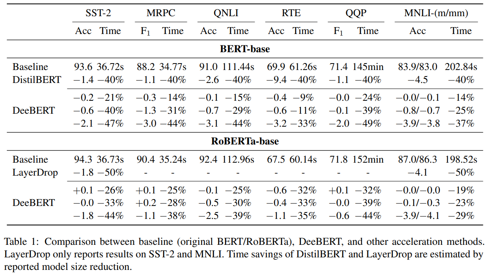
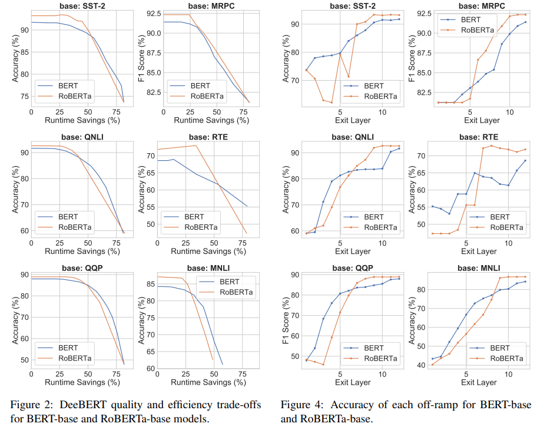
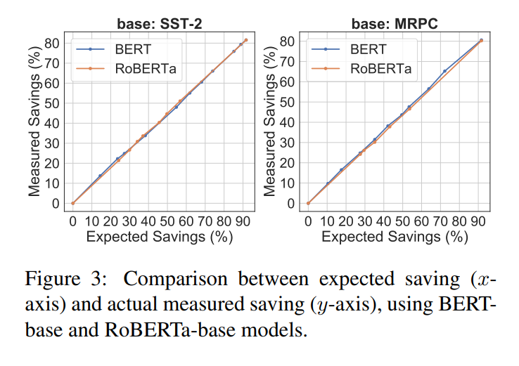
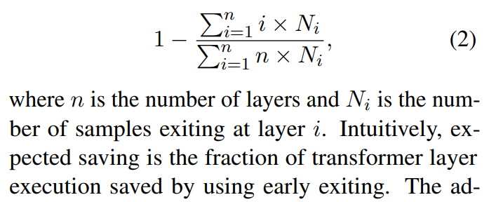
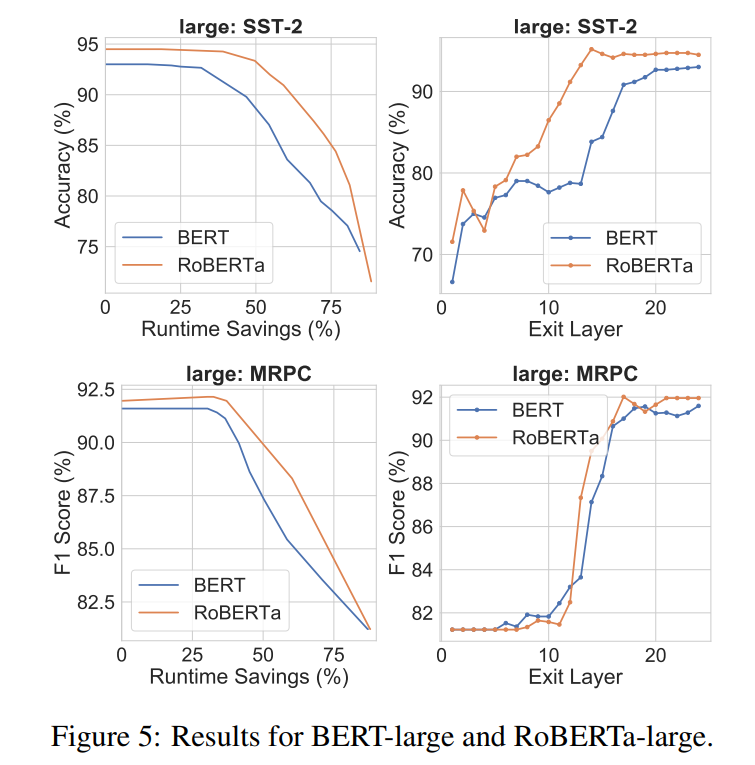
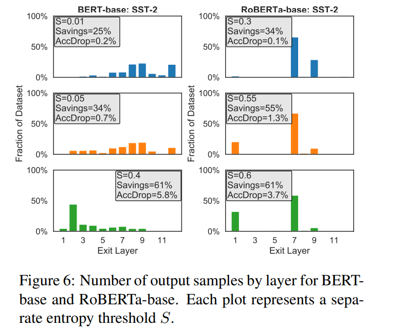

# DeeBERT: Dynamic Early Exiting for Accelerating BERT Inference
[toc]

- https://arxiv.org/pdf/2004.12993v1.pdf
- https://github.com/castorini/DeeBERT
## Abstract
- 推理速度慢，难以在实时应用程序中部署
- DeeBERT能够节省高达〜 40％的推理时间与模型质量退化最小

## 1 Introduction

- 提出DeeBERT
  - 灵感来自计算机视觉界：在深度卷积神经网络中，高层通常会产生更详细和更细粒度的特征
    - 假设，对于BERT，中间层提供的特征可能足以对一些输入样本进行分类
  - DeeBERT通过在BERT的每个层之间插入额外的分类层（off-ramps）来加快BERT推理

## 2 Related Work
- 略

## 3 Early Exit for BERT inference
- DeeBERT修改了BERT模型的微调和推论，使预训练保持不变。它为每层增加了一个匝道。推理样本可以在偏离入口处更早退出，而无需经过其余的层。最后一个斜坡是原始BERT模型的分类层

### 3.1 DeeBERT at Fine-Tuning
- 第i个匝道的损失函数为交叉熵损失函数

- 分为两个阶段进行微调
  - 使用函数Ln更新嵌入层，所有Transformer和最后一个匝道。此阶段与原始论文中的BERT微调相同
  - 冻结在第一阶段微调所有参数，使用$\sum_{i=1}^{n-1} L_i$更新除了最后一个匝道外所有匝道的参数
    - 冻结Transformer层参数的原因是为了使最后保持最佳的输出质量，保证最后一层的效果不受影响

### 3.2 DeeBERT at Inference

- 使用输出概率分布zi的熵来量化匝道在其预测中的置信度
- 较大的S导致模型更快但精度较低，而较小的S导致模型精度更高但较慢
- 还探索了使用多层而不是单层的聚合来制作坡道，没有带来明显的改进
  - 原因是来自不同层的预测通常高度相关，并且其他层不太可能“固定”错误的预测

## 4 Experiments
### 4.1 Experimental Setup
- 将DeeBERT应用于BERT和RoBERTa
  - SST-2，MRPC，QNLI，RTE，QQP和MNLI

### 4.2 Main Results

- 设置不同的熵阈值S来改变DeeBERT的质量效率折衷方案
- 基于开发集上的质量-效率折衷选择三个熵阈值S，旨在证明两种情况
  - 最大的运行时间减少和最小的性能下降（<0.5％）
  - 节省了运行时间，并且性能下降适中（2％−4％）

- 直到运行减少达到某个转折点，然后逐渐下降。BERT的转折点通常比RoBERTa的转折点来得早，但是在转折点之后，RoBERTa的性能下降的速度比BERT的转折点快
- 在曲线中观察到尖峰，例如SST-2中的RoBERTa，以及RTE中的BERT和RoBERTa。我们将其归因于早期退出带来的可能的正则化，因此有效模型尺寸较小，即在某些情况下，使用所有层可能不如仅使用其中一些层

- DeeBERT具有以下两个优点
  - 不是像DistilBERT那样生成固定大小的较小模型
  - DeeBERT不需要对模型进行进一步的预训练，这比微调更耗时

### 4.3 Expected Savings

- 提出了另一种指标来捕获效率，称为预期节省，节约的所有样本的执行层数

- 曲线显示了预期节省量与实际节省量之间的线性关系，表明我们报告的运行时间是对DeeBERT效率的稳定衡量
- 在同一数据集上，RoBERTa通常可以节省更多的运行时间，同时保持大致相同的输出质量，但是在达到转折点后质量下降得更快

- BERT-large和RoBERTa-large共享冗余的迹象：与前几层相比，最后几层没有显示出很大的改进（某些情况下性能甚至略有下降）

### 4.4 Layerwise Analyses
逐层输出性能
: 对于每个脱离斜坡，我们都强制将开发集中的所有样本都退出此处，测量输出质量
BERT的输出质量随着出口偏离斜坡的指数增加而以相对稳定的速度提高。另一方面，RoBERTa的输出质量几层几乎保持不变（甚至变差），然后迅速提高，并在BERT之前达到饱和点

逐层退出的样本数
: 在给定的熵阈值下每个偏离出口处离开的样本的比例
熵阈值S=0是基线，所有样本都在最后一层退出；随着S的增加，逐渐有更多的样本提前退出
如果某个层没有提供比以前的层更好的输出质量，例如BERT-Base中的第11层以及RoBERTa-Base中的第2–4和6层中，通常是由很少的样本选择的
表明，熵阈值可以在质量可比的那些中选择最快的匝道，并在质量和效率之间取得良好的折衷

## 5 Conclusions and Future Work
- 将来的有趣的方向
    - DeeBERT的训练方法在保持最后一个坡道的质量的同时，减少了中间坡道可用的模型容量；寻找一种在所有坡道之间实现更好平衡的方法很重要
    - 一些层出现冗余的原因为何DeeBERT认为某些样品比其他样品容易的原因仍然未知；进一步探索预训练和层冗余，样本复杂度和出口层以及相关特征之间的关系
