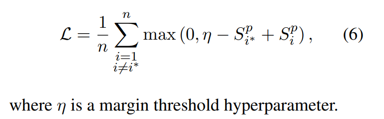

# Pre-training Is (Almost) All You Need: An Application to Commonsense Reasoning

[toc]

## PDF
- https://arxiv.org/pdf/2004.14074.pdf

## Abstract
- 微调过程是次优的，因为预先训练的模型在特定的分类器标签上没有先验，尽管它可能已经学习了任务的内在文本表示形式

## 1 Introduction
- 我们处理了由合理性排名组成的NLP任务的子集, 此问题是通过将每对共同分类来解决的, 将特殊标记[CLS]（用于句子级任务）提供给分类器，以预测给定示例的标签

- 由于预先训练的模型没有在特定分类器标签上集成任何先验模型，因此使用随机初始化的头部可能显得次优。为了验证这种直觉，我们将MLM模型输入转换为全文格式
  - [CLS] The man broke his toe because he dropped a hammer on his foot [SEP]
- 以基于边际的损失微调这个新的评分函数,  使用RoBERTa，我们的结果表明，这种新的训练程序可以提高准确性和训练轨迹
- 我们发现训练数据集大小的逐渐减小导致我们提出的方法与标准分类器之间的精度差距逐渐增大。这使我们的方法在小型数据集环境中具有优势

## 2 Related Work

## 3 Method
### 3.1 Problem Formulation

### 3.2 Sequence Scoring Method
- score representing the likelihood of hi of being implied by p
- transform operator T converts <p, hi> pair into a full-text input

- target premise score'
  - 在给出全文输入的情况下，利用词掩蔽的预训练任务来计算其结果
  - si\w as the sentence si with the tokens of w replaced by the [MASK] token
  
  针对p每个词语都计算其ｍａｓｋ的概率，然后汇总
  该值随着ｐ的长度有变换
- target hypothesis score
  
  - best hypothesis
  
- 目标前提得分可以使不同假设之间公平比较
  - 它们在词的统计频率，序列长度方面存在固有差异，或者在词之间可能表现出或多或少的强相互依赖性（例如，复合词会增强彼此的置信度）
  - 这种差异可能会使每个假设的相对重要性产生偏差（独立于前提）
  - 同一目标前提词的不同概率仅受假设上下文变化的影响

- N-grams sequence scoring
  - 不仅可以对单个单词的重构得分，还可以对整个n-gram的得分进行评分，从而扩展SSM
  - 在对数均值组合中添加n-gram概率不仅可以增强评分方法的稳定性，而且还可以更好地对（相关的）封闭词的联合概率进行建模，尤其是在zero-shot设置中
 
    - p(u:v) as the sub-sequence of p spanning between indexes u and v (included)
    - target premise score 等于 1-gram partial target premisescore 
- n-gram sequence scoring accumulates masked language model probabilities from every gram size till n
  

### 3.3 SSM-based fine-tuning
- 评分功能，因为它并不添加头模块，因此可以直接应用而无需任何重新训练
- 计算不同的掩蔽输入目标前提得分，成批在一起进行计算，目的是一次计算Ｓi^P
- 该模型充当孪生网络，可针对每个假设hi独立执行目标前提得分的计算

- 损失函数
  - 多项选择任务（如COPA）更自然地表现为学习对问题进行排名
  - 与交叉熵损失相比，我们将marginbased loss作为目标函数
  
  - 根据我们的初步实验，我们没有在一般损失中添加第二个MLM分量，因为对于MLM项的各种加权贡献，它总是导致模型性能下降

## 4 Datasets

- COPA
  - 两种任务，原因与效果，添加　because 和 so
  - reverse the premise and hypothesis order for cause samples order to convert all cause samples into effect samples
    - 训练单一任务，效果更好
  - SuperGLUE split
- Swag
- HellaSwag
- CommonsenseQA
  - Q:[space] to the question, A:[space] to the answer

## 5 Experiments
- zero-shot 设置中应用评分方法
- 调整使用的训练数据百分比的同时，微调评分方法，并将其与使用随机初始化的分类器Head的方法进行比较
- RoBERTaLARGE

### 5.1 Task probing
- 评估zero-shot得分来执行任务探测，即通过从输入中删除前提并仅对假设评分来获得zero-shot得分
- 如果分数明显优于随机基准，则意味着该任务实际上不是通过常识推理来解决，而是通过在假设中使用统计偏差来解决

- COPA和CommonsenseQA的假设得分仅接近随机基线，但Swag和HellaSwag的得分均显着高于其随机基线（超过两倍）
- Zellers等表明Swag的假假设是使用弱生成器生成的，认为Swag的BERT模型的精细调整过程学会了吸收弱生成器留下的统计线索
- 我们的结果表明，RoBERTa可以利用这些分布偏差，而无需进行微调阶段，也即是说该假假设在训练集模型上的概率本来就低
  - RoBERTa的人工编写的预训练语料库偏向于给人工编写的语言提供更高的分数，而不是模型生成的句子
  - 在人类文本和机器文本之间确实仍然存在很大的分布差异

### 5.2 Zero-shot Results

- 相对于假设，针对前提提供了更好的结果，这进一步强化了我们的论点，即针对假设可能会更加困难，因为假设之间的差异会使得分比较更加嘈杂
- 更多的gram给出越来越好的结果，但是趋势在4-gram之后反转，这可能是由于没有训练MASK模型来掩盖大块文本
- 零射结果明显好于BERT在COPA训练集上微调的交叉熵模型, CommonsenseQA相当
- 有意地切换so以及beacuse连词格式时，COPA上样本准确性显着下降（64.4％），表明我们的计分方法有效地重用了预先学习的表示形式的任务全文格式

- Swag和HellaSwag，目标假设模式明显优于目标前提模式
- 证实了这个设定我们的zero-shot法主要是在假设采取偏见的优势。因此，我们避免对这两个数据集进行更多的zero-shot实验

### 5.3 Fine-tuning Results
Comparison settings
: - target premise mode, 1-gram, margin-based loss, full-text
  - randomly initialized classifier with crossentropy loss and separated-sentence format (head CE)
  - randomly initialized classifier with marginbased loss and full-text format (head margin)

- 学习率设置为1e-5，预热比为训练步骤总数的6％，线性学习率衰减和权重衰减为0.01
- 经过几次试验，我们将η=0.5

- 我们的方法在平均准确度和最大/最佳准确度方面均优于Head CE和Head margin方法
- 发现训练数据集大小的逐渐减小会导致我们的方法与其他方法之间的最佳精度差距逐渐增大
  - 在缺乏训练数据的情况下，我们的方法是最有利的
- 当使用CommonsenseQA的1％训练数据时，我们的方法在测试中的准确性达到56.7％
- 我们的方法提供了相对于随机种子更加稳定的训练
- 改进的稳定性归因于预先训练的模型优先级的更好重用，并且没有新的随机初始化的权重。这对于轻松进行实验比较而言是重要的结果

## 6 Conclusions
- 未来的工作包括将这种评分方法应用于更广泛的分类任务，例如自然语言推断和情感分析。我们还认为，我们的token评分方法可以在自我监督的预训练阶段使用，以扩展传统的下一句预测和序列排序任务，从而在模型中带来更多常识知识

