# SKEP: Sentiment Knowledge Enhanced Pre-training for Sentiment Analysis

[toc]

### ABSTRACT
- 预训练方法问题点： 未使用情感知识，如情感词和属性-情感词对
- 如何做
  - 自动挖掘的知识，SKEP进行情感MASK并构建三个情感知识预测目标，以便将单词，极性和属性级别的情感信息嵌入到预训练的情感表示
  - 属性情感对的预测会转换为多标签分类，旨在捕获一对单词之间的依赖性

### 1 INTRODUCTION
- 情绪分析与其他NLP任务的不同之处在于，它主要处理新闻文本以外的用户评论
- 许多特定的情感任务，这些任务通常取决于不同类型的情感知识，包括情感词，单词极性和属性-情感对

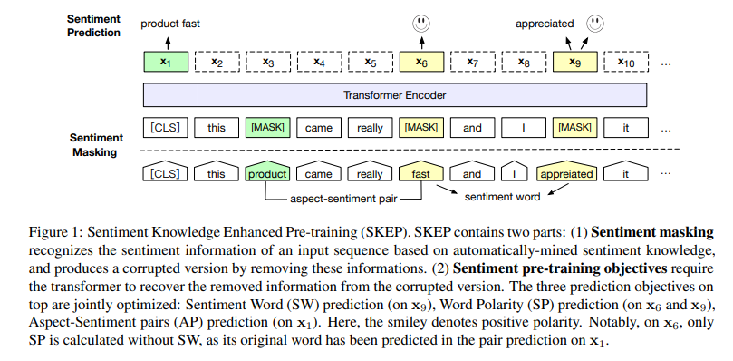

- 在预训练期间解决情感特定表达的第一项工作
  - 传统的情感分析方法中，通常针对特定的情感任务分别研究不同类型的情感知识，调优
- 贡献
  - 用于情感分析的情感知识增强型预训练，可为多个情感分析任务提供统一的情感表示
  - 在预训练期间共同优化三个情感知识预测目标，以便将情感词，极性，方面-情感对嵌入表示中。特别是，将对预测转换为多标签分类，以捕获方面和情感之间的依存关系
  - 效果soa

### 2 BACKGROUND: BERT AND ROBERTA
- 略

### 3 SKEP: SENTIMENT KNOWLEDGE ENHANCED PRE-TRAINING
#### 3.1 Unsupervised Sentiment Knowledge Mining
- SKEP找到了一种将以前的知识挖掘技术与预训练相结合的方法
- 基于点向互信息（PMI）的简单有效的挖掘方法

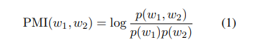

- 首先构建候选单词对的集合，其中每个单词对都包含一个种子单词，并与预先定义的词性模式匹配
- 通过PMI计算单词对的PMI
- 单词的极性取决于所有正种子和所有负种子的PMI得分之间的差异

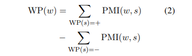

- 在提取情感词之后，通过简单的约束条件提取方面-情感对。方面-情感对是指提及方面及其对应的情感词，具有最接近的名词的情感词将被视为一个方面-情感对。一对属性词和情感词之间的最大距离在经验上限制为不超过3 TOkens

#### 3.2 Sentiment Masking

Sentiment Detection with Knowledge
： 基于知识的情感检测
- 情感词检测。单词检测很简单。如果输入序列中的单词也出现在知识库中G，则该词被视为情感词
- 方面情感对检测。方面情感对的检测类似于前面所述的挖掘。所检测到的情感词及其附近的名词词被视为一个方面-情感对候选词，并且这两个词的最大距离限制为3。因此，如果在挖掘的知识中也找到了这样的候选人G，则将其视为一个方面情感对

Hybrid Sentiment Masking
： 混合情感Mask，情感检测会为输入序列生成三种类型的令牌：方面-情感对，情感词和通用Token
- 方面情感对MASK。最多2个方面情感对，随机选择Mask，同时被替换为[MASK]，提供了一种用于捕获方面词和情感词的组合的方式
- 情感词MASK。对于那些未掩盖的情感词，随机选择其中一些，并将其所有标记替换为[MASK],总数限制为小于10％
- 通用令牌掩码。如果步骤2中的令牌数量不足，则说少于10％，这将在此步骤中用随机选择的令牌填充。在这里，随机令牌屏蔽与RoBERTa相同
  - For each sentence, we would always in total mask 10% of
its tokens at step 2 and 3. Among these masked tokens, 79.9%
are sentiment words (during step 2) and 20.1% are common
words (during step 3) in our experiment

#### 3.3 Sentiment Pre-training Objectives
- 总体损失函数
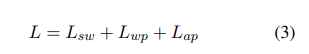

- Sentiment Word Prediction
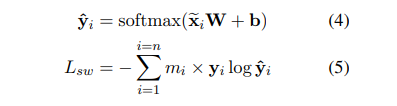
  - 输出到一个osftmax中进行词语预测
  - mi表示该词是否被MASK为情感词，取值0,1

- Word Polarity Prediction 词语极性预测
  - 同上，新增一个二分类来预测词语的极性

- Aspect-sentiment Pair Prediction
  - 方面情感对比情感词揭示的信息更多；成对的单词不是互相排斥的。这与BERT完全不同，后者假设令牌可以独立预测
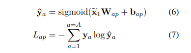
  - x1 denotes the output vector of [CLS]
  - A 是属性-情感词对的个数
  - ya映射到一个aspect-sentiment对多多个tokens上，因此是多标签分类
  - It is possible to predict masked pairs with CRF-layer.However, it is more than 10-times slower than multi-label classification, thus could not be used in pre-training

### 4 Fine-tuning for Sentiment Analysis
- 在预训练的编码器的顶部，添加了输出层以执行特定于任务的预测。然后根据任务特定的标记数据对神经网络进行微调
- Sentence-level Sentiment Classification
  - 使用 [CLS] 进行分类
- Aspect-level Sentiment Classification
  - 输入为2部分：属性描述以及正文，使用 [sep] 隔开
  - 使用  [CLS] 进行分类
- Opinion Role Labeling 意见角色标签
  - 任务转换为序列标记，该序列标记使用BIOS方案进行标记，并添加了CRF层以预测标记

### 5 Experiment
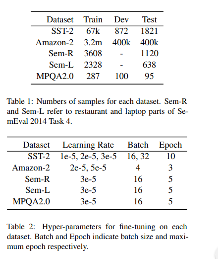

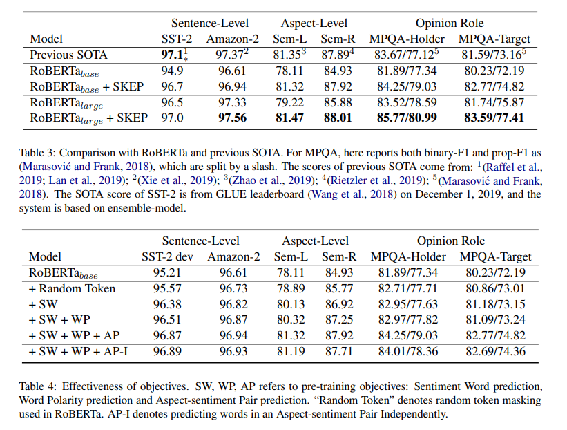

-  input sequence is truncated to 512 tokens. Learning rate is kept as 5e−5,and batch-size is 8192.

#### 5.4 Detailed Analysis
Effect of Sentiment Knowledge： 随机词MASK有效果，但是情感知识点效果更为明显
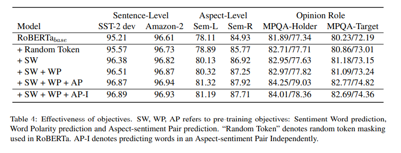

Effect of Multi-label Optimization：
- 提出了多标签分类来处理方面情感对中的依赖性
- S-I使用softmax进行归一化，并独立预测一对词中的每个词作为情感词预测
- 独立预测一对单词不会损害句子级分类的性能。这是合理的，因为句子级任务主要依赖于情感词，在方面级分类和意见角色标签中，多标签分类是有效的，并且最多可提高0.6点。这表明多标签分类确实捕获了方面和情感之间更好的依存关系，并且也有处理这种依存关系的必要性

向量用于方面-情感对预测的比较
- 【CLS】 为Sent-Vector方法。另一种方法是使用成对的两个单词的最终向量的串联，我们将其称为Pair-Vector
- 两个决策的性能非常接近。我们认为这归因于预训练方法的鲁棒性。由于使用单个向量进行预测更有效
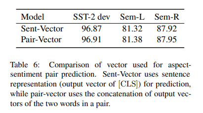

注意可视化
- [CLS]令牌的最后一层的注意分布。在SST-2的示例中，尽管RoBERTa提供了正确的预测，但它对情绪的关注并不准确。在Sem-L案中，RoBERTa未能使用“惊人”一词，并产生了错误的预测。相反，在这两种情况下，SKEP都会得出正确的预测并适当关注情绪信息。这表明SKEP具有更好的解释性

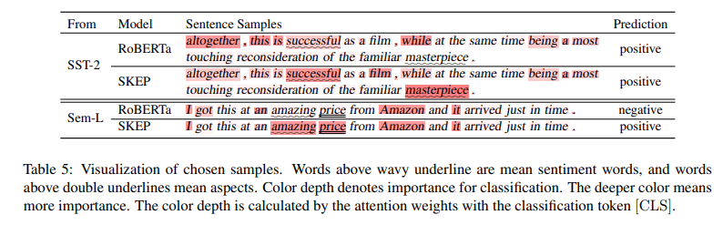

### 6 Related Work
- 略

### 7 Conclusion
- 工作验证了将情感知识用于预训练模型的必要性，并为广泛的情感分析任务提供了统一的情感表示
- 希望将SKEP应用于更多的情感分析任务，以进一步了解SKEP的一般化，并且我们也有兴趣开发更多类型的情感知识和更细粒度的情感挖掘方法

