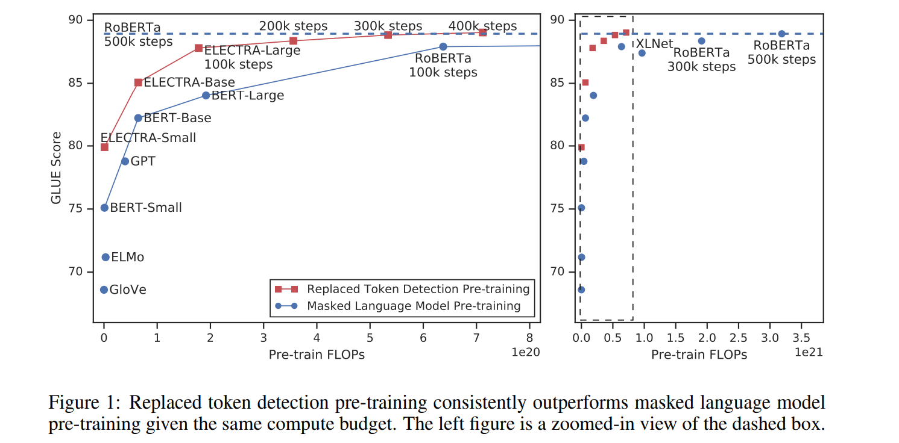
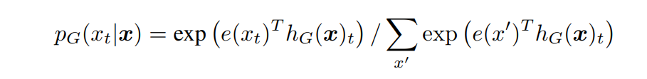
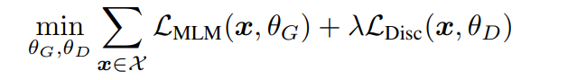
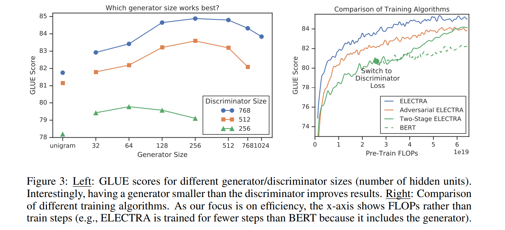
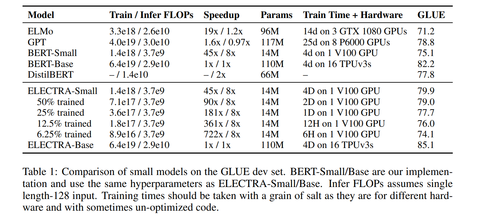
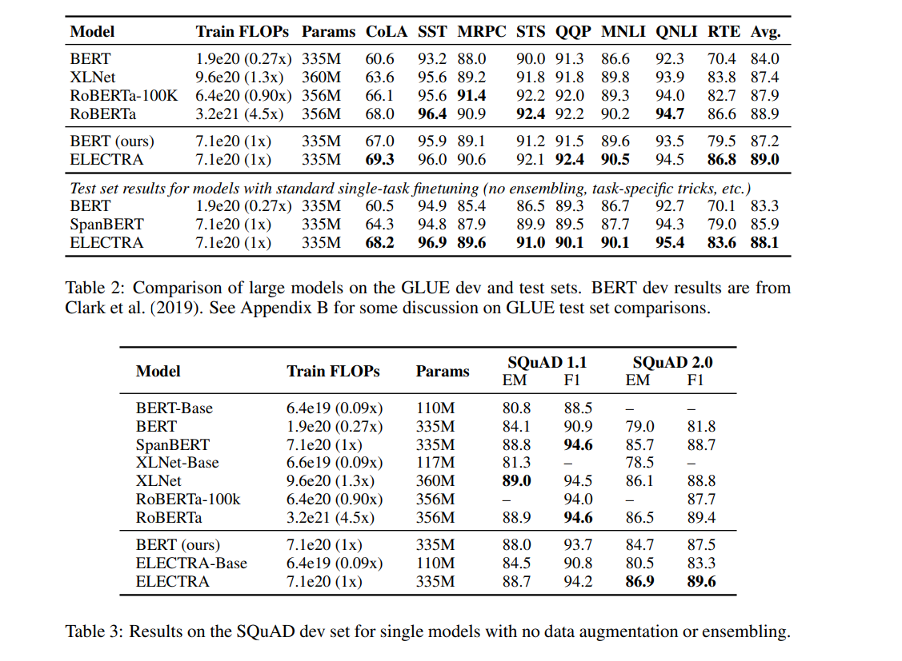
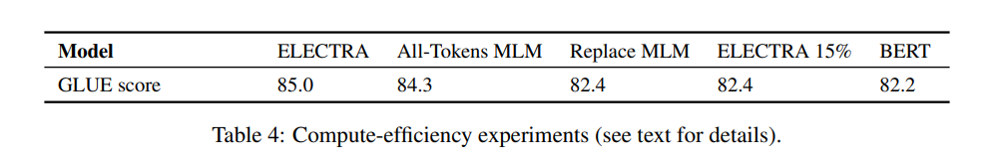

# ELECTRA: PRE-TRAINING TEXT ENCODERS AS DISCRIMINATORS RATHER THAN GENERATORS
[toc]

- pdf:  https://openreview.net/pdf?id=r1xMH1BtvB
- code: http://anonymized/

## ABSTRACT
MLM如BERT使用MASK替换原始词语，然后训练模型进行重建
提出替换文本检测模型

## 1 INTRODUCTION
- BERT等DAE语言模型，由于只从一个例子中学习15%的词语信息，因此其计算代价昂贵
-  ELECTRA：Efficiently Learning an Encoder that Classifies Token Replacements Accurately
    - MLM是生成模型，是对MASK词语的预测
    - 本模型是对替换文本的判断，我们针对每个词语都进行判断，比MLM只生成词语子集更为有效
    - 虽然能让人想到GAN以及判别器，但是本模型不是对抗学习，生成模型并没有通过文本GAN进行学习

与现有的生成式的语言表示学习方法相比，区分真实数据和具有挑战性的负样本的分类任务具有更高的计算效率和参数效率 compute-efficient and parameter-efficient

## 2 METHOD
整体结构
: 
: 

生成器G
: 
x = [x1, x2, ..., xn]
生成MASK  m = [m1, ..., mk]

不同点
: - 如果生成与原词语相同，则标记为real
生成器是通过最大似然进行训练，而不是像GAN那样去欺骗识别器

合并LOSS
:  
判别器的梯度不会传给生成器
训练结束后，丢掉生成器并在具体的下游任务上进行微调
因为判别器的任务相对来说容易些，RTD loss相对MLM loss会很小，因此加上一个系数，作者训练时使用了50

## 3 EXPERIMENTS
### 3.1 EXPERIMENTAL SETUP
### 3.2 MODEL EXTENSIONS
Weight Sharing
: 建议生成器和判别器之间共享权重来提升预训练的效率。如果两者大小相同，可以直接共享所有权重，但是本文发现小型生成器会更加有效，此时只在两者间共享 token 嵌入。这时我们使用和判别器隐层大小一致的 token 嵌入(只需要在生成器里加线性层将 token 嵌入投影为生成器隐层大小即可)。生成器的“输入”和“输出”嵌入和 BERT 一样是共享的
: 生成器和判别器的权重共享是否可以提升效果呢？设置了相同大小的生成器和判别器，在不共享权重下的效果是83.6，只共享token embedding层的效果是84.3，共享所有权重的效果是84.4。
: 假设 ELECTRA 受益于共享 token 嵌入，因为 MLM 在学习这些表示方面特别有效：尽管判别器仅更新输入中存在的令牌或由生成器采样的令牌，但生成器在词汇表上的softmax 会密集更新所有令牌嵌入。另一方面，共享所有编码器权重几乎没有改善，同时带来了要求生成器和判别器具有相同大小的重大缺点。基于这些发现，我们在本文中使用共享 token 嵌入进行进一步的实验

Smaller Generators
: 如果生成器和判别器的大小相同，则训练 ELECTRA 每步所需的计算量约为仅使用 MLM 的训练量的两倍。我们建议使用较小的生成器来减少这一因素。具体来说，我们通过减小层的大小并使其他超参数保持恒定来使模型更小。我们还探索使用一个非常简单的“unigram”生成器，该生成器根据训练集语料库的出现频率对替换标记进行采样。图 3 的左侧显示了不同大小的生成器和判别器的 GLUE 得分。所有模型都经过了 500k 步的训练，这使得较小的生成器在计算方面处于不利地位，因为它们每个训练步骤所需的计算量更少。尽管如此，我们发现判别器大小的 1/4-1/2 的生成器的效果最佳。我们推测，生成器太强大可能会给判别器带来挑战性的任务，从而阻止其有效学习。本文的进一步实验将使用针对给定判别器尺寸找到的最佳生成器尺寸
: 

Training Algorithms
: 我们提出了 ELECTRA 的其他训练算法，尽管这些最终并没有改善结果。最终采用的训练目标将联合训练生成器和判别器，我们还对两阶段的训练过程进行试验：
: 1. 仅使用 LmLm ​ 训练生成器 n 步。
: 2. 用生成器的权重初始化判别器的权重。然后使用 Ldisc 训练判别器 n 步，并且生成器的权重冻结。
:  此过程中的权重初始化要求生成器和判别器具有相同的大小。我们发现，如果不进行权重初始化，则判别器有时甚至无法学习，这可能是因为生成器的起步时间远早于判别器。另一方面，联合训练自然为判别器提供了一个课程，使生成器起步较弱，但在整个训练过程中却变得更好。我们还探索了如何像GAN中那样对抗性地训练生成器，使用强化学习来适应来自生成器的离散采样操作。
:  在两阶段训练期间，从生成目标变为判别目标后，下游任务性能显着提高，但最终表现不及联合训练。尽管仍然优于 BERT ，但我们发现对抗训练的效果不如最大似然训练。鉴于 GAN 在文本生成方面总体表现相对较差，因此这种负面结果并不令人惊讶。

### 3.3 SMALL MODELS

### 3.4 LARGE MODELS

- ELECTRA仅用了1/4的计算量就达到了RoBERTa的效果

### 3.5 EFFICIENCY ANALYSIS
实验
- ELECTRA 15%：让判别器只计算15% token上的损失
- Replace MLM：训练BERT MLM，输入不用[MASK]进行替换，而是其他生成器。这样可以消除这种pretrain-finetune直接的diff
- All-Tokens MLM：接着用Replace MLM，只不过BERT的目标函数变为预测所有的token，比较接近ELECTRA

分析
- 对比ELECTRA和ELECTRA 15%：在所有token上计算loss确实能提升效果
- 对比Replace MLM和BERT：[MASK]标志确实会对BERT产生影响，而且BERT目前还有一个trick，就是被替换的10%情况下使用原token或其他token，如果没有这个trick估计效果会差一些。
- 比All-Tokens MLM和BERT：如果BERT预测所有token 的话，效果会接近ELECTRA
另外，ELECTRA体积越小，相比于BERT就提升的越明显，说明fully trained的ELECTRA效果会更好。另外作者推断，由于ELECTRA是判别式任务，不用对整个数据分布建模，所以更parameter-efficient。

## 4 RELATED WORK
略

## 5 CONCLUSION
我们提出了替代令牌检测，这是一种用于语言表示学习的新的自监督任务。关键思想是训练文本编码器，以区分输入令牌与由小型生成器网络生成的高质量负样本。与 MLM 相比，我们的预训练目标具有更高的计算效率，并且可以在下游任务上实现更好的性能。即使使用相对少量的计算，它也能很好地工作，我们希望这将使研究人员和从业人员更容易开发和应用经过预训练的文本编码器，并使用较少的计算资源。我们还希望未来在NLP预训练方面的更多工作将考虑效率以及绝对性能，并按照我们的工作报告计算使用情况和参数计数以及评估指标。
