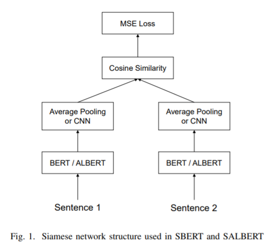
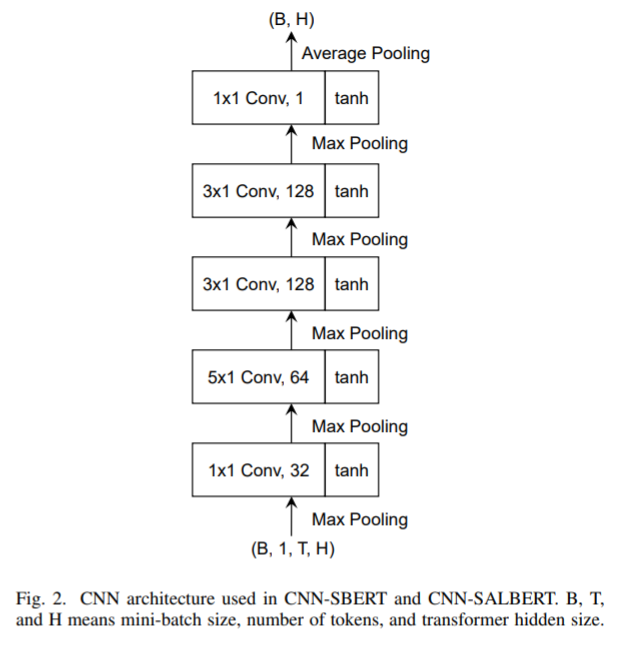
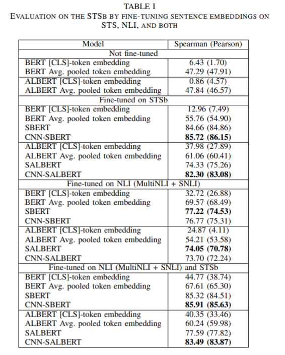
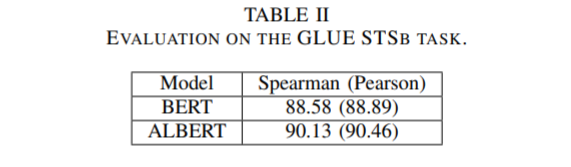
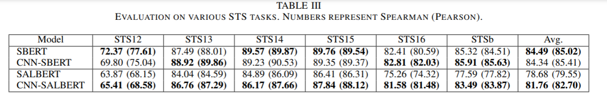

<!-- TOC -->

- [Abstract](#abstract)
- [Model](#model)
- [Result](#result)

<!-- /TOC -->
# Abstract
语言模型的语境化表示能够集中在下游的自然语言处理任务上取得较好的效果。经过训练的 BERT 和 a Lite BERT (ALBERT)模型可以在句对回归(semantic textual similarity，STS)和自然语言推理(natural language inference，NLI)中得到最新的结果。尽管基于 bert 的模型产生的[ CLS ]令牌向量作为一个合理的句子嵌入，寻找一个最佳的句子嵌入方案仍然是一个活跃的研究领域在计算语言学。本文探讨了 BERT 和 ALBERT 的句子嵌入模型。特别地，我们采用了一种具有连体和三联体网络结构的改进的 BERT 网络，称为句子 BERT (SBERT) ，并用 ALBERT 代替 BERT 来创建句子 ALBERT (SALBERT)。我们还实验了一个外部的 CNN 句子嵌入网络的 SBERT 和 SALBERT。我们使用 STS 和 NLI 数据集对所有句子嵌入模型的性能进行了评估。实证结果表明，我们的结构改善 ALBERT 模型实质上比 BERT 模型的 STS 基准。尽管模型参数明显减少，ALBERT 句子嵌入在后续的自然语言处理评估中对 BERT 具有很强的竞争力

# Model
- A. The [CLS] token embedding
- B. Pooled token embeddings
- C. Sentence-BERT (SBERT)
- D. Sentence-ALBERT (SALBERT)

- E. CNN-SBERT
- F. CNN-SALBERT

# Result

