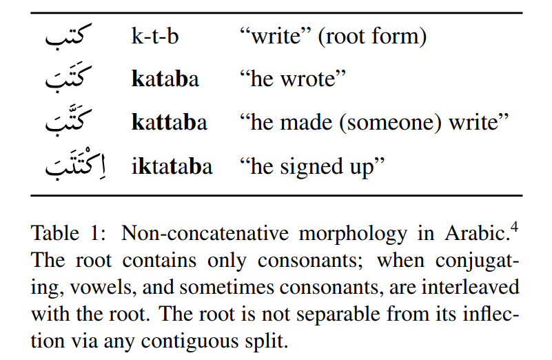
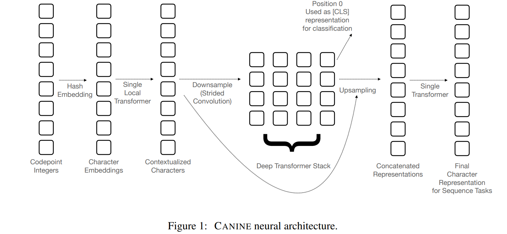
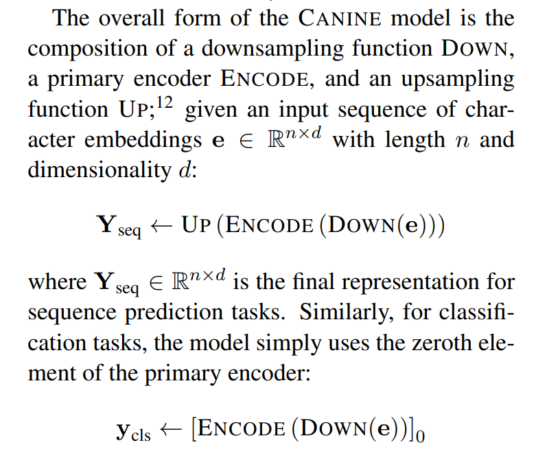
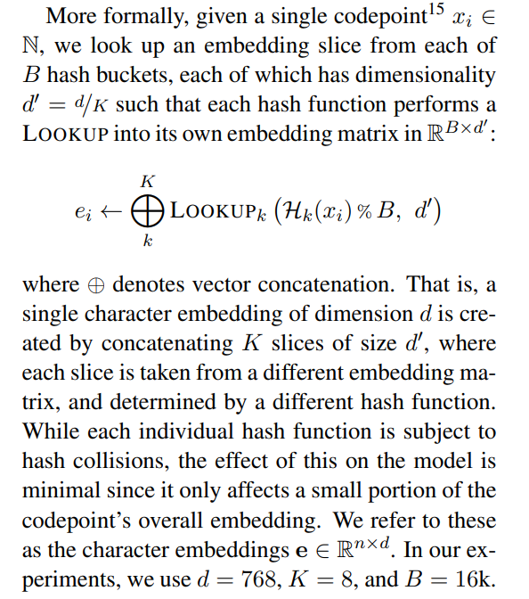
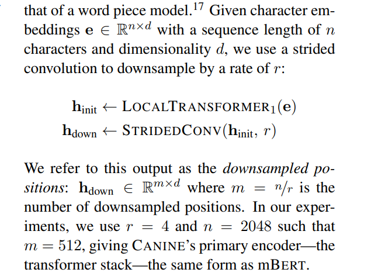
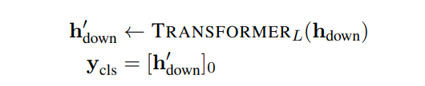
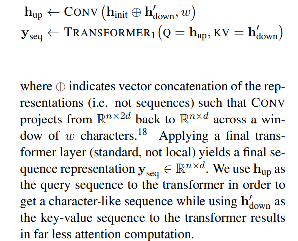

<!-- TOC -->

- [CANINE: Pre-training an Efficient Tokenization-Free Encoder for Language Representation](#canine-pre-training-an-efficient-tokenization-free-encoder-for-language-representation)
- [ABSTRACT](#abstract)
- [1 INTRODUCTION](#1-introduction)
- [2 MOTIVATION](#2-motivation)
- [3 CANINE](#3-canine)

<!-- /TOC -->
# CANINE: Pre-training an Efficient Tokenization-Free Encoder for Language Representation

- https://arxiv.org/pdf/2103.06874.pdf

# ABSTRACT
- 最近基于数据派生子词词典的标记方法不像手工设计的标记方法那么脆弱，但这些技术并不同样适用于所有语言，任何固定词汇表的使用都可能限制模型的适应能力
- 本文提出了一种直接对字符序列进行操作的神经编码器
- 没有明确的标记化或词汇，而是采用软归纳偏差代替硬标记边界的预训练策略
- Canine 结合了下行采样(降低了输入序列长度)和深度转换堆栈(对上下文进行编码)

# 1 INTRODUCTION
- 标记器通常是精心构建的特定语言规则系统，这些系统成本高昂，需要人工特征工程和语言专业知识; 或者是数据驱动的算法，比如字节对编码 bpe2016、 WordPiece016，或者SP 2018，这些句子段基于语料库中的频率分割字符串，这样做不那么脆弱，也更容易进行规模化，但最终过于简单化，无法正确处理单纯的字符串分割(2.1)无法捕捉的广泛的语言现象

- 直接对原始文本字符串进行操作的端到端模型可以避免这些问题，而是学会将单个字符组合成它自己任意复杂的特性，这对准确性和易用性都有潜在的好处
  - 用单个字符组成的词汇表替换 Bert Devlin2018这样的模型中的子词汇表
  - 标准的子词模型平均每个子词大约有4个字符，输入序列长度增加4倍会导致模型明显变慢。其次，简单地切换到一个字符的词汇，结果很差

CANINE

- 模型的输入是 Unicode 字符序列
- 有143,698个分配给 Unicode 13.0中的字符。它涵盖了154种文字和900多种语言。没有词汇表，我们采用哈希策略
- 将输入通过条带卷积，将相对较大的输入序列长度下行采样到深层变压器栈中一个更小的序列长度
- 语言模型(MLM)和下一句预测(NSP)任务

# 2 MOTIVATION
- 词汇来源于对语料库的统计分析: 一个普通的字符串更有可能作为一个单位被记住，而罕见的字符串被分割成更小的成分
- 即使在资源丰富的语言中，子词模型仍然倾向于在具有挑战性的领域中挣扎，例如非正式的文本，其中经常包括拼写错误，拼写变异，例如，说西班牙语和意大利语的人在打字时可能会丢掉重音。音译，或表情符号(Oconnor2010)
- 在预训练期间使用固定词汇表还会给下游任务带来复杂性，这些任务随后被绑定到相同的标记器和词汇表上，即使这些词汇表不太适合目标域和/或最终任务
- 大型词汇嵌入矩阵还存在这样一个问题，即它们可能有许多不常见的词汇元素，因此无法学习好的嵌入，因为在预训练期间很少访问的嵌入，除了它们的随机初始化之外，不会更新很多。这可能会导致错失泛化的机会
- 一个基于字符的模型，其中两个单词共同估计共享权重，应该允许甚至不经常的单词得到良好的表示，只要它们有一定程度的重叠与更频繁的单词
- 在模型预先培训、精细调整和服务期间(可能相隔数月或数年) ，其权重和模型实现可能被转换为与另一个工具包兼容，其微调数据可能以不同的方式标记，单词的自然分布可能大不相同。所有这些东西都会在标记化和训练前的词汇之间引入大量的不匹配的机会

# 3 CANINE

- Preprocessing
  - 只需迭代输入字符串中的字符，并返回它们的码点整数值

- Character hash embeddings
  - 码点整数使用多个哈希函数，一个词汇表无关的字哈希嵌入技巧

- Downsampling
  - 使用单层分块局部注意转换器对字符进行编码。这个模型只在预先定义大小的每个块内执行自我注意，我们在实验中使用了128个字符的窗口

- Deep transformer stac

- Upsampling
  - 序列预测任务要求模型公开一个与输入具有相同序列长度的输出层(即字符仍然是模型的输入和输出“ API”，用于标记和跨度预测等任务)

- Residual connections
  - 最初的字符编码器(下采样前)和最终的字符编码器(上采样后)都代表字符位置，但它们在网络中有着非常不同的用途。直观上，我们认为初始字符编码器是组合字符，以创建更像单词的表示，而最终字符编码器是提取与预测每个位置的内容的“意义”相关的上下文表示
  - 必须能够处理额外的歧义，因为单个下采样位置可能跨越一个以上的单词。由于这些诱导特征的不同作用，我们不使用 h init 和 h up 之间的残余连接

---

- Span-wise masking
  - 遮罩在每个序列中的几个字符跨度
  - 个跨度对应于一个子词。掩码区域中的所有字符都被输入中的特殊“掩码”代码点替换
- Span prediction
