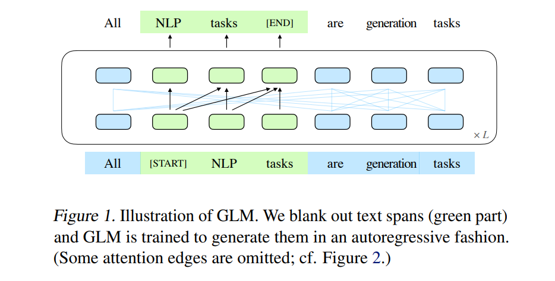

<!-- TOC -->

- [All NLP Tasks Are Generation Tasks: A General Pretraining Framework](#all-nlp-tasks-are-generation-tasks-a-general-pretraining-framework)
  - [引言](#引言)
  - [GLM PRE-TRAINING FRAMEWORK](#glm-pre-training-framework)
    - [AUTOREGRESSIVE BLANK INFILLING](#autoregressive-blank-infilling)
    - [2D Positional Encoding](#2d-positional-encoding)
    - [PRE-TRAINING OBJECTIVES](#pre-training-objectives)
    - [FINETUNING GLM](#finetuning-glm)
    - [DISCUSSION AND ANALYSIS](#discussion-and-analysis)
  - [EXPERIMENTS](#experiments)

<!-- /TOC -->
# All NLP Tasks Are Generation Tasks: A General Pretraining Framework
- 有各种类型的预训练体系结构，包括自回归模型(如 GPT)、自编码模型(如 BERT)和编码-解码模型(如 T5)。另一方面，自然语言处理任务在本质上是不同的，主要有三种类型: 分类、无条件生成和条件生成。然而，没有一个预训练框架能够最好地完成所有任务，这给模型开发和选择带来了不便。针对这一挑战，我们提出了一种新的预训练框架 GLM (通用语言模型)。与以前的工作相比，我们的体系结构有三个主要的优点: (1)它在分类、无条件生成和条件生成任务上只用一个预训练模型; (2)由于改进了预训练-微调一致性，它在分类方面优于类 bert 模型; (3)它自然地处理对许多下游任务至关重要的可变长度空白填充。根据经验，在使用相同数量的训练前数据的情况下，GLM 在 SuperGLUE 自然语言理解基准测试中的表现明显优于 BERT。此外，采用1.25 x 的 BERT-Large 参数的 GLM 在 NLU 获得了最好的性能，同时实现了有条件生成和无条件生成，这表明它对不同的下游任务具有普适性

- https://github.com/thudm/GLM

## 引言
- 本文提出了一种新的基于自回归填空的预训练方法—— GLM。根据自回归预训练的思想，采用自编码的思想，从输入文本中随机排除标记的连续跨度，训练模型重构标记跨度。为了在一个框架中学习双向和单向注意机制，我们将输入文本分为两部分，其中未屏蔽的令牌可以互相关注，但屏蔽的令牌不能关注后续的屏蔽令牌。我们还提出了一种二维位置编码技术来表示跨距和跨距内的位置信息
- 在完善我们关于下游任务的模型时，我们根据(Schick and Schütze，2020b，a)的启发，将其重新构造为空白填充一代。每个任务都与一个人工制作的完形填空问题相关联，并且该模型可以预测完形填空的答案。例如，一个情感分类任务被重新制定为填补“[句子]”中的空白
- GLM 受益于预训练和微调训练之间的一致性，因为预训练和细化都涉及训练模型来生成文本给定的上下文。结果表明，GLM 模型比 bert 模型更适合于下游分类任务。为了使我们的预训练方法更好地适用于文本生成任务，我们还研究了一个多任务预训练装置，该装置联合训练模型来重建掩蔽区域并生成更长的文本

- 在相同的训练前数据和相近的计算量的情况下，GLM 在 SuperGLUE 自然语言理解基准上明显优于 BERT，差距在4.6%-5.0% 之间。在使用相同的、更大的语料库(158gb)进行预训练时，GLM 的性能还优于 RoBERTa、 T5和 BART。此外，与独立基线相比，具有多任务预训练的 GLM 可以在理解、条件生成和具有共享参数的语言建模任务方面取得改进

## GLM PRE-TRAINING FRAMEWORK

- 对 BERT 架构进行了两次修改。(1)重新排列了层归一化和 ResNet 连接的顺序，这对于大规模 bert 模型来说是至关重要的。(2)将令牌预测的前馈网络改为线性层，从而将输出位置 i 定义为

### AUTOREGRESSIVE BLANK INFILLING
- 通过优化自回归空白填充任务训练 GLM。给定一个输入文本 x = [ x1，...，xn ] ，取样多个文本跨度{ s1，...，sm } ，其中每个跨度 s i 对应于 x 中一系列连续的标记[ si，1，....，si，li ]

- Span 数量和长度取决于训练前的目标
- 每个 span 被一个单独的[ MASK ]标记替换，形成损坏的文本 x 损坏。该模型以自回归的方式预测损坏文本中缺少的标记，这意味着当预测一个跨度中缺少的标记时，该模型可以访问损坏的文本和先前预测的跨度
- 为了充分捕捉不同跨度之间的相互依赖关系，我们随机改变跨度的顺序，类似于 Yang 等人2019年的研究。在形式上，设 z m 为长度-m 索引序列[1,2，...，m ]的所有可能排列的集合，s z < i 为[ s z 1，...，s z i-1] ，我们将预训练目标定义为

- 模型不知道一个 span 中缺少的令牌的数量。同时，GLM 也以自回归的方式预测丢失的 Token 。我们总是按照从左到右的顺序在每个空格中生成标记，也就是说，生成跨度 si 的概率被因式分解为

- 自回归空白填充任务。输入标记分为两部分。第一部分由已损坏的文本 x 损坏组成，其中采样的文本跨度由[ MASK ]标记替换。B 部分由掩码区域中的标记组成。A 部分中的令牌可以关注 a 中的所有令牌，但不能关注 b 部分中的任何令牌，b 部分中的令牌可以关注 a 中的令牌以及 b 中的先行令牌，但不能关注 b 中的任何后续位置。通过这种方式，我们的模型在单个模型中自动学习双向编码器(a 部分)和单向解码器(b 部分)

### 2D Positional Encoding
- 依靠添加到输入嵌入中的位置编码来注入标记的绝对和相对位置
- 每个令牌都用两个位置 id 进行编码。第一个位置 id 表示已损坏的文本 x 已损坏的位置。对于 b 中的标记，它是相应的[ MASK ]标记的位置。第二个位置 id 表示跨距内的位置。对于 a 中的标记，第二个位置 id 为0。对于 b 中的标记，它的范围是从1到跨度的长度。两个位置 id 通过两个独立的嵌入表投影到两个位置矢量中，并添加到输入嵌入中

### PRE-TRAINING OBJECTIVES
- GLM 的预训练目标被定义为自回归生成的掩蔽跨度。在 BERT 之后，掩码跨度占原始令牌的15% 。根据经验，我们发现这个比率对于下游自然语言理解任务的良好表现是至关重要的。跨度长度取自 λ = 3的泊松分佈，根据 BART (Lewis et al. ，2019)。我们反复对新的跨区域进行Sample ，直到超过15% 的原始标记被屏蔽

- GLM Mask 短时间跨度，适合 NLU 任务。然而，我们感兴趣的是预先培训一个单一的模型，可以处理自然语言理解和文本生成。我们进一步研究了一个多任务的训练前设置，其中第二个目标是生成更长的文本与 GLM 联合优化。具体地说，我们对一个 Span 进行了 Sample，该跨度涵盖了原始令牌的50%-100% 。跨距长度取自均匀分布。新目标的定义与原始目标的定义相同。唯一的区别是只有一个，但跨度要长得多

### FINETUNING GLM
- 对于下游的自然语言理解任务，线性分类器将预先训练的模型产生的表示作为输入，并预测正确的答案。对于令牌分类任务，输入是目标令牌的表示形式。对于序列分类任务，输入是[ CLS ]令牌的表示，作为序列的表示。这种做法不同于完形填空的前期训练任务，导致了前期训练与后期完形填空的不一致

- 在自然语言理解单元中制定了空白填充的生成任务，接下来是 PET (Schick and Schütze，2020a)。在形式上，给定一个带标签的示例(x，y) ，我们通过包含单个掩码标记[ MASK ]的模式将输入文本 x 映射到完形填空问题 c (x)。模式应该类似于预训练数据集中的自然语言。例如，情感分类任务中的文本可以表示为“[ SENTENCE ]真的是[ MASK ]”。Lable y 也映射到完形填空的答案，称为 verbalizer v (y)。在情绪分类任务中，将“正面”或“负面”标签映射到空白处的“好”或“坏”字上。句子正面或负面的概率与空格中“好”或“坏”的预测成正比

- GLM 特别适合这种设置有两个原因。首先，GLM 能够自然地填补未知长度的空白。Bert 风格的模型必须通过[ MASK ]令牌的数量或位置编码来知道缺少令牌的数量。其次，GLM 打破了 BERT 的隐蔽令牌独立性假设，从而可以捕获更多的依赖关系
- 对于文本生成任务，我们直接应用 GLM 作为自回归模型。给定的上下文构成输入的 a 部分，最后有一个[ MASK ]标记。然后 GLM 在 b 部分中自回归生成文本。我们可以直接将预先训练好的 GLM 用于无条件生成

### DISCUSSION AND ANALYSIS
- BERT 是以自动编码为目标进行训练的。模型需要在原始文本中用[ MASK ]标记预测标记的子集。由于模型独立地预测掩码令牌，BERT 未能捕捉掩码令牌的相互依赖性.BERT 的另一个缺点是不能正确处理多标记答案的空白填充。为了推断长度为 l 的答案的概率，BERT 必须执行 l 连续的预测。为了从零开始预测答案，有必要列举所有可能长度的集合，因为 BERT 需要根据答案的长度更改[ MASK ]标记的数量
- GLM 和 XLNet (Yang 等人，2019)都是带有自回归目标的预训练。与 XLNet 比较，GLM 有三个不同之处。首先，XLNet 在损坏前使用原始位置编码。在推理过程中，XLNet 要么需要知道答案的长度，要么需要枚举可能的长度集。其次，采用双流自注意结合目标感知表示代替右移的方法，利用变换器结构解决信息泄漏问题。双流注意增加了训练前的时间成本。第三，XLNet 决定是否独立预测一个令牌，而 GLM 首先采样掩码的长度
- T5(拉菲尔等人，2020年)提出了一个空白填充目标类似的 GLM 预训练编码器解码器变压器模型。相反，GLM 使用一个单一的变压器编码器模型来学习双向和单向的注意力。与编解码器结构相比，GLM 具有两种注意力的共享参数，因此具有更高的参数效率。另一方面，T5(Raffel 等人，2020)在编码器和解码器中对标记使用独立的位置编码，依靠哨兵标记来区分不同的掩码跨度。在下游任务中，最多使用一个这样的哨兵令牌，导致模型容量的浪费以及预训练和微调之间的不一致
- 在UniLM框架下，通过改变双向、单向和交叉注意之间的注意掩码，统一了不同的预训练目标。与自回归模型相比，由于自编码模型的独立性假设，该模型不能完全捕获当前令牌对先前令牌的依赖性。对下游生成任务的细化 GLM 也依赖于掩蔽语言模型，这比自回归模型效率低

## EXPERIMENTS

