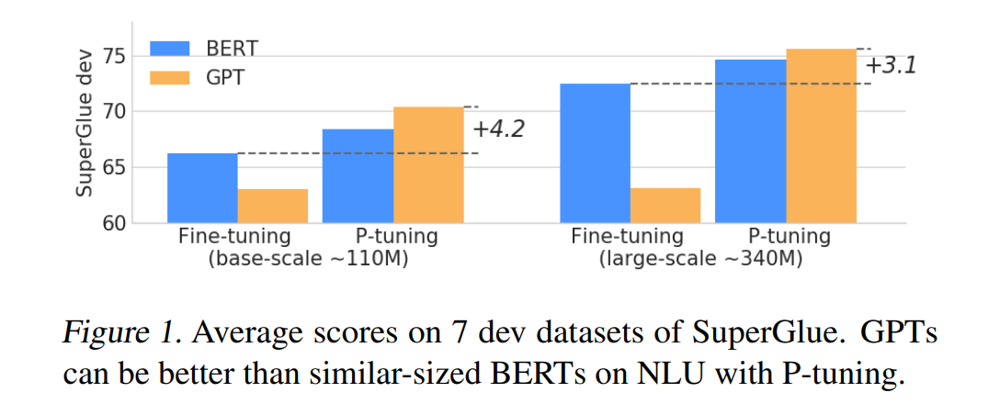
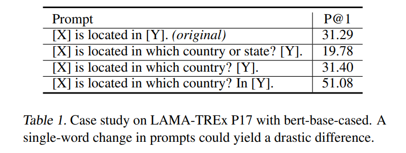
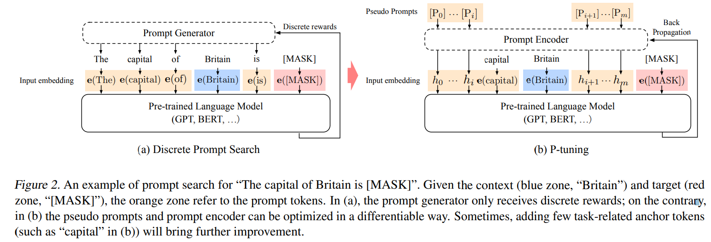
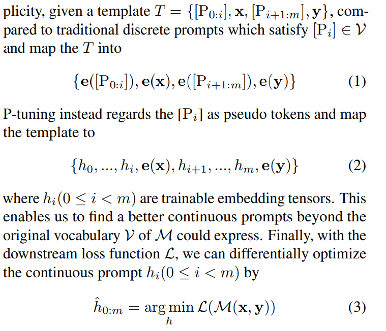
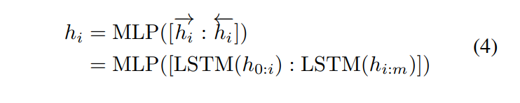
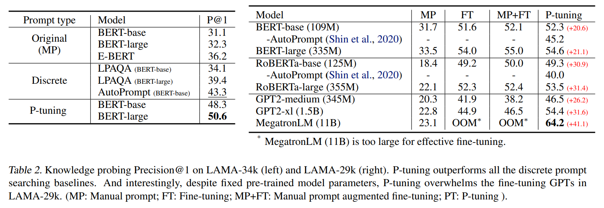

<!-- TOC -->

- [GPT Understands, Too](#gpt-understands-too)
  - [ABSTRACT](#abstract)
  - [INTRODUCTION](#introduction)
  - [MOTIVATION](#motivation)
  - [METHOD: P-TUNING](#method-p-tuning)
    - [Optimization](#optimization)
  - [Experiments](#experiments)

<!-- /TOC -->
# GPT Understands, Too

## ABSTRACT
- 虽然传统的微调 GPTs 在自然语言理解(NLU)方面不能取得很好的效果，但是我们发现，在 NLU 任务上，GPTs 可以优于或者可以与相似大小的 BERTs 相媲美，并且采用了一种新的 p 调整方法ーー采用可训练的连续提示嵌入

- 在知识探测(LAMA)基准上，最好的 GPT 在测试期间不提供任何附加文本的情况下恢复世界知识的64% (p@1) ，这大大提高了以前最好的20多个百分点。在 SuperGlue 基准测试中，与同等大小的监督式学习相比，GPTs 的性能可以与之媲美，有时甚至更好

- 发现 p 调优还可以提高 bert 在少镜头和监督环境下的性能，同时大大减少了对提示工程的需求。因此，在少量的 SuperGlue 基准测试中，p 调优优于最先进的方法

## INTRODUCTION
- 预先训练的语言模型可以分为三类: 用于自然语言生成的单向语言模型(例如，GPT (Radford 等人，2019)) ，用于自然语言理解的双向语言模型(例如，BERT (Devlin 等人，2018))和混合语言模型(例如，XLNet (Yang 等人，2019) ，UniLM (Dong 等人，2019))。长期以来，研究人员观察到，gpt 类型的模型在具有微调的 NLU 任务中表现不佳，因此假定它们在本质上并不适合于语言理解
- 新兴的 GPT-3(Brown 等人，2020)及其在手工提示的少次和零次学习方面的特殊性能已经席卷了机器学习社区。它的成功表明，巨大的单向语言模型结合适当的手工提示可能有助于自然语言的理解。然而，手工制作性能最佳的提示就像大海捞针一样，通常需要非常大的验证集。在许多情况下，及时的工程有效地意味着过多的测试设置。此外，很容易创建对抗性的提示，从而导致大幅度的性能下降。鉴于这些问题，最近的工作集中于自动搜索离散提示(Jiang 等人，2020b; Shin 等人，2020; Reynolds and McDonell，2021; Gao 等人，2020) ，并证明了它们的有效性。然而，由于神经网络天生就是连续的，离散的提示可能是次优的

- p 调整利用少量连续的自由参数作为提示符输入到预先训练的语言模型。然后，我们使用梯度下降法优化连续提示符，以替代离散提示符搜索

- 语言模型包含的世界知识和先验任务知识比我们之前假设的要多得多。P 调优还可以作为调优预先训练的语言模型以获得最佳下游任务性能的通用方法。总括而言，我们作出以下的贡献
  - 通过 p 调优，GPTs 在自然语言理解方面可以和 bert 一样具有竞争力(有时甚至更好) ，这可以提高预先训练的语言模型的性能。这表明，人们低估了 gpt 风格的体系结构在自然语言理解方面的潜力
  - p 调谐是一种改善 GPTs 和 BERTs 在少镜头和完全监督的设置的一般方法。特别是通过 p 调整，我们的方法在 LAMA 知识探测和 few-shot SuperGlue 方面优于现有的方法，这表明语言模型在训练前掌握了更多的世界知识和先验任务知识

## MOTIVATION
- 致命的问题是巨型模型的可转移性很差。对下游任务的微调对那些万亿级模型几乎没有用。即使对于多次微调的设置，这些模型仍然太大，无法快速记忆微调样本
- 作为替代，GPT-3和 DALL-E 已经被报道利用手工提示来引导下游应用程序的模型。然而，手工提示搜索在很大程度上依赖于不切实际的大规模验证集，但其性能也是不稳定的
  - 在 LAMA (Petroni 等人，2019)知识探索(表1)中展示了一个类似的例子，其中一个单词的变化可能导致巨大的差异

## METHOD: P-TUNING

- 与离散提示相似，p 调优仅对输入应用非侵入性修改。然而，p 调优用其差分输出嵌入代替了预训练语言模型的输入嵌入
- input tokens x1:n = {x0, x1, ..., xn} will be mapped to input embeddings {e(x0), e(x1), ..., e(xn)} by the pretrained embedding layer e ∈ M.
  - often use the output embeddings of a set of target tokens y for downstream processing
  - x refers to the unmasked tokens while y refers to the [MASK] ones; and in the sentence classification, x refers to the sentence tokens while y often refers to the [CLS]
- prompt p is to organize context x, target y and itself into a template T
  - 提示符 p 的作用是将上下文 x、目标 y 和自身组织到模板 t 中。例如，在预测一个国家的首都(LAMA-TREx P36)的任务中，模板可能是“英国的首都是[ MASK ]”(见图2) ，其中“The capital of ... is ...”是提示，“英国”是上下文，“[ MASK ]”是目标。提示可以非常灵活，我们甚至可以将它们插入到上下文或目标中

### Optimization
two optimization challenges
- Discretenes： m 的原始字嵌入 e 在训练前已经变得高度离散。如果 h 是用随机分布初始化的，然后用随机梯度下降(SGD)优化，这已被证明只改变一个小邻域的参数(Allen-Zhu et al. 2019) ，优化器很容易陷入局部极小
- Association： 我们认为提示符嵌入 h i 的值应该相互依赖，而不是独立。我们需要一些机制来将提示嵌入彼此关联起来

我们建议也使用提示编码器将 h i 建模为序列，该编码器由一个非常精简的神经网络组成，可以解决离散性和关联性问题。在实践中，我们选择了一个双向长短期记忆网络(LSTM) ，一个 ReLU 激活的双层多层感知机(MLP) ，以鼓励离散性。从形式上讲，语言模型 m 的实际输入嵌入 h ′ i 

- 虽然 LSTM 磁头的使用确实为连续提示的训练增加了一些参数，但是 LSTM 磁头比训练前的模型小了几个数量级。此外，在推理过程中，只需要输出嵌入 h 即可丢弃 LSTM 头
- for RTE task, the token “?” within prompt template “[PRE][prompt tokens][HYP]?[prompt tokens][MASK]” is specially added as an anchor token and affects the performance a lot

## Experiments

- P 调谐显著地将知识探测的边界从 LAMA-34k 的43.3% 提高到50.6% ，将 LAMA-29k 的45.2% 提高到64.2% 。这个结果有力地表明，语言模型通过寻找更好的提示和不进行微调，获得的知识远远超过人们以前的想象。当 p 优化与以前的离散提示搜索方法比较时，比如在相同大小的模型上使用 AutoPrompt (Shin 等人，2020)和 LPAQA (Jiang 等人，2020b) ，p 优化仍然比它们更好
