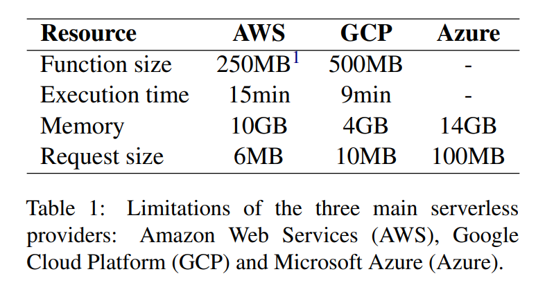
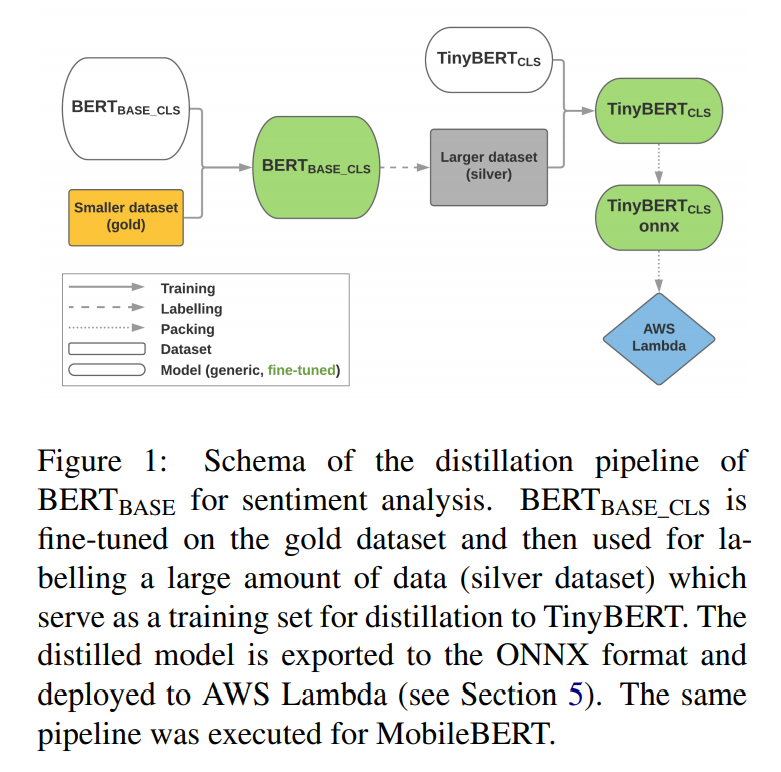
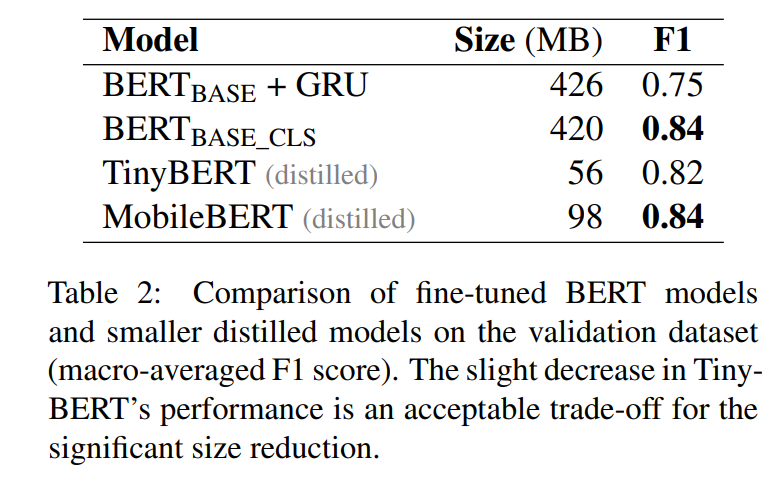
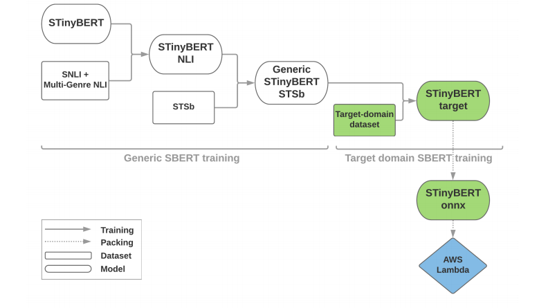
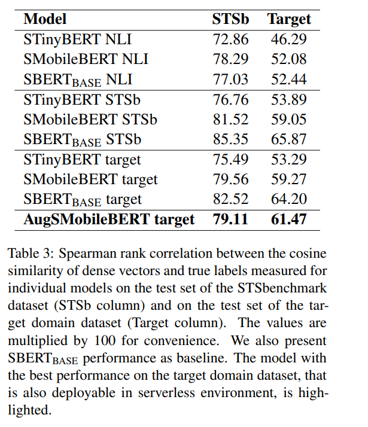
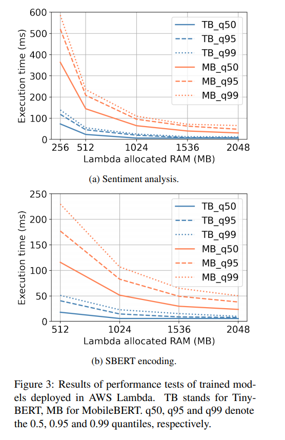

<!-- TOC -->

- [Cost-effective Deployment of BERT Models in Serverless Environment](#cost-effective-deployment-of-bert-models-in-serverless-environment)
  - [ABSTRACT](#abstract)
  - [INTRODUCTION](#introduction)
  - [RELATED WORK](#related-work)
  - [SERVERLESS ENVIRONMENTS](#serverless-environments)
  - [MODEL TRAINING](#model-training)
    - [BERT FOR SENTIMENT ANALYSIS](#bert-for-sentiment-analysis)
    - [SENTENCE-BERT FOR SEMANTIC TEXTUAL SIMILARITY](#sentence-bert-for-semantic-textual-similarity)
  - [DEPLOYMENT](#deployment)

<!-- /TOC -->
# Cost-effective Deployment of BERT Models in Serverless Environment
- https://arxiv.org/abs/2103.10673v1

## ABSTRACT
- 展示了在生产环境中向 AWS Lambda 部署 bert 风格模型的可行性。由于免费提供的预训练模型太大，不能以这种方式部署，我们利用知识提取和微调专有数据集上的模型来完成两个真实世界的任务: 情感分析和语义文本相似性
- 获得针对特定领域进行调优的模型，并在无服务器环境中进行部署。随后的性能分析表明，这个解决方案不仅报告了生产使用可接受的延迟水平，而且还是一种成本效益高的替代 BERT 模型中小规模部署的方法，所有这些方法都没有任何基础设施开销

## INTRODUCTION
- 描述了在生产环境中将基于 bert 的模型部署到 AWS Lambda 的经验。我们考虑两个任务: 情感分析和语义语篇相似度。虽然标准的方法是对预先训练的模型进行微调，但这在我们的案例中是不可能的，因为最终得到的模型太大，无法符合 AWS Lambda 规定的限制。相反，我们采用一种知识提取方法结合较小的基于 bert 的模型。我们表明，对于某些任务，我们能够训练数量级较小的模型，同时报告性能与较大的模型相似

## RELATED WORK
- TinyBERT
- MobileBERT

## SERVERLESS ENVIRONMENTS
- 部署在无服务器环境中的函数共享底层硬件、操作系统和运行时 lynn2017初始版本，因此在这种环境中运行的函数自然存在许多限制。最明显的例子包括
  - Maximum function size: 最大的函数大小，大多数限制为几百 MB
  - Maximum memory: 几个 GB
  - No acceleration: 没有加速。无服务器环境不支持 GPU 或 TPU 加速

## MODEL TRAINING
- 知识提炼到更小的模型或直接培训一个更小的模型。为此，我们使用 TinyBERT jia2019 TinyBERT 和 MobileBERT sun2020mobilebert，分别有大约56 MB 和98 MB 的大小

### BERT FOR SENTIMENT ANALYSIS

- 首先，我们使用一个带标签的68K 训练样本数据集为我们的域微调 BERTBASE。然后，我们进行知识提炼，以更快的推理进入一个较小的模型: 微调的 BERTBASE 是用于标记大量的无标记数据，用于训练一个较小的模型与类 bert 架构
- 在 Transformer 块的顶部添加一个额外的磁头，即在混合输出的顶部添加一个线性层。附加层通常只接收特殊[ CLS ]令牌的表示作为其输入。为了获得最终的预测结果，这一层的输出通过一个 Softmax 层，在预测的类上方产生概率分布
- 用一个标记为68K 的数据集(包含特定领域的数据)为我们的任务调整了 BERTBASE 序列分类(BERTBASE _ cls)。利用 AdamW 优化器对模型进行了8个时期的训练，学习速度小于3 × 10-5，L2重量衰减为0.01，批量大小为128
- 大约82% 的数据集是中性的，10% 是阴性的，8% 是阳性的。为了加快训练速度，我们以欠抽样的方式对类平衡的批次进行抽样，同时将相似长度的例子放在一起(为了对类似的填充数据进行更有效的处理)。使用这种方法，我们能够至少部分避免在最大类上的过拟合，减少约2.5倍的训练时间
- 尝试了另一种微调方法，冻结 BERTBASE 层，并在其上附加一个小型可训练网络。对于可训练的部分，我们实验了1层的双向大小为128与辍学0.25加上线性层和软最大输出。BERTBASE _ cls 明显优于这种方法

- 获得几乎无限量的无标签领域特定数据，我们用微调的 BERTBASE _ cls”教师”模型标记了几乎90万例子，并将其作为基本真理标签，用于培训较小的”学生”模型。我们用 MobileBERT 和甚至更小的 TinyBERT 作为学生模型进行实验，因为与 BERTBASE 相比，他们的尺寸分别小了3倍和7倍
- 以与第4.1.1节相同的方式对批次进行取样，除了一个较小的批量为64。我们使用学习率为2 × 10-5的 AdamW 优化器对少数几个时期进行训练，权重衰减为 0.01, TinyBERT 为3个时期后提前停止，MobileBERT 为1个时期(在下一个时期，模型在验证集上不再改进)
- F1得分仅下降了0.02分(宏观平均值)。在 MobileBERT 的情况下，我们能够匹配 BERTBASE _ cls 的性能。表2总结了性能比较。这些结果表明，在现实生活中，大型语言模型对于分类任务可能不是必需的

### SENTENCE-BERT FOR SEMANTIC TEXTUAL SIMILARITY

- BERT 选择训练我们自己的 SBERT 模型。我们通过将前面提到的 BERT 选项应用到 SBERT 体系结构中，即在 BERT 模型上增加一个嵌入平均层，创建了较小的 SBERT 模型
- 为了使较小的 SBERT 模型在 STS 任务中执行，我们将它们分为两个阶段进行微调。首先对标准数据集进行微调，得到通用的 SBERT 模型，然后对目标域数据进行微调
- 我们首先精细调整的 SBERT 基于一个较小的 BERT 替代的组合 SNLI bowman2015snli 和多流派 NLI williams2018multili 数据集。基于验证集性能，批量大小为16，使用学习率为2 × 10-5的 Adam 优化器，以及线性学习率占总训练批次的10% 以上的线性学习率预热，对4个时期的模型进行微调
- 我们继续使用相同的方法在 STSbenchark (STSb)数据集 cer2017stsb 上微调模型，除了基于 STSb 开发集性能和批量大小128的早期停止
- 使用了一个私有的平衡数据集2856对。每一对被分配到三个类别中的一个: 重复的(目标余弦距离1) ，相关的(0.5)或无关的(0)。这些类是半自动分配的。使用 OPUS-MT 项目 tiedemann: helsinki 中发布的翻译模型，通过反向翻译 senrich2016反向翻译创建了重复对。相关对被预先选择和专家注释和无关对是由随机文本配对形成的
- 验证和测试集分别由665对和696对专家注释组成。这些集合是不平衡的，因为手动查找重复对比查找相关或不相关的对要困难得多，而后者源于问题的本质。这就是为什么重复的类形式只占数据集的大约13% ，而相关和不相关的类各占大约43% 的原因
- 在目标域数据集的训练集上进行了通用 SBERT 模型的微调实验。基于验证集性能、批量大小64、学习率为2 × 10-5的 Adam 优化器以及占总训练批次10% 以上的线性学习率，我们对其进行了8个时期的微调，并提前停止
- 选择379K 复制候选人使用 BM25 Amati2009和注释他们使用预先训练的交叉编码器基于 RoBERTaLARGE。在注释数据中，低相似度值最为普遍(中位相似度为0.18)。出于这个原因，我们需要平衡数据集，以获得最终的32K 对平衡数据集。我们把原来的专家注释称为黄金数据和交叉编码器注释称为银数据
- 在创建银数据集之后，我们首先对银数据和黄金数据进行了微调。正确的超参数选择对于成功的微调至关重要。为了对 gold 数据进行最终的微调，降低学习速度和设置正确的批量大小尤其必要。对于银数据集，我们使用了2 × 10-5的学习速率和64的批量大小。对于黄金数据集的最终微调，我们使用了2 × 10-6的较低学习速率和16的批量大小。
- 较小模型性能较差的原因不仅在于它们的参数较少，而且在本质上还取决于模型输出密集向量的大小

## DEPLOYMENT

- 使用了一个更小的模型解释器库 ONNX Runtime bai2019onnx，它的大小仅为14 MB，为实际模型留下了大量空间
- 使用 AWS Lambda，我们可以很容易地达到任务和模型的执行时间低于100毫秒的0.99分位数。我们还观察到执行时间随 RAM 的增加而减少。这是因为 AWS Lambda 环境自动分配更多的 vCPU 和更多的 RAM
- AWS Lambda 部署也具有成本效益。1M 预测的总成本 每台100毫秒，使用1gb 内存大约是2美元，而最便宜的1gb 内存的 AWS EC2虚拟机每月的成本是8美元

