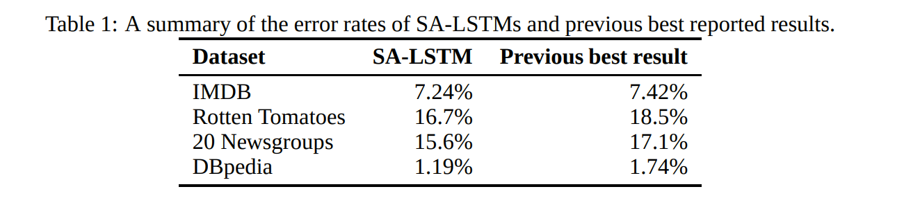

# Semi-supervised Sequence Learning
[toc]

https://arxiv.org/abs/1511.01432
## Abstract
- 使用两种方法对LSTM进行预训练, 获得更高的结果以及更高的稳定性

## 1 Introduction
本文主要是提供了两种利用无标签数据来提高序列模型表现的方法。第一种是利用传统的神经语言模型（predict what comes next in a sequence），第二种就是利用序列的自动编码器（autoencoder）。这两种模型可以提前用海量无标注数据来训练，得到的参数可以用于后续有监督学习模型的初始化参数。在论文实验中，利用预训练参数训练的LSTM网络表现的更好且更稳定，并且在许多NLP分类任务中取得了不错的表现

与Skip-Thought的区别
- Skip-Thought的目标更难, 因为其是预测下一句
- Skip-Thought是纯的无监督学习算法, 不需要进行微调

## 2 Sequence autoencoders and recurrent language models
发现可以使用大量的无监督数据先对网络参数进行预训练,  然后将该参数作为初始值再进行优化
- 把句子输入模型，再把相同的句子输出来，名为自编码器。该思路来自经典的seq2seq框架。这一套自编码器模型，其实就是去学习句子的表达，用于之后的分类模型训练。其中ENCODER和DECODER参数一样, 由于其能够把原句进行输出, 因此其确实是整个句子的向量表达

- 预测下一个词。这一套框架更简单了，本质就是把上面的自编码器的ENCODER部分给去掉。（其实就是普通多层循环神经网络模型）

## 3 Overview of methods
SA-LSTM: Sequence Autoencoder
LM-LSTM: Language Model

## 4 Experiments

其他略
