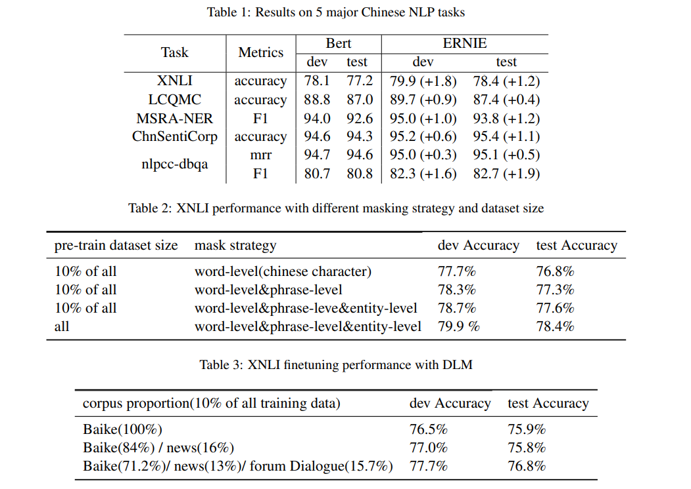
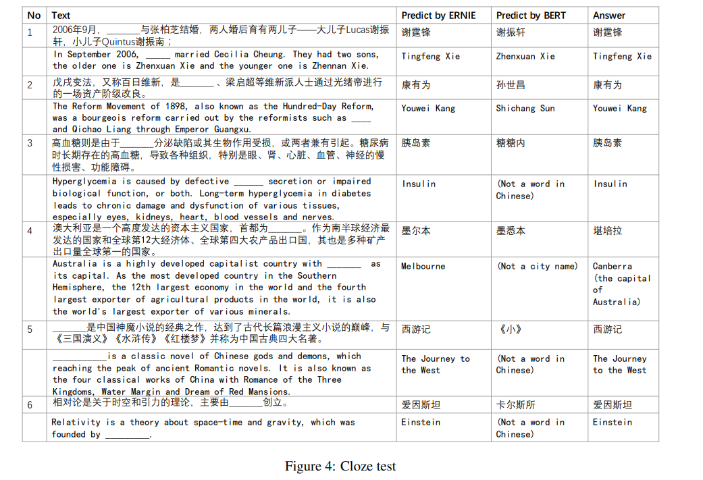

# ERNIE: Enhanced Representation through Knowledge Integration
[toc]
- https://arxiv.org/pdf/1904.09223v1.pdf

## Abstract
- 提出： Enhanced Representation through kNowledge IntEgration
- 知识MASK策略： entity-level masking，phrase-level masking

## 1 Introduction
- 为了获得可靠的词向量，模型被设计为从词共现中通过无监督进行学习
- 上面的研究没有考虑先验知识，将导致对词的预测过于简单，如黑龙(江)的省会是哈尔滨

## 2 Related Work
### 2.1 Context-independent Representation
从NNLM到W2V以及Glove
### 2.2 Context-aware Representation
-  Skip-thought
-  COVE
-  ULMFit
-  ELMo
-  GPT
-  BERT
-  MT-DNN
-   GPT-2
-   XLM
### 2.3 Heterogeneous Data

## 3 Methods

### 3.1 Transformer Encoder
与之前模型的结构相同
中文在每个字之间加空格处理

### 3.2 Knowledge Integration

 Phrase-Level Masking
 : 英语使用词法分析以及Chunking工具进行处理
 中文使用依赖分割工具获取词语词组

Entity-Level Masking
: 人、地点、组织、产品

## 4 Experiments
### 4.1 Heterogeneous Corpus Pre-training
大数据训练

### 4.2 DLM
- DLM (Dialogue Language Model) task
- 使用QRembedding来学习对话，QR可以用于多轮对话
- 还使用句子随机替换后来判断对话是否真假
- 该任务能帮助模型来学习对话中的隐式关系，增强语义表征

### 4.3 Experiments on Chinese NLP Tasks
### 4.4 Experiment results

