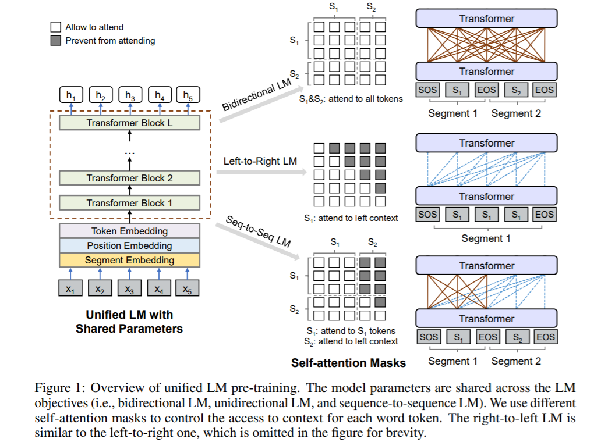

<!-- TOC -->

- [Unified Language Model Pre-training for Natural Language Understanding and Generation](#unified-language-model-pre-training-for-natural-language-understanding-and-generation)
  - [ABSTRACT](#abstract)
  - [1 INTRODUCTION](#1-introduction)
  - [2 UNIFIED LANGUAGE MODEL PRE-TRAINING](#2-unified-language-model-pre-training)
  - [3 EXPERIMENTS](#3-experiments)

<!-- /TOC -->
# Unified Language Model Pre-training for Natural Language Understanding and Generation

## ABSTRACT
- 本文提出了一种新的统一预训练语言模型(Unified pre-trained Language Model，UniLM) ，该模型可以对自然语言理解和生成任务进行微调。该模型使用三种类型的语言建模目标进行预训练: 单向(从左到右和从右到左)、双向和序列到序列预测
- 可以将 UniLM 微调为单向解码器、双向编码器或序列到序列模型，以支持各种下游的自然语言理解和生成任务

## 1 INTRODUCTION

- UniLM 是一个深层的 Transformer 网络，共同对大量的文本进行预训练，针对三种类型的非监督语言建模目标进行优化，如表2所示。特别是，我们为表2中的语言模型设计了一组MASK ，其中基于上下文预测屏蔽词。这些MASK任务的上下文定义方式不同。对于从左到右的单向 LM，要预测的屏蔽词的上下文由其左侧的所有词组成。对于从右向左的单向 LM，上下文由右边的所有单词组成。对于双向 LM，上下文由右边和左边的单词 Devlin 等人(2018)组成。对于序列到序列 LM，第二个(目标)序列中待预测词的上下文包括第一个(源)序列中的所有词以及目标序列中位于其左侧的词
- 与 BERT 类似，预先训练的 UniLM 可以进行微调(如果必要，还可以添加特定于任务的层) ，以适应各种下游任务。但是，与主要用于自然语言理解任务的 BERT 不同，UniLM 可以配置，使用不同的自我注意掩蔽，以聚合不同类型的语言模型的上下文，从而可以用于自然语言理解和生成任务
- 三个主要优点
  - 首先，统一的预训练程序导致一个单一的变压器 LM，它使用不同类型的 LMs 的共享参数和体系结构，减轻了单独训练和托管多个 LMs 的需要
  - 其次，参数共享使得学习的文本表示更加通用，因为它们针对不同的语言建模目标进行了联合优化，上下文以不同的方式被利用，减少了对单个 LM 任务的过度适应
  - 第三，除了它在自然语言理解任务中的应用，使用 UniLM 作为一个Seq2Seq的 LM

- UNILM的预训练是基于大量语料，其在不同任务上的微调在Table 2中已经有所描述。
(1)UNILM作为一个双向encoder：
与BERT在GLUE数据集、SQuAD 2.0和CoQA的抽取式问答对比， 此时的UNILM作为一个双向的encoder。
(2)UNILM作为一个sequence-to-sequence模型：
在摘要生成(CNN/DailyMail)、问题生成(SQuAD)和生成式问答(CoQA)中UNILM作为一个sequence-to-sequence模型

## 2 UNIFIED LANGUAGE MODEL PRE-TRAINING

- UniLM 预训练针对几个无监督语言建模目标(即单向 LM、双向 LM 和序列到序列 LM)优化共享 Transformer 网络。为了控制对要预测的单词标记上下文的访问，我们使用不同的 MASK 来进行自我注意。换句话说，我们使用屏蔽来控制标记在计算其上下文化表示时应该关注多少上下文。一旦对统一 LM 进行了预训练，我们就可以针对各种下游任务对特定于任务的数据进行微调
- 输入 x 是一个字序列，可以是单向 LM 的文本片段，也可以是为双向 LM 和序列到序列 LM padding 的一对片段。我们总是在输入的开头添加一个特殊的序列起始符([ SOS ])。相应的输出向量可以作为整个输入的表示。此外，我们在每个段的末尾附加一个特殊的序列末尾([ EOS ])标记。标记表示一对段的边界。[ EOS ]不仅标记了自然语言理解任务中的句子边界，而且还用于模型学习自然语言生成任务中何时终止解码过程
- WordPiece

## 3 EXPERIMENTS
- 训练目标函数是不同类型 LMs 的平均似然之和。具体来说，在一个培训批中，我们使用双向 LM 目标的1/3时间，使用顺序到顺序 LM 目标的1/3时间，左到右和右到左 LM 目标的采样率都是1/6。对于双向 LM 的例子，我们还添加了下一句预测的平均可能性

- Abstractive Summarization

- Question Answering (QA)

- Question Generation

- Response Generation

- GLUE
