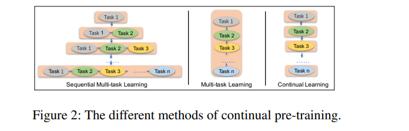
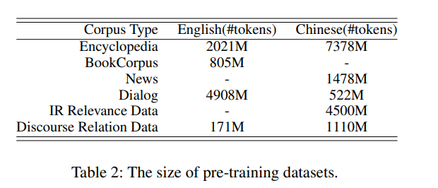
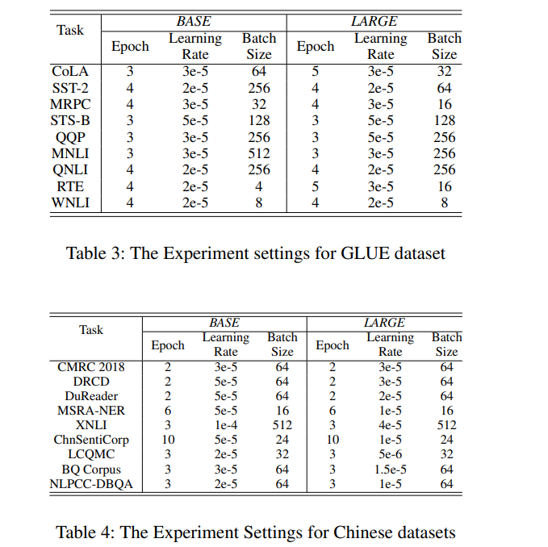
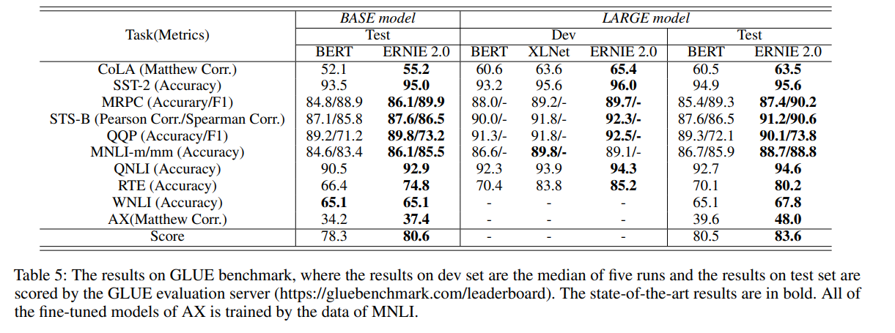
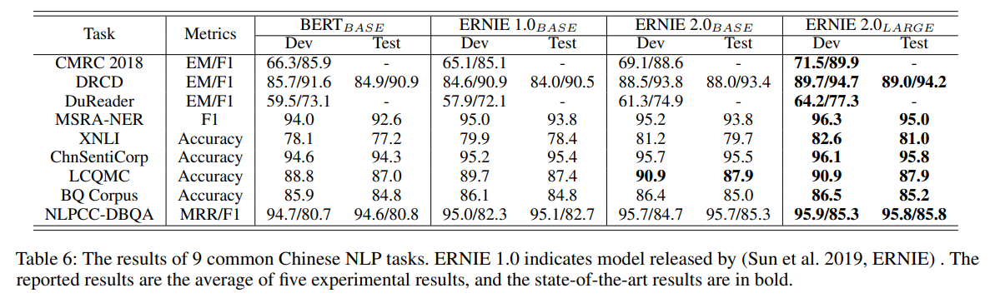
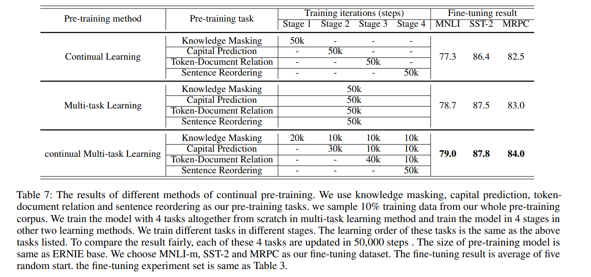

# ERNIE 2.0: A Continual Pre-Training Framework for Language Understanding
[toc]
- https://arxiv.org/pdf/1907.12412
- https://github.com/PaddlePaddle/ERNIE

## Abstract
- 当前预训练模型主要是领会词语或者句子之间的共现关系
- 还有其他的词法、语法、语义信息在语料中，如命名实体识别、语义距离、会话关系等

## Introduction
- 命名实体识别可能包含概念信息，句子顺序或者句子亲近度能使模型去学习结构感知表示，文档级别的语义相似性以及句子间的语篇关系允许模型学习语义感知表示
- ERNIE提出连续多任务学习
- 贡献
  - 支持个性化训练任务以及增量连续多任务学习
  - 使用3累非监督学习任务进行检验，达到最优
  - 代码公开

## Related Work
Continual Learning
: 连续学习目标在于按顺序训练多个任务，使得模型在学习新的任务时记得之前的任务
连续学习来源于人学习的灵感，先学会一样然后再学习其他的，并且不忘记之前的任务

## The ERNIE 2.0 Framework

### Continual Pre-training
Pre-training Tasks Construction
: 使用自监督或者弱监督从大量的数据中获取数据

Continual Multi-task Learning
: 两大问题：1) 如何训练才不会忘记原来的任务；2) 如何有效快速训练

: 使用前面学习到的模型参数进行初始化，然后同时学习新任务和之前的任务
每个任务分配N个迭代，在不同的训练阶段自动划分每个任务的N个迭代

### Fine-tuning for Application Tasks
每个任务微调后都有自己的模型

## ERNIE 2.0 Model

### Model Structure
Transformer Encoder
: 使用transform，[CLS]加在前面，对于多句则[SEP]进行分割

Task Embedding
: 不同的任务使用ID从0到N，每个映射到Task Embedding
在微调阶段可以使用任意Task ID

Pre-training Tasks
: 使用3种不同的任务，词感知任务用捕捉词法信息，结构感知任务用以不住语法信息，语义感知任务用以学习语义信息

### Word-aware Pre-training Tasks
Knowledge Masking Task
: 使用短语Masking以及命名实体Masking，用以学习局部以及全局的依赖信息
作为学习的初始版本

Capitalization Prediction Task
: 大写词语具有重要的语义信息

Token-Document Relation Prediction Task
: 任务预测一个词语出现在一个Segment，是否出现在同文档的另一个segment中；一般来说，这种词语是公共词或者与主题相关的词语；可以学习一个文档的关键词

### Structure-aware Pre-training Tasks
Sentence Reordering Task
: 将一段随机划分为1~m分段，然后进行重排，使用模型进行k-分类（k=$\sum_{n=1}^m n!$，也即是说根据句子个数以及其排列数生成一个大的多分类）；能够学习一个文档中的句子间的关系

Sentence Distance Task
: 3分类，0表示两个句子在同个文档相邻；1表示两个句子在同个文档不相邻；2表示两个句子位于不同的文档中
### Semantic-aware Pre-training Tasks
Discourse Relation Task
: 预测两个句子的语义或修饰关系

IR Relevance Task
: 3分类来表示query与title之间的关系，0表示强相关用户点击；1表示弱相关表示会出现在query搜索结果中，但是不会被用户点击；2表示随机信息

## Experiments

