# ERNIE: Enhanced Language Representation with Informative Entities
[toc]
https://www.aclweb.org/anthology/P19-1139.pdf
https://github.com/thunlp/ERNIE
## Abstract
- NLP表示模型如BERT的预训练模型能够在大量的纯文本语料中捕获丰富的语义信息，并且通过微调改进NLP任务的效果
- 已存在的预训练语言模型很少考虑将知识图谱的结构化信息融入其中，从而提高语言的理解。我们认为知识图谱中的信息实体能够增强语言表示。
- 在这篇论文中，我们利用了大规模的语料信息和知识图谱，去训练一个增强的语言表示模型，它能够同时利用词汇、语义和知识信息。实验结果表明了ERNIE效果很好，在各项知识驱动的任务中都超过了BERT模型

## 1 Introduction
- 预训练语言表征模型已经获得了很好的效果，并且在很多 NLP 任务中都可以作为常规组件，但它却忽略了将知识信息整合到语言理解中
- 如下图 1 所示，如果不知道「Blowin’ in the Wind」和「Chronicles: Volume One」分别是歌曲与书籍，那么模型很难识别它们是 Bob Dylan 的两个工作。即在实体类型任务中，模型识别不出 Bob Dylan 同时是歌曲作家和书籍作者。对于现有的预训练语言表征模型，上面例子的两句话在句法上是有歧义的，例如可以理解为「UNK wrote UNK in UNK」。因此使用丰富的知识信息能构建更好的语言理解模型，也有益于各种知识驱动的应用，例如实体类型和关系分类等

如果要将外部知识组合到语言表征模型中，我们又会遇到两大主要挑战：
- 结构化的知识编码：对于给定的文本，如何高效地抽取并编码对应的知识图谱事实是非常重要的，这些 KG 事实需要能用于语言表征模型。
- 异质信息融合：语言表征的预训练过程和知识表征过程有很大的不同，它们会产生两个独立的向量空间。因此，如何设计一个特殊的预训练目标，以融合词汇、句法和知识信息就显得非常重要了

ERNIE 分为抽取知识信息与训练语言模型两大步骤
- 对于抽取并编码的知识信息，研究者首先识别文本中的命名实体，然后将这些提到的实体与知识图谱中的实体进行匹配。研究者并不直接使用 KG 中基于图的事实，相反他们通过知识嵌入算法（例如 TransE）编码 KG 的图结构，并将多信息实体嵌入作为 ERNIE 的输入。基于文本和知识图谱的对齐，ERNIE 将知识模块的实体表征整合到语义模块的隐藏层中
- 与 BERT 类似，研究者采用了带 Mask 的语言模型，以及预测下一句文本作为预训练目标。除此之外，为了更好地融合文本和知识特征，研究者设计了一种新型预训练目标，即随机 Mask 掉一些对齐了输入文本的命名实体，并要求模型从知识图谱中选择合适的实体以完成对齐。现存的预训练语言表征模型只利用局部上下文预测 Token，但 ERNIE 的新目标要求模型同时聚合上下文和知识事实的信息，并同时预测 Token 和实体，从而构建一种知识化的语言表征模型

研究者针对两种知识驱动型 NLP 任务进行了实验，即实体分型（entity typing）和关系分类。实验结果表明，ERNIE 在知识驱动型任务中效果显著超过当前最佳的 BERT，因此 ERNIE 能完整利用词汇、句法和知识信息的优势。研究者同时在其它一般 NLP 任务中测试 ERNIE，并发现它能获得与 BERT 相媲美的性能

## 2 Related Work
略

## 3 Methodology
### 3.1 Notations

### 3.2 Model Architecture
ERNIE 的整个模型架构由两个堆叠的模块构成：
- 底层的文本编码器（T-Encoder），负责获取输入 token 的词法和句法信息；
- 上层的知识型编码器（K-Encoder），负责将额外的面向 token 的知识信息整合进来自底层的文本信息，这样我们就可以在一个统一的特征空间中表征 token 和实体的异构信息了。我们用 N 表示 T-Encoder 的层数，用 M 表示 K-Encoder 的层数
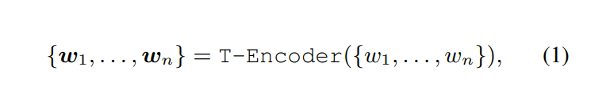
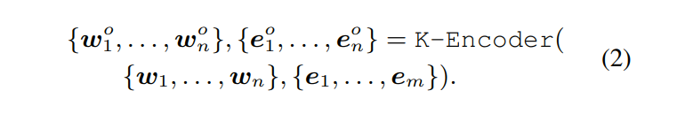

### 3.3 Knowledgeable Encoder
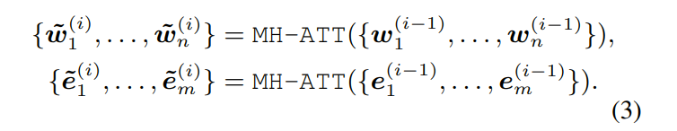
有对齐实体的信息融合计算
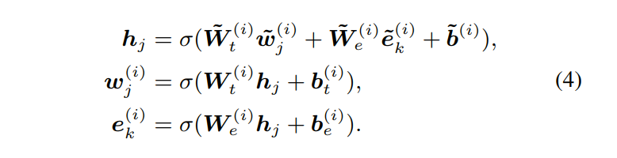
无对齐实体的信息融合计算
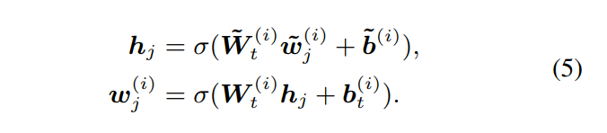
整体融合, 其中hj内部隐藏状态，将词汇和实体信息集成在一起。σ(.)为GELU
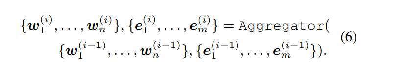

### 3.4 Pre-training for Injecting Knowledge
denoising entity auto-encoder ,dEA
: - 为了通过实体将知识图谱注入语言表征模型，做了一个随机遮挡对齐的token-entity的操作，然后让模型根据对齐的token预测所有对应的实体
  - 降低复杂度,预测实体的整体选择空间为序列中所有实体, 而不是全局实体
  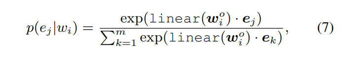
  将使用该值来计算交叉熵损失函数

: 使用如下方法来处理词语-实体对齐过程中的错误
: - 5% 使用随机实体替换该实体, 目的是训练模型纠正词语对齐到错误实体上
: - 15% Mask词语实体对齐,目的是是纠正实体对齐没有查找出来的情况
: - 剩余情况按照正常进行

训练方式包含
- MLM masked Laguage Model
- NSP Next Sentence Prediction
- 总和: dEA + MLM + NSP

### 3.5 Fine-tuning for Specific Tasks

关系分类
: - 关系分类任务需要系统基于上下文分类给定实体对的关系标签。要针对关系分类任务精调ERNIE，最直接的方法是将池化层应用于给定实体提及的最终输出嵌入{$e_1^o, e_2^o...$}，并将它们的提及嵌入的连接结果用于表征给定的实体对，以便进行分类
: - 本文提出了另外一种方式，通过加上mark-token来强调提到的实体以此来改变输入token序列。这种额外标记方式起到类似位置嵌入的作用
: - 使用[HD]和[TL]来指示需要进行关系分类的实体对,然后使用[CLS]进行分类

实体类型
: - 针对实体分型的特定精调过程是关系分类的一种简化版本。因为之前的分型模型对上下文嵌入和实体提及嵌入都进行了充分的利用，所以研究者认为经过提及标记 token [ENT] 修改过的输入序列可以引导 ERNIE 关注将上下文信息与实体提及信息两者结合起来

## 4 Experiments
### 4.1 Pre-training Dataset
由于有dEA, 因此使用wiki百科的数据进行处理, 并且去掉一句话中少于3个实体的. 使用TransE来计算知识库的实体嵌入

### 4.2 Parameter Settings and Training Details
N = 6, M = 6, Hw = 768, He = 100, Aw = 12, Ae = 4.
max sequence = 256

Fine-tune:
batch size: 32,
learning rate (Adam): 5e−5, 3e−5,2e−5
number of epochs: 3 to 10

使用TAGME来提取实体信息
### 4.3 Entity Typing
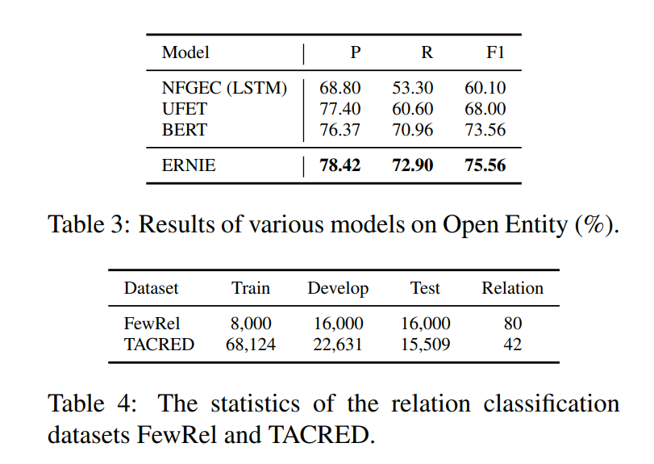

### 4.4 Relation Classification
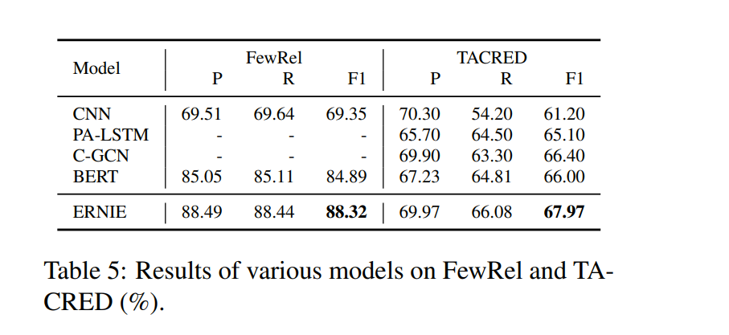

### 4.5 GLUE
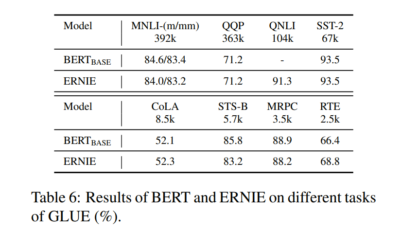

### 4.6 Ablation Study
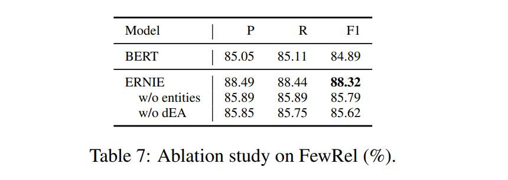

## 5 Conclusion
这篇论文提出了 ERNIE，可将知识信息整合进语言表征模型中。为了更好地融合来自文本和知识图谱的异构信息，这篇论文还提出了知识型聚合器和预训练任务 dEA。实验结果表明，ERNIE 在去除远监督的数据的噪声和在有限数据上精调方面的能力都胜过 BERT。研究者认为还有三个有待未来研究的重要方向: 
- 将知识图谱引入基于特征的预训练模型，如ELMo
- 将多种结构的知识引入语言表示模型
- 标注更多真实语料进行更大规模的预训练
