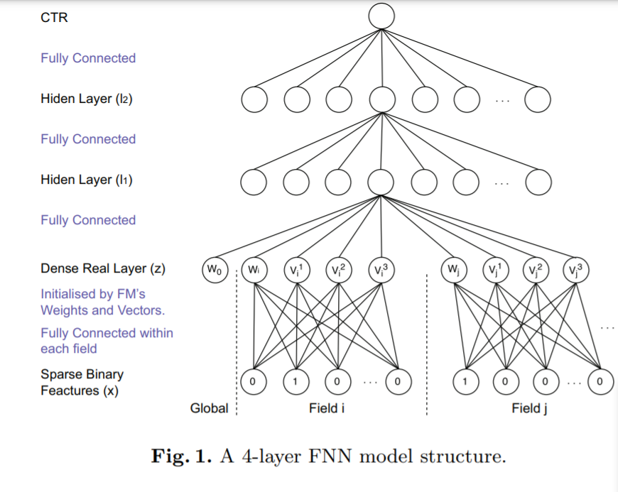

<!-- TOC -->

- [Deep Learning over Multi-field Categorical Data: A Case Study on User Response Prediction](#deep-learning-over-multi-field-categorical-data-a-case-study-on-user-response-prediction)
  - [ABSTRACT](#abstract)
  - [1 INTRODUCTION](#1-introduction)
  - [2 RELATED WORK](#2-related-work)
  - [3 DNNS FOR CTR ESTIMATION GIVEN CATEGORICAL FEATURES](#3-dnns-for-ctr-estimation-given-categorical-features)
    - [FACTORISATION-MACHINE SUPPORTED NEURAL NETWORKS (FNN)](#factorisation-machine-supported-neural-networks-fnn)
    - [SAMPLING-BASED NEURAL NETWORKS (SNN)](#sampling-based-neural-networks-snn)
    - [REGULARISATION](#regularisation)
  - [4 EXPERIMENT](#4-experiment)

<!-- /TOC -->

# Deep Learning over Multi-field Categorical Data: A Case Study on User Response Prediction

- https://arxiv.org/abs/1601.02376

## ABSTRACT
- 用户响应预测模型必须限制自己的线性模型或需要手动建立高阶组合特性。前者失去了探索特征交互的能力，而后者则导致在大的特征空间中进行繁重的计算

- 为了使 dnn 有效地工作，我们提出了三种特征变换方法，即因子分解机器(FMs)、限制性玻耳兹曼机器(RBMs)和去噪自编码器(DAEs)。本文介绍了模型的结构及其有效的训练算法。对真实世界数据的大规模实验表明，我们的方法比主要的最先进的模型工作得更好

## 1 INTRODUCTION
- 本文介绍了两种深度学习模型: 基于因子分解机器的神经网络(FNN)和基于抽样的神经网络(SNN)。提出了一种基于因子分解机器的监督学习嵌入层FNN，有效地将稀疏特征降维为稠密连续特征。第二个模型 SNN 是一个深度神经网络，由基于采样的受限玻尔兹曼机(SNN-rbm)或基于采样的去噪自动编码器(SNN-dae)和一个提出的负采样方法提供动力。在嵌入层的基础上，我们构建了具有完全连接的多层神经网络来探索非平凡的数据模式。我们对多个真实世界广告客户的广告点击数据进行的实验表明，我们提出的模型与最先进的模型相比，在点击率估计方面有一致的改进

## 2 RELATED WORK
- 大多数模型使用的是基于一组稀疏二进制特征的 Logit模型，这些特征是通过一热编码从原始的范畴特征转换而来的
- 在低维向量空间中嵌入大量特征向量，可以降低数据和模型的复杂度，提高训练和预测的有效性和效率，有利于预测任务的实现。已经提出了各种嵌入体系结构的方法[37,23]。因子分解机(FM)[31] ，最初为协同过滤推荐而提出，被认为是最成功的嵌入模型之一。FM自然有能力估计任何两个特征之间的相互作用，通过映射到向量在低阶潜在空间
- 深度学习模型的新颖之处在于第一层的初始化，其中输入的原始特征是从原始分类特征转换而来的高维和稀疏的二进制特征，这使得传统的 dnn 很难在大规模中训练

## 3 DNNS FOR CTR ESTIMATION GIVEN CATEGORICAL FEATURES

### FACTORISATION-MACHINE SUPPORTED NEURAL NETWORKS (FNN)

- 上述神经网络可以更有效地从因子分解机器表示中学习，从而自然地绕过高维二进制输入的计算复杂性问题。不同的隐藏层可以看作是不同的内部函数，它们可以捕获数据实例的不同表示形式。由于这个原因，这个模型具有更多捕获内在数据模式的能力，从而获得更好的性能
- 隐层(FM 层除外)的权重通过分层的 RBM 预训练[3]利用contrastive divergence[17]初始化，有效地保留了输入数据集中的信息
- 损失函数： 交叉熵

### SAMPLING-BASED NEURAL NETWORKS (SNN)

- 为了初始化底层的重量，我们在训练前阶段尝试了受限玻尔兹曼机和去噪自动编码器。为了处理大型稀疏单热编码数据的计算问题，我们提出了一个基于抽样的 RBM (图2(b) ，表示为 snn-RBM)和一个基于抽样的 DAE (图2(c) ，表示为 snn-DAE)来有效地计算底层的初始权重

### REGULARISATION
- 为了防止过度拟合，在损失函数中加入了广泛使用的 L2正则化项
- dropout

## 4 EXPERIMENT
- dataSet： iPinYOU
  - 19.50M data instances with 14.79K positive label (click)
  - Feature examples in the ad log data are user agent, partially masked IP, region, city, ad exchange, domain, URL, ad slot ID, ad slot visibility, ad slot size, ad slot format, creative ID, user tags, etc

- HYPERPARAMETER TUNING
  - 学习率从1,0.1,0.01,0.001到0.0001
  - 提前停止
  - stochastic gradient descent
  - 负样本数 m = 1,2和4进行了尝试，发现 m = 2在大多数情况下产生最好的结果
  - 研究具有3、4和5个隐藏层的体系结构，并发现具有3个隐藏层(即总共5个层)的体系结构在 AUC 性能方面是最好的
  - 尝试所有隐藏单元的组合，而是使用了另一种策略，即在所有三个隐藏层中用相同数量的隐藏单元来调整不同的隐藏层大小，因为具有相同大小的隐藏层的体系结构经验上优于[24]中宽度增加或减小的体系结构
  - Droupout 优于 L2

