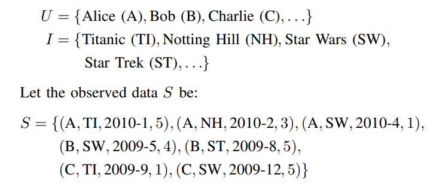
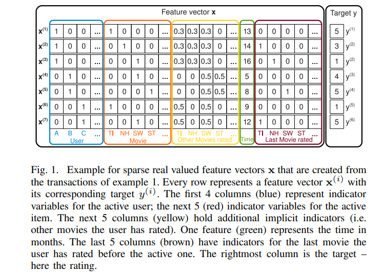
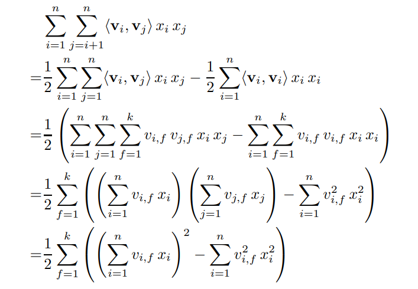
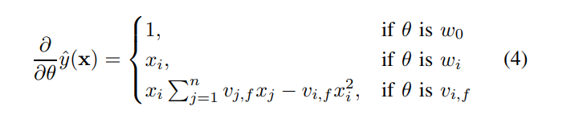
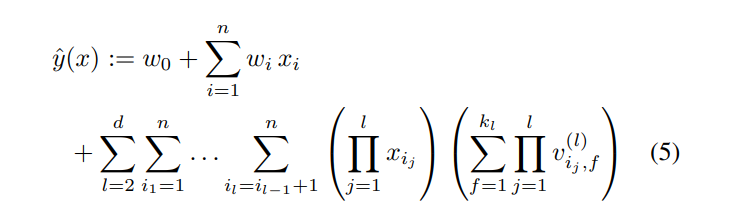

# Factorization Machines
[toc]
- https://www.csie.ntu.edu.tw/~b97053/paper/Rendle2010FM.pdf

### Abstract
- 因子机结合SVM和因子分解模型（factorization models）的优点
- FM用实值向量，与SVM相比FM使用因子分解参数（factorized parameters）模拟所有特征相互作用。因此，即使在SVM不适用的具有巨大稀疏特征（如推荐系统）问题中，他们也能够估计特征的相互作用
- FM的模型方程可以在线性时间内计算，FM可以直接优化。因此，与非线性SVM不同，对偶形式的转换不是必需的，并且可以直接估计模型参数，而无需样本中的任何支持向量。 我们展示了FM与SVM的关系以及FM在稀疏数据中进行参数估计的优势。
- 有很多不同的因子分解模型（如矩阵分解、并行因子分析、SVD++、PITF、FPMC）。这些模型的缺点是它们不适用于一般预测任务，仅适用于特殊输入数据。 此外，他们的模型方程和优化算法是针对每个任务单独导出的。 我们通过指定输入数据（即特征向量）表明FM可以模仿这些模型。 这使得即使对于没有分解模型专业知识的用户，FM也很容易适用

### I. INTRODUCTION
- 协同过滤等算法中，SVM效果不好，最好的模型是标准矩阵/张量因子分解模型的直接应用
  - 本文表明SVM在这些任务中不成功的唯一原因是它们无法在非常稀疏的数据下学习复杂的非线性内核空间中的参数
  - 张量因子分解模型的缺点是：不适用于标准预测数据（如实值特征向量）、需要对不同的任务单独生成不同的专用模型

- 本文引入FM，是通用分类器
  - 能在非常高的稀疏度下估计参数。与SVM中的多项式内核相比，FM模拟所有变量交互，但使用分解参数化（factorized parametrization）而不是像SVM中那样的密集参数化（dense parametrization）
  - FM的模型方程可以在线性时间内计算，它仅取决于线性数量的参数。 这允许直接优化和存储模型参数，而无需存储任何训练数据（例如，支持向量）。 与此相反，非线性SVM通常以对偶形式进行优化，并且计算的模型方程取决于部分训练数据（支持向量）
  - FM是一种可以与任何实值特征向量一起使用的通用预测器。 与此相反，其他最先进的因子分解模型仅适用于非常有限的输入数据

### II. PREDICTION UNDER SPARSITY
- 机器学习常见任务：
  - 分类：hinge损失或logit损失
  - 回归：最小二乘误差
  - 排序：训练一个分值，再按分值排序，分值由成对训练数据（两者之间有先后关系）学习得到

- 在本文中，我们处理x高度稀疏的问题，即几乎矢量x的所有元素xi都为零
  - 令m(x)为特征向量x中的非零元素的数量，非mD为所有向量x∈D的非零元素数m(x)的平均数。巨大稀疏性的一个原因是底层问题涉及大的分类变量域（ One reason for huge sparsity is that the underlying problem deals with large categorical variable domains.）
  - 例子：用户给电影评分

### III. FACTORIZATION MACHINES (FM)
#### A. Factorization Machine Model
Model Equation
: 

Expressiveness
: 对于任何正定矩阵W，一定存在矩阵V，使得W = V·Vt，条件是k足够大。 这表明如果k被选择得足够大，则FM可以表达任何交互矩阵W。然而，在稀疏数据中，通常应该选择小的k，因为没有足够的数据来估计复杂的相互作用W。限制k（FM的表达性）导致更好的泛化，从而改善稀疏性下的交互矩阵

Parameter Estimation Under Sparsity
: 在稀疏环境下，通常没有足够的数据来直接和独立地估计变量之间的交互关系
FM即使在这些设置中也可以很好地估计交互，因为它通过分解破坏了交互参数的独立性
一般来说，这意味着一个交互的数据也有助于估计相关交互的参数
> 假设想要估计爱丽丝(User: A)对于星际迷航(Movie: ST)的评分(Target: y)：
> 显然，训练数据中没有 x_A 和 x_st 都非零的情况，无法直接估计二者间的交互关系, 但是通过因式分解构造相互作用参数 <v_A, v_st>，即使在这种情况下也可以估计交互作用; 首先，鲍伯和查理将有相似的因子向量 V_B 和 V_C ，因为二者在星球大战 V_SW 上有相似的交互，即 <v_B, V_SW> 和 <V_C, V_SW> 是相似的。爱丽丝 V_A 和查理 V_C 将有不同的因子向量，因为她在泰坦尼克号和星球大战的评分上与查理有不同的交互关系; 接下来，星际迷航的因子向量很可能类似于星球大战的因子向量，因为鲍伯对于这两部电影都有相似的评分; 总之，这意味着爱丽丝和星际迷航因子向量的点积 <V_A, V_ST> (即相互作用)将类似于爱丽丝和星球大战 <V_A, V_SW> 因子向量的点积，这在直觉上也是合理的

Computation
: 优化FM使其在计算上更加适用; 直接计算FM的复杂度为 o(kn^2)，因为必须计算所有成对的相互作用; 通过重新配置方程，可以降为线性的复杂度 o(kn)

此外，在稀疏性下，x中的大多数元素是0（即m（x）很小），因此，仅需要在非零元素上计算和。因此，在稀疏应用中，分解机器的计算是$O(k\hat m_D)$, 对于典型的推荐系统 $\hat m_D$ = 2

#### B. Factorization Machines as Predictors
- 略

#### C. Learning Factorization Machines
- FM具有可在线性时间内计算的闭合模型方程
- 可以通过梯度下降在各种loss（square、logit、hinge）监督下学习

- Σj=1,n,vj,fxj这部分求和跟样本i是独立的，因此可以预先计算好
- 每个梯度都是O(1)复杂度

#### D. d-way Factorization Machine

#### E. Summary
FM使用分解形式而不是完全参数化的形式来建模特征向量x中所有可能的交互关系
- 即使在高度稀疏的情况下，也可以估计数值值之间的相互作用，特别是可能捕捉到人工未观察到的相互作用
- 参数的数量以及预测和学习的时间是线性的，可使用SGD直接优化，并允许使用各种损失函数

### IV. FMS VS. SVMS
- SVM的二元特征交叉参数是独立的，而FM的二元特征交叉参数是两个k维的向量vi、vj，这样子的话，<vi,vj>和<vi,vk>就不是独立的，而是相互影响的
- 线性svm只有一维特征，不能挖掘深层次的组合特征在实际预测中并没有很好的表现
- 多项式svm正如前面提到的，交叉的多个特征需要在训练集上共现才能被学习到，否则该对应的参数就为0，这样对于测试集上的case而言这样的特征就失去了意义，因此在稀疏条件下，SVM表现并不能让人满意。而FM不一样，通过向量化的交叉，可以学习到不同特征之间的交互，进行提取到更深层次的抽象意义
- FM可以在原始形式下进行优化学习，而基于kernel的非线性SVM通常需要在对偶形式下进行
- FM的模型预测是与训练样本独立，而SVM则与部分训练样本有关，即支持向量

### V. FMS VS. OTHER FACTORIZATION MODELS
- 略

### VI. CONCLUSION AND FUTURE WORK
- 略
