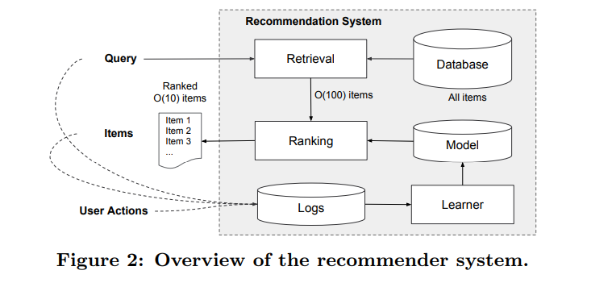
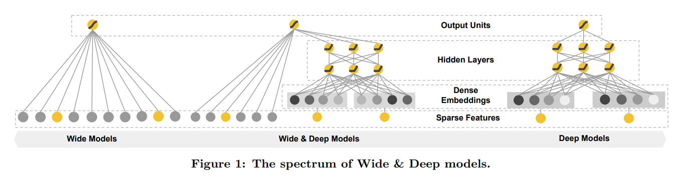
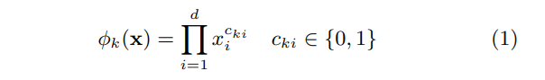
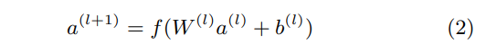
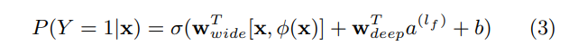
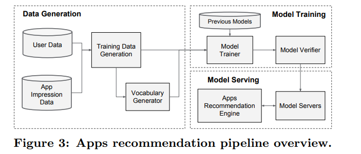
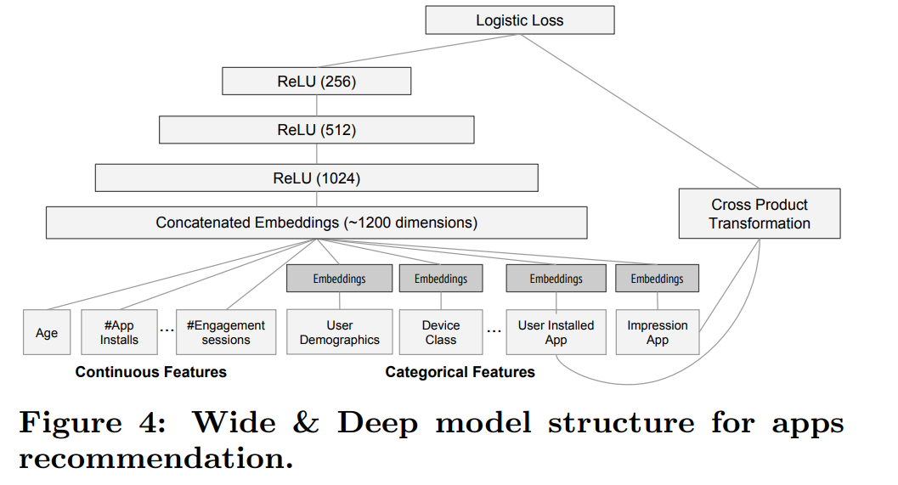
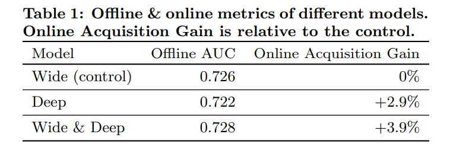
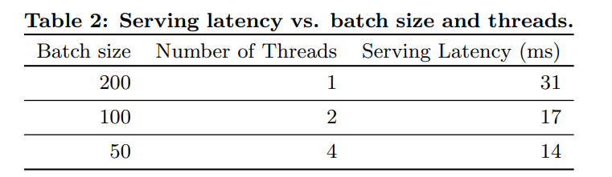

# Wide & Deep Learning for Recommender Systems
[toc]
- https://arxiv.org/pdf/1606.07792.pdf

### ABSTRACT
- 模型有记忆（memorization）和泛化（generalization）能力
  - 记忆，推荐具有极高的相关性而缺少泛化内容
  - 泛化，推荐存在过度泛化和推荐缺乏相关性的问题
  - 在推荐系统中，记忆体现的准确性而泛化体现的是新颖性

### 1. INTRODUCTION
- 推荐系统可以看着搜索排序系统，输入为query，返回为item的列表
- 挑战在于记忆和泛化
  - 记忆可以定位为从历史数据中学习item或者特征的频繁共现以及相关性，推荐主要热门主题性以及直接相关
  - 泛化为基于相关的传递性发现很少出现的新特征，推荐主要多样性
- 本文主要基于GOOGLE的App Store进行推荐

- 基于embedding的模型：如FM或DNN。
可以通过学习低维稠密embedding向量泛化出未见的query-item特征对。当query-item矩阵稀疏且高秩（high-rank）时，例如具有特定偏好的用户或有特定方面吸引力的item。这种情况下大多数query、item不应该存在交互，但是embedding将导致对所有item的非0预测。

- 广义线性模型：如逻辑回归
简单、可拓展、可解释，使用onehot可以有效实现记忆，可以手动添加特征增加泛化。需要手动特征工程，不会泛化到未出现在训练数据中的。

- 本文通过联合训练线性模型组件 和神经网络组件，在一个模型中实现记忆和泛化。该模型显著提高了ctr，同时满足了训练的速度要求。

### 2. RECOMMENDER SYSTEM OVERVIEW

Query 包含各种各样用户以及上下文的特征
第一步为检索，通常使用一些machine learn系统以及用户定义规则集成系统，基于一些信号进行匹配，返回列表
第二步为排序，通常基于特征x计算y的点击概率，特征包含用户特征（国家、语言、人口统计信息）、上下文特征（设备、时间小时、时间周几）、印迹数据（app年龄、app历史统计信息）

### 3. WIDE & DEEP LEARNING

#### 3.1 The Wide Component
- 广义线性模型y=wTx+b，一个最重要的变换特征是cross-product transformation， 捕捉了二元特征之间的相互作用，并为广义线性模型增加了非线性。定义为（cki∈{0,1}是一个布尔变量，如果第i个特征是第k个transformatio即φk 的一部分，则值为1）

对于二分类来说，只有两个特征均为1时该组合特征变换才会为1

#### 3.2 The Deep Component
- 先转为嵌入，维度为O(10) ~ O(100)，然后再进入前馈神经网络

#### 3.3 Joint Training of Wide & Deep Model
- wide和deep的输出加权作为结果，将其送到一个损失函数来联合训练
- 联合训练（joint training）和集成学习（ensemble）之间有区别：
  - 在集成学习中模型之间独立训练，仅在推理时合到一起。独立模型一般比较大
  - 联合训练在训练时考虑其deep和wide，用其总和来同时优化所有参数。wide部分通过补充少量cross-product transformations特征来弥补模型的deep缺点，而不是全尺寸的wide模型
- 预测时，会将 Wide 和 Deep 的输出加权得到结果。在训练时，使用 logistic loss function 做为损失函数。模型优化时，利用 mini-batch stochastic optimization 将梯度信息传到 Wide 和 Deep 部分。然后，Wide 部分通过 FTRL + L1 优化，Deep 部分通过 AdaGrad 优化

### 4. SYSTEM IMPLEMENTATION

#### 4.1 Data Generation
- 对于出现超过一定次数的 categorical feature，ID 化后放入到模型中
- Continuous real-valued features 通过 cumulative distribution function 归一化到 [0, 1] 区间
- categorical feature 由 32 维 embedding 向量组成，最终的输入到 Deep 部分的向量大概在 1200 维

#### 4.2 Model Training
- 训练数据有 500 billion examples， Input layer 会同时产生稀疏(sparse)的和稠密(dense)的特征，具体的 Model 上面已经讨论过了。需要注意的是，当新的训练数据来临的时候，我们用的是热启动(warm-starting)方式，也就是从之前的模型中读取 embeddings 以及 linear model weights 来初始化一个新模型，而不是全部推倒重新训练

#### 4.3 Model Serving
- 略

### 5. EXPERIMENT RESULTS

