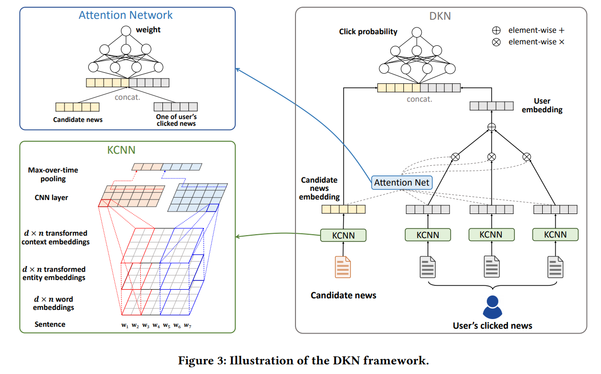
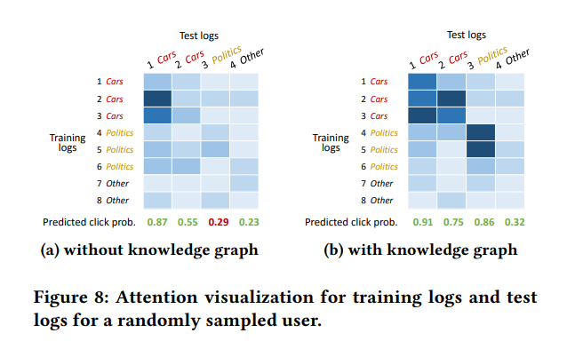

<!-- TOC -->

- [DKN: Deep Knowledge-Aware Network for News Recommendation](#dkn-deep-knowledge-aware-network-for-news-recommendation)
  - [ABSTRACT](#abstract)
  - [1. INTRODUCTION](#1-introduction)
  - [2. PRELIMINARIES](#2-preliminaries)
  - [3. PROBLEM FORMULATION](#3-problem-formulation)
  - [4. DEEP KNOWLEDGE-AWARE NETWORK](#4-deep-knowledge-aware-network)
  - [5. EXPERIMENTS](#5-experiments)

<!-- /TOC -->
# DKN: Deep Knowledge-Aware Network for News Recommendation
- https://arxiv.org/abs/1801.08284
- https://github.com/hwwang55/DKN

## ABSTRACT
- 新闻语言是高度浓缩的，充满了**知识实体和常识**。然而，现有的方法并没有意识到这些外部知识，不能充分发现新闻之间潜在的知识层面的联系
- 关键组成部分是一个多通道和单词实体对齐的知识感知卷积神经网络(KCNN) ，融合了语义层和知识层的新闻表示
- 为了满足用户的不同兴趣，我们还在 DKN 中设计了一个注意力模块，动态地聚合用户当前候选新闻的历史记录

## 1. INTRODUCTION
- 新闻文章是高度时间敏感的，他们的相关性很快在短期内失效
- 人们在新闻阅读中对话题敏感，因为他们通常对多个特定的新闻类别感兴趣。如何根据用户对当前候选新闻的多样化阅读历史，动态地衡量用户的兴趣是新闻推荐系统的关键
- 新闻语言通常是高度浓缩的，由大量的知识实体和常识组成

- 深度知识感知网络(deep knowledge-aware network，DKN)。DKN 是一个基于内容的点击点进率预测模型，它以一条候选新闻和一个用户的点击历史作为输入，并输出用户点击新闻的概率
-  1)多渠道，因为它把单词嵌入、实体嵌入和上下文实体嵌入的新闻视为多个堆叠的渠道，就像彩色图像一样; 2)单词实体对齐，因为它在多个渠道中对齐一个单词及其相关实体，并应用转换函数来消除单词嵌入和实体嵌入空间的异质性

- 我们首先通过将新闻内容中的每个词与知识图表中的相关实体联系起来来丰富其信息。我们还搜索和使用每个实体的上下文实体集(即知识图中的直接邻居)来提供更多的互补和可区分的信息。然后设计了知识感知卷积神经网络(KCNN) ，融合新闻的词级和知识级表示，生成知识感知嵌入向量
- 为了得到一个用户相对于当前候选新闻的动态表示，我们使用了一个注意力模块来自动匹配候选新闻到每一条点击的新闻，并聚合不同权重的用户历史。最后利用深层神经网络对用户嵌入和候选新闻嵌入进行处理，进行点击率预测

## 2. PRELIMINARIES
**KNOWLEDGE GRAPH EMBEDDING**
- 知识图由数百万个实体-关系-实体三元组(h，r，t)组成，其中 h，r 和 t 分别表示一个三元组的头、关系和尾
- 给定知识图中的所有三元组，知识图嵌入的目的是学习每个实体和关系的低维表示向量，以保留原知识图的结构信息

---
**CNN FOR SENTENCE REPRESENTATION LEARNING**

## 3. PROBLEM FORMULATION
- 本文仅以新闻标题为输入，因为标题是影响用户阅读选择的决定性因素

## 4. DEEP KNOWLEDGE-AWARE NETWORK

---
**KNOWLEDGE DISTILLATION**

- 利用实体链接技术(Milne and Witten，2008; Sil and Yates，2013)通过将文本中的提及与知识图中预定义的实体相关联来消除文本中的歧义
- 已识别实体的基础上，构造子图，从原始知识图中提取各子图之间的关系链。请注意，所识别的实体之间的关系可能只是稀疏的，缺乏多样性
- 扩展知识子图到所有实体在一个跳
- 我们发现，在后续的建议中使用单一实体的学习嵌入信息仍然是有限的。为了帮助识别实体在知识图中的位置，我们提出为每个实体提取额外的上下文信息。实体 e 的“上下文”被定义为其知识图中的近邻集合

- 除了使用“搏击俱乐部”本身的嵌入来代表实体，我们还包括它的背景，如“悬念”(类型) ，“布拉德 · 皮特”(演员) ，“美国”(国家)和“奥斯卡”(奖项) ，作为它的标识符

----
- 实体视为“伪单词”，并将它们连接到单词序列
  - 连接策略有以下局限性: 1)连接策略打破了单词和相关实体之间的连接，并且没有意识到它们的对齐。2)词嵌入和实体嵌入是通过不同的方法学习的，这意味着它们不适合卷积在一个单一的向量空间中。3)连接策略隐式地强制字嵌入和实体嵌入具有相同的维度，这在实际设置中可能不是最佳的，因为字和实体嵌入的最佳维度可能彼此不同

---
- 多通道、单词实体对齐的 KCNN，将单词语义和知识信息结合起来

---
**ATTENTION-BASED USER INTEREST EXTRACTION**
- 用户对新闻主题的兴趣可能是多种多样的，当考虑用户 i 是否会点击 t j 时，用户 i 的点击项目应该对候选新闻 t j 有不同的影响。为了描述用户的不同兴趣，我们使用了一个注意力网络(Wang et al. ，2017c; Zhou et al. ，2017)来模拟用户点击新闻对候选新闻的不同影响

## 5. EXPERIMENTS

- 网络新闻中实体的出现模式是稀疏的，有一条长尾(80.4% 的实体出现不超过10次) ，但实体在知识图中一般有丰富的上下文: 每个实体的上下文实体平均数为42.5个，最大值为140,737个。因此，语境实体可以极大地丰富新闻推荐中单个实体的表现形式。

---
- KCNN.字嵌入和实体嵌入的维度都设置为100
- 对于每个窗口大小为1、2、3、4的窗口，过滤器的数量设置为100
- 使用 Adam (Kingma 和 Ba，2014)通过优化log损失来训练 DKN
- 对于 KPCNN，字和实体嵌入的维度都设置为100。对于 DSSM，语义特征维数设置为100。对于 DeepWide，深度和宽度组件的最终表示都设置为100。对于 youtube.com，最终层的尺寸设置为100。对于 LibFM 和 DeepFM，因子分解机器的维数设置为{1,1,0}。对于 DMF，用户和项的潜在表示的维度设置为100

- DKN 的 AUC 分数和额外10个测试日的基线。我们可以观察到，DKN 曲线在10天内始终高于基线，这有力地证明了 DKN 的竞争力。此外，与基线相比，DKN 的性能方差也较小，说明 DKN 在实际应用中也具有较强的稳定性

---

