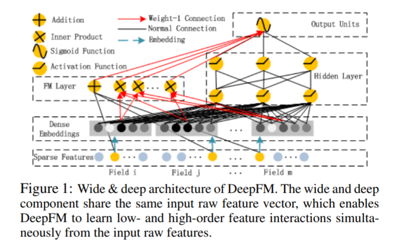

<!-- TOC -->

- [DeepFM: A Factorization-Machine based Neural Network for CTR Prediction](#deepfm-a-factorization-machine-based-neural-network-for-ctr-prediction)
  - [ABSTRACT](#abstract)
  - [1 INTRODUCTION](#1-introduction)
  - [2 OUR APPROACH](#2-our-approach)
    - [FM](#fm)
    - [Deep](#deep)
    - [Relationship with the other Neural Networks](#relationship-with-the-other-neural-networks)
  - [3 Experiments](#3-experiments)

<!-- /TOC -->

# DeepFM: A Factorization-Machine based Neural Network for CTR Prediction

- https://arxiv.org/abs/1703.04247

## ABSTRACT
- 现有的方法似乎对低阶或高阶交互有很强的偏见，或者需要专业知识特性工程
- 证明了一个侧重于低阶和高阶特征交互的端到端学习模型是可能的。该模型将因子分解机器的推荐能力和深度学习能力结合在一个新的神经网络体系结构中，用于特征学习。与谷歌最新的宽深模型相比，DeepFM 对其“宽”和“深”部分有共享输入，除了原始功能外，不需要特性工程

## 1 INTRODUCTION
- 了解用户点击行为背后的隐含特性交互对点击率预测非常重要
- 人们经常在用餐时间下载外卖应用程序，这表明应用程序类别和时间戳之间的交互可以作为点击率的信号
- 男性青少年喜欢射击游戏和 RPG 游戏，这意味着应用类别、用户性别和年龄的交互是点击率的另一个信号
- 用户点击行为背后的功能交互可能非常复杂，低级和高级功能交互都应该扮演重要角色
- 关键的挑战在于有效地建立特征交互的模型。一些特性交互很容易理解，因此可以由专家设计(如上面的实例)。然而，大多数其他特征交互都隐藏在数据中，难以先验地识别(例如，经典的关联规则“尿布和啤酒”是从数据中挖掘出来的，而不是由专家发现的) ，这只能通过机器学习自动捕获
- 线性模型缺乏学习特征交互的能力，通常的做法是在其特征向量中手动包含成对的特征交互。这种方法很难推广到高阶特征交互模型或者那些从未或很少出现在训练数据中的模型

- 主要贡献
  - DeepFM集成了 FM 和深层神经网络(DNN)的体系结构。它对低阶特征交互(如 FM)和高阶特征交互(如 DNN)进行建模
  - 有效地训练，因为它的宽部分和深部分共享相同的输入和嵌入向量
  - 基准数据和商业数据两方面对 DeepFM 进行了评估，结果表明，与现有的 CTR 预测模型相比，该模型有一致的改进

## 2 OUR APPROACH

### FM

- 特征之间的线性相互作用(order -1)之外，FM 还将特征之间的成对相互作用(order -2)作为特征潜矢量的内积
- 能够比以前的方法更有效地捕获阶数为2的特征交互，特别是在数据集稀疏的情况下。在以前的方法中，只有当特征 i 和特征 j 出现在同一个数据记录中时，特征 i 和特征 j 交互的参数才能被训练

### Deep

- 嵌入层将输入向量压缩为低维的、密集的实值向量，然后进一步输入到第一隐藏层，否则网络可能会压倒训练
  - 用户 ID 的一个字段向量很多维度

- 两个有趣特征: 
  - 1)不同输入域向量的长度可以不同，但它们的嵌入大小相同(k) ; 
  - 2) FM 的潜在特征向量(v)作为网络权值，学习并用于将输入域向量压缩为嵌入向量
- 没有像[ Zhang 2016]那样使用 FM 的潜在特征向量来初始化网络，而是将 FM 模型作为我们整体学习架构的一部分，以及其他 DNN 模型，以端到端的方式联合培训整个网络

### Relationship with the other Neural Networks

- FNN: 如图5(左)所示，FNN 是一个 fm 初始化的前馈神经网络[ Zhang et al. 2016]。FM 预训练策略存在两个局限性: 1)嵌入参数可能受 FM 的影响过大; 2)预训练阶段引入的开销降低了效率。此外，模糊神经网络只捕获高阶特征交互
- PNN: 为了捕捉高阶特征交互，PNN 在嵌入层和第一隐藏层之间增加了一个Product层[ Qu et al. 2016]。根据不同类型的产品运算，有三种变量: IPNN、 OPNN 和 PNN/* ，其中 IPNN 是基于向量的内积，OPNN 是基于外积，PNN 是基于内积和外积。
  - 为了提高计算效率，作者提出了内积和外积的近似计算方法: 1)通过剔除部分神经元近似计算内积; 2)通过将 m k 维特征向量压缩成一个 k 维向量近似计算外积。然而，由于外积的近似计算丢失了大量的信息，使得计算结果不稳定，因此外积的可靠性要低于内积。虽然内积更可靠，但由于产品层的输出连接到第一隐层的所有神经元，因此仍然存在计算复杂度高的问题。与 PNN 不同的是，DeepFM 中产品层的输出只连接到最终的输出层(一个神经元)。与FNN一样，所有的FNN都忽略了低阶特征交互

- Wide & Deep: Wide & Deep (图5(右))由 Google 提出，用于同时建模低阶和高阶特征交互。正如[ Cheng 等人2016]所示，在“广泛”部分的输入(例如，用户安装应用程序的跨产品和应用程序推荐中的印象应用程序)上需要专门的特性工程。相比之下，DeepFM 不需要这样的专业知识来直接从输入的原始特性中学习处理输入
  - 这个模型的一个直接的扩展是用 FM 替换 LR (我们在第3节中也评估了这个扩展)。这个扩展类似于 DeepFM，但是 DeepFM 分享了 FM 和 deep 组件之间嵌入的特性。特征嵌入的共享策略(以反向传播的方式)通过低阶和高阶特征交互影响特征表征，从而更精确地模拟特征表征

## 3 Experiments
- Criteo Dataset
  - 90% 用于培训训练，剩下的10% 用于测试
- Company∗ Dataset
  - 我们连续7天在「应用程式商店」的游戏中心收集用户的点击记录，并于次日进行测试。在整个采集的数据集中有大约10亿条记录
  - 在这个数据集中，有应用程序特性(例如，标识、类别等)、用户特性(例如，用户下载的应用程序等)和上下文特性(例如，操作时间等)

- 评估指标
  - AUC (ROC 下面积)和 Logloss (交叉熵)
- MODELS
  - LR, FM, FNN, PNN (three variants), Wide & Deep, and DeepFM

- 参数设置
  - (1) dropout: 0.5; (2) network structure: 400-400-400; (3) optimizer: Adam; (4) activation function: tanh for IPNN, relu for other deep models. To be fair, our proposed DeepFM uses the same setting. The optimizers of LR and FM are FTRL and Adam respectively, and the latent dimension of FM is 10
  - LR 和 FM 的优化器分别是 FTRL 和 Adam，FM 的潜在维数为10

- 效率: 
  - 时间为 LR 训练时间的倍数
  - 结果如图6所示，包括对 CPU (左)和 GPU (右)的测试，其中我们有以下观察: 1)FNN 的预训练使其效率较低; 2)尽管 IPNN 和 PNN 在 GPU 上的速度比其他模型高，但由于内积运算的效率低，它们仍然计算昂贵; 3) DeepFM 在两个测试中几乎都达到了最高的效率

- 结果 
  - 学习特征交互提高了点击率预测模型的性能。这种观察是基于 LR (这是唯一一个不考虑特征交互的模型)比其他模型表现更差这一事实。作为最佳模型，DeepFM 在 Company x 和 criceo 数据集上的 AUC (1.15% 和5.60%)分别比 LR 高出0.86% 和4.18%
  - 同时学习高阶和低阶特征交互，适当地提高了点击率预测模型的性能。DeepFM 的性能优于只学习低阶特征交互(即 FM)或高阶特征交互(即 FNN、 IPNN、 OPNN、 PNN x)的模型 
    - than 0.37% and 0.25% in terms of AUC (0.42% and 0.29% in terms of Logloss) on Company ∗  and Criteo datasets
  - 相比 LR & DNN 和 FM & DNN 效果好，DeepFM 在 Company x 和 criceo 数据集上的 AUC 分别达到0.48% 和0.33% 以上(Logloss 分别为0.61% 和0.66%)

---
- HYPER-PARAMETER STUDY

- 激活函数
  - 对于所有深度模型，除了 IPNN，relu 比 tanh 更合适。可能的原因是 relu 引起稀疏性

- Dropout 
  - 神经元保留在网络中的概率。 Dropout 是一个正则化技术妥协的精度和复杂性的神经网络。我们把 Dropout 率设置为1.0,0.9,0.8,0.7,0.6,0.5
  - 在模型中加入合理的随机性可以增强模型的鲁棒性

- Number of Neurons per Layer
  - 当其他因素保持不变时，增加每层神经元的数量会带来复杂性。正如我们可以从图9中观察到的，增加神经元的数量并不总是带来好处。例如，当每层神经元数目由400个增加到800个时，DeepFM 的性能稳定; 当每层神经元数目由400个增加到800个时，OPNN 的性能更差。这是因为一个过于复杂的模型很容易过度适合。在我们的数据集中，每层200或400个神经元是一个很好的选择

- Number of Hidden Layers
  - 增加隐藏层的数量会在开始时提高模型的性能，但是，如果隐藏层的数量不断增加，它们的性能就会降低。这种现象也是因为过拟合

- Network Shape
  - 四种不同的网络形状: 常数、增加、减少和菱形。当我们改变网络的形状时，我们确定了隐藏层的数量和神经元的总数。例如，当隐层数为3，神经元总数为600时，有四种不同的形状: 常数(200-200-200)、增加(100-200-300)、减少(300-200-100)和菱形(150-300-150)。正如我们可以从图11中看到的那样，“常量”网络形状在经验上优于其他三种选择，这与以前的研究一致
