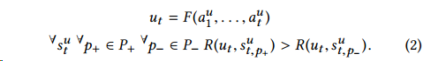
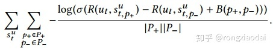
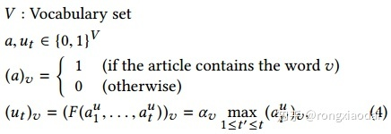
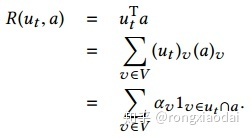
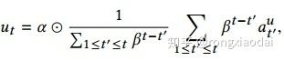
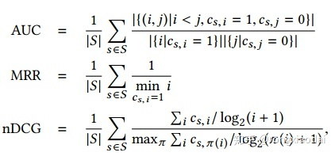
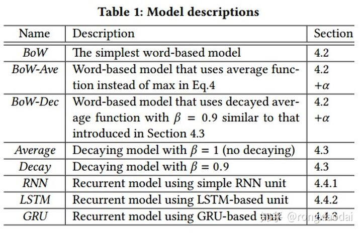
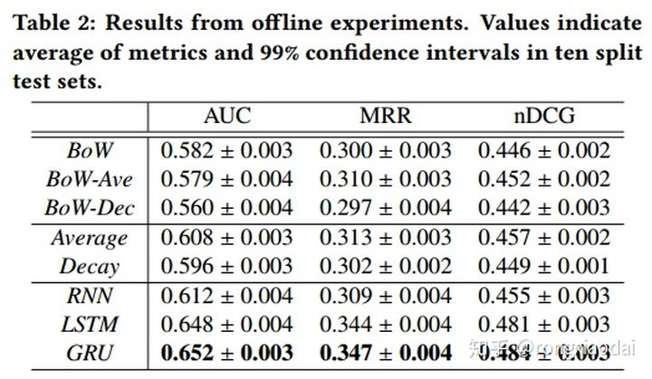
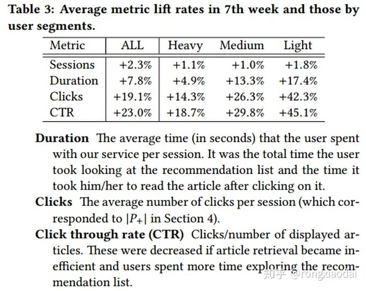
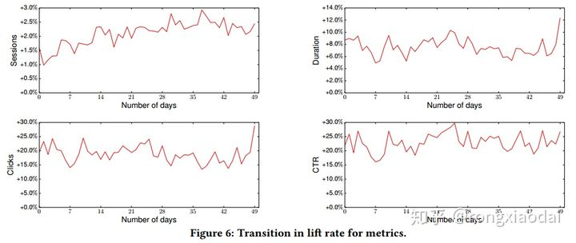

<!-- TOC -->

- [Embedding-based News Recommendation for Millions of Users](#embedding-based-news-recommendation-for-millions-of-users)
  - [摘要](#摘要)
  - [1 介绍](#1-介绍)
  - [2 服务和工作流](#2-服务和工作流)
  - [3 文章表示](#3-文章表示)
  - [4 用户表示](#4-用户表示)
    - [符号](#符号)
    - [基于词的模型](#基于词的模型)
    - [衰减模型](#衰减模型)
    - [循环模型](#循环模型)
  - [5 离线实验](#5-离线实验)
    - [训练数据集](#训练数据集)
    - [测试集](#测试集)
    - [离线度量](#离线度量)
    - [模型和训练](#模型和训练)
    - [实验结果](#实验结果)
  - [6 部署](#6-部署)
    - [设置](#设置)
    - [在线度量](#在线度量)
    - [实验结果](#实验结果-1)
    - [深度学习部署上的挑战](#深度学习部署上的挑战)

<!-- /TOC -->
# Embedding-based News Recommendation for Millions of Users

## 摘要
- 虽然基于ID的方法如协同过滤和低秩分解是众所周知的推荐方法，但这种方法不适合新闻推荐，因为候选文章过期很快，并在短时间内被新文章取代

- 基于单词的方法，通常在信息检索设置中使用，在系统性能方面是很好的候选者，但是也有一些挑战，比如处理同义词和拼写变体，以及定义用户历史活动中的“查询”

- 提出了一种基于嵌入的端到端方式使用分布式表示的方法: (i)从基于一种去噪自动编码器的文章分布式表示开始，(ii)生成以浏览历史记录作为输入序列的用户表示递归神经网络(RNN) ，(iii)基于内积操作为每个用户的匹配和列表文章考虑系统性能

## 1 介绍
- 在新闻的推荐中，有三个关键点：
  - 理解文章的内容
  - 理解用户的偏好
  - 基于文章内容和用户偏好，为不同的用户列出不同的文章列表

- 推荐系统基线: 文章可以认为是文本中的词的集合，用户可以看成是他最近读过的文章中的词的集合，然后通过词共现的方式来学习用户点击某篇文章的概率
  - 可以反映出用户的近期的偏好，由于模型很简单，可以在很短的时间间隔上进行更新。而且排序估计可以在已有的搜索引擎上使用词的倒排索引的方式得到
  - 推荐的质量上有一些负面的影响
    - 第一个问题就是词的表示，当一个词被用作了特征，另外两个意思相同的词会被认为是完全不一样的特征，如果他们的标记是不一样的话。当不同的内容提供者就同一个事件提交了文章的时候，这个问题就开始显现
    - 第二个问题在于处理用户的浏览历史的时候，在这个方法中，用户的浏览历史被处理成一个集合。但是，浏览历史实际上是一个序列，它们之间的顺序可以反映出用户兴趣的转移。我们还需要注意用户的历史记录的长度的变化是非常大的
    - 如果我们构建一个RNN来预测用户和新闻之间的兴趣匹配度的话，可能没办法在系统需要的时间约束内完成

- 这个方法的关键就是使用内积来预测文章—用户之间的相关性。我们可以提前算好用户和文章的向量表示。当用户访问我们的服务的时候，我们只要选择这个用户的表示，然后和所有的候选文章做内积。这种方法同时兼顾了用户的历史浏览行为的表示和实时性的要求

## 2 服务和工作流

- 顶上有个搜索栏，连接到其他的服务。中间是主题模块，提供了6篇重要的新闻，是由专业人员选出来的。底下是个性化模块，提供个性化的推荐。用户在个性化模块部分往下滑动的话，可以想看多少新闻都可以。大部分用户一般只会滑动看前20条，这篇文章描述的就是这个个性化模块的推荐方法

- 通过5个操作来为百万的用户进行文章的挑选：
  - 身份确认：从用户的历史中事先得到用户的特征
  - 匹配：使用用户的特征抽取所有用户可用的文章
  - 排序：用特定的优先级对列表进行重排序
  - 去重：去掉那些包含了相同的信息的内容
  - 广告：如果需要的话就插入广告

- 这些操作需要在几百毫秒内完成。实际上，从新闻的保鲜度的角度看，所有的新闻会在24小时内过期，每天会产生成千上万的新的文章，旧的文章会被去掉。每个操作都利用了非常轻量计算的方法，利用了预先计算的用户表示和文章表示
- 通过匹配用户的表示和文章表示的内积来选择候选文章，我们在排序的时候，考虑到了一些额外的因素，如文章的预计的页数，文章的新鲜度等。我们使用余弦距离，使用贪心方法去掉相似的文章。因为相似的文章会降低推荐的多样性

## 3 文章表示
- 基于去噪自编码器生成的，使用了弱监督的方法。传统的去噪自编码器的形式

- h就是我们用来表示x的向量。不过，h只有来自x的信息，我们想要的是，如果x0和x1很相似的话，h1和h2的内积会很大。为了得到这个效果，我们使用了三元组（x0, x1, x2），作为训练的输入，然后修改了损失函数

- x0和x1是相似的，x0和x2是不相似的，方程（1）满足当x趋近于0的时候，h也是趋近于0的，这表示当x里面没什么内容的时候，h是和任何其他的文章都不相似的。图2给出了这个方法的大概结构

- h作为文章的表示（1）可以输入用户状态函数（2）可以度量用户和文章的匹配程度（3）可以度量文章之间的相似性，去除重复

## 4 用户表示

### 符号
- 浏览指的是用户访问文章的页面。会话指的是用户调用推荐服务，并且点击了推荐列表中的一篇文章。
- 会话对应了一个给用户u推荐的列表，我们可以通过这个文章的列表来表示整个会话。P是推荐列表的位置集合，P+ 是点击的位置，P- 是没有点击的位置

- 需要两个函数，第一个就是计算当前用户状态与文章匹配程度的函数R(u_t,a)R(ut,a)，另一个就是表示用户当前状态的函数F 
- 考虑到需要应用到实时的场景中，F的计算需要非常的快。因为候选文章会频繁的替换，因此不能提前计算好R，所以需要在非常短的时间内计算出这个得分。不过，我们有足够的时间去计算用户的状态函数F，我们只要在下一次会话之前计算好就可以了

实际操作的时候，会有一个bias，点击的概率是依赖于展示的位置的，我们使用下面的目标函数把这个bias加了进去，其中B是一个参数，通过学习得到

### 基于词的模型
- 模型可以认为是上一节中所描述的一种特殊形式，文章表示a和用户状态函数F定义

- 计算相关性的函数变成了简单的线性模型

- 模型有两个主要的问题：
  - 1、表示的稀疏性，只有当ut和a之间相同的词越多的时候，相关性才会越高，因此，尽管用户对相似的文章感兴趣，如果所用的词不一样的话，相关性也会差很多
  - 2、第二个问题是强度，浏览历史被认为是一个集合，浏览历史的顺序和频次信息丢失掉了，这样的模型非常容易受噪声影响

### 衰减模型
- 这个模型相对于baseline有两个改动：
  - 使用分布表示来表示文章，代替词袋
  - 使用加权平均来聚合历史浏览数据，而不是取最大值，更具体一点，我们对近期的浏览使用大权重，过去的浏览使用小权重

a是一个参数向量，具有和 $a^u_t$ 相同的维度，β是一个标量，在0到1之间，在这个模型中，训练参数只有a

### 循环模型
- 上面的模型也有其问题，比如线性模型的限制，遗忘效果受到指数衰减的限制

- 尝试通过RNN来学习这个函数, LSTM和GRU

## 5 离线实验
### 训练数据集
- 采样了1200万用户，这些用户至少点击了一篇文章，对于每个用户，随机抽取了2周时间段的日志，包括了至少一次点击。这种方法可以减少一些热门的文章在某段时间内的影响
- 最终，数据集中有166百万的会话，10亿浏览，2百万不同的文章，还在同一个时间段内创建了验证集

### 测试集
- 采样了500000个会话，在2016年10月，用户点击的文章的位置在20以上，每个会话我们抽取了2周以内的日志，我们使用了位置从1到20的文章作为验证，不管有没有出现在屏幕上

### 离线度量

### 模型和训练
- 提出了五种不同模型来表现用户的当前状态
  - Word-based model，前文所述baseline的算法，用出现的词的交集来衡量相似度，这样做难以解决同义词的问题，也面临着稀疏性的难题
  - Decaying model，基于词袋模型做了时间的衰减
  - Simple recurrent unit，单纯的RNN模型
  - Long-short term memory unit，lstm，解决梯度弥散的问题
  - Gated recurrent unit，GRU模型，同样用于解决梯度弥散的问题

### 实验结果

## 6 部署
### 设置
- 用户状态是从历史浏览记录中事先算好的
- 当用户访问我们的服务的时候，我们对所有的在最近发布的文章计算相关性得分
- 去重之后，我们按照得分降序呈现给用户

### 在线度量
下面列出了4个在线度量的指标：
- 会话：用户每天调用我们的服务的平均次数

### 实验结果

###  深度学习部署上的挑战
非常重要的一点是需要频繁的更新模型来适应新的数据分布。但是有几个原因无法非常频繁的更新模型：
- 训练模型需要很长的时间，即便是使用GPU也需要几周
- 如果更新的文章表示模型，需要重新计算所有的文章，并更新索引
- 如果更新了用户表示模型，需要重新计算所有的历史浏览状态，实际上对于一段时间以外的历史数据，没办法重新计算，只能丢弃。
- 存储用户表示和文章表示的搜索索引需要同步

