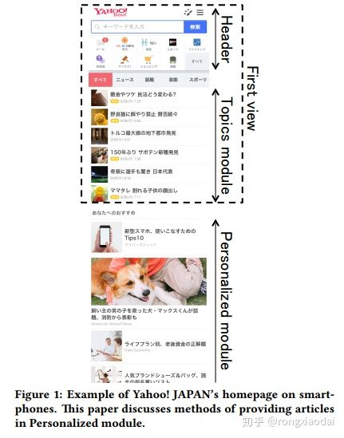
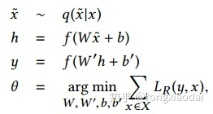
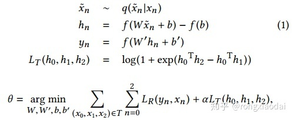
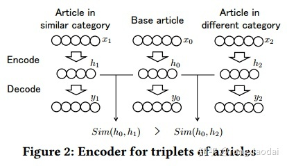
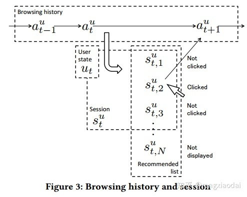

<!-- TOC -->

- [Embedding-based News Recommendation for Millions of Users](#embedding-based-news-recommendation-for-millions-of-users)
  - [摘要](#摘要)
  - [1 介绍](#1-介绍)
  - [2 服务和工作流](#2-服务和工作流)
  - [3 文章表示](#3-文章表示)
  - [4 用户表示](#4-用户表示)
    - [符号](#符号)
    - [基于词的baseline](#基于词的baseline)
    - 

<!-- /TOC -->
# Embedding-based News Recommendation for Millions of Users

## 摘要
- 虽然基于ID的方法如协同过滤和低秩分解是众所周知的推荐方法，但这种方法不适合新闻推荐，因为候选文章过期很快，并在短时间内被新文章取代

- 基于单词的方法，通常在信息检索设置中使用，在系统性能方面是很好的候选者，但是也有一些挑战，比如处理同义词和拼写变体，以及定义用户历史活动中的“查询”

- 提出了一种基于嵌入的端到端方式使用分布式表示的方法: (i)从基于一种去噪自动编码器的文章分布式表示开始，(ii)生成以浏览历史记录作为输入序列的用户表示递归神经网络(RNN) ，(iii)基于内积操作为每个用户的匹配和列表文章考虑系统性能

## 1 介绍
- 在新闻的推荐中，有三个关键点：
  - 理解文章的内容
  - 理解用户的偏好
  - 基于文章内容和用户偏好，为不同的用户列出不同的文章列表

- 推荐系统基线: 文章可以认为是文本中的词的集合，用户可以看成是他最近读过的文章中的词的集合，然后通过词共现的方式来学习用户点击某篇文章的概率
  - 可以反映出用户的近期的偏好，由于模型很简单，可以在很短的时间间隔上进行更新。而且排序估计可以在已有的搜索引擎上使用词的倒排索引的方式得到
  - 推荐的质量上有一些负面的影响
    - 第一个问题就是词的表示，当一个词被用作了特征，另外两个意思相同的词会被认为是完全不一样的特征，如果他们的标记是不一样的话。当不同的内容提供者就同一个事件提交了文章的时候，这个问题就开始显现
    - 第二个问题在于处理用户的浏览历史的时候，在这个方法中，用户的浏览历史被处理成一个集合。但是，浏览历史实际上是一个序列，它们之间的顺序可以反映出用户兴趣的转移。我们还需要注意用户的历史记录的长度的变化是非常大的
    - 如果我们构建一个RNN来预测用户和新闻之间的兴趣匹配度的话，可能没办法在系统需要的时间约束内完成

- 这个方法的关键就是使用内积来预测文章—用户之间的相关性。我们可以提前算好用户和文章的向量表示。当用户访问我们的服务的时候，我们只要选择这个用户的表示，然后和所有的候选文章做内积。这种方法同时兼顾了用户的历史浏览行为的表示和实时性的要求

## 2 服务和工作流

- 顶上有个搜索栏，连接到其他的服务。中间是主题模块，提供了6篇重要的新闻，是由专业人员选出来的。底下是个性化模块，提供个性化的推荐。用户在个性化模块部分往下滑动的话，可以想看多少新闻都可以。大部分用户一般只会滑动看前20条，这篇文章描述的就是这个个性化模块的推荐方法

- 通过5个操作来为百万的用户进行文章的挑选：
  - 身份确认：从用户的历史中事先得到用户的特征
  - 匹配：使用用户的特征抽取所有用户可用的文章
  - 排序：用特定的优先级对列表进行重排序
  - 去重：去掉那些包含了相同的信息的内容
  - 广告：如果需要的话就插入广告

- 这些操作需要在几百毫秒内完成。实际上，从新闻的保鲜度的角度看，所有的新闻会在24小时内过期，每天会产生成千上万的新的文章，旧的文章会被去掉。每个操作都利用了非常轻量计算的方法，利用了预先计算的用户表示和文章表示
- 通过匹配用户的表示和文章表示的内积来选择候选文章，我们在排序的时候，考虑到了一些额外的因素，如文章的预计的页数，文章的新鲜度等。我们使用余弦距离，使用贪心方法去掉相似的文章。因为相似的文章会降低推荐的多样性

## 3 文章表示
- 基于去噪自编码器生成的，使用了弱监督的方法。传统的去噪自编码器的形式

- h就是我们用来表示x的向量。不过，h只有来自x的信息，我们想要的是，如果x0和x1很相似的话，h1和h2的内积会很大。为了得到这个效果，我们使用了三元组（x0, x1, x2），作为训练的输入，然后修改了损失函数

- x0和x1是相似的，x0和x2是不相似的，方程（1）满足当x趋近于0的时候，h也是趋近于0的，这表示当x里面没什么内容的时候，h是和任何其他的文章都不相似的。图2给出了这个方法的大概结构

- h作为文章的表示（1）可以输入用户状态函数（2）可以度量用户和文章的匹配程度（3）可以度量文章之间的相似性，去除重复

## 4 用户表示

### 符号
- 浏览指的是用户访问文章的页面。会话指的是用户调用推荐服务，并且点击了推荐列表中的一篇文章。
- 会话对应了一个给用户u推荐的列表，我们可以通过这个文章的列表来表示整个会话。P是推荐列表的位置集合，P+ 是点击的位置，P- 是没有点击的位置

### 基于词的baseline

### 