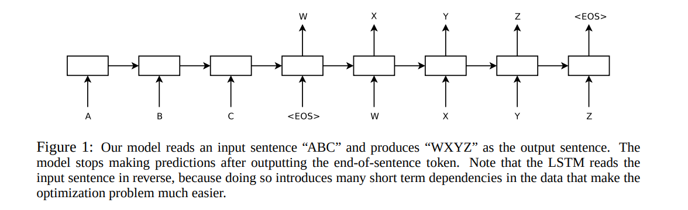
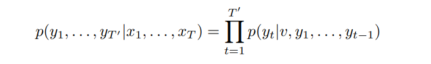
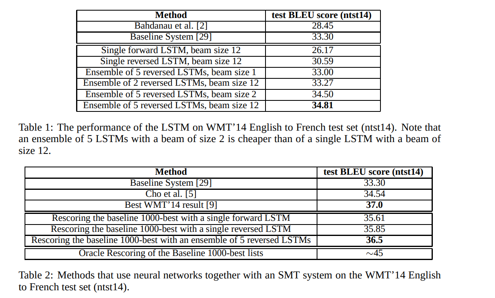
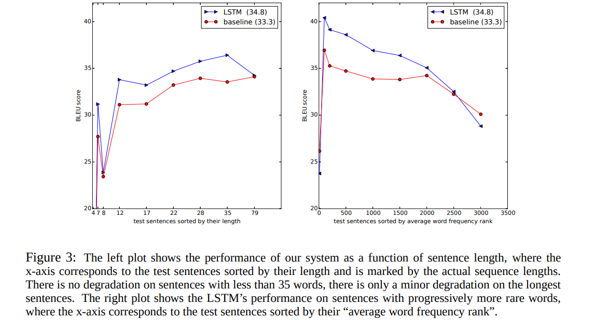
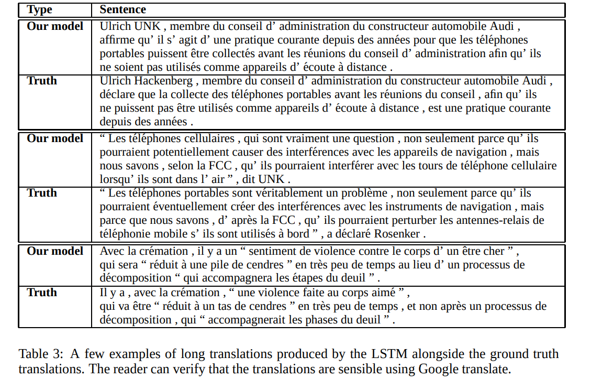
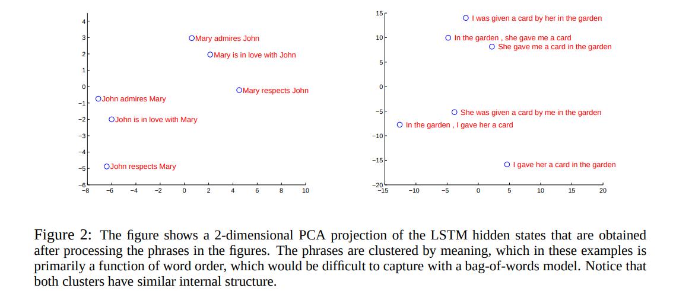

# Sequence to Sequence Learning with Neural Networks
[toc]

### Abstract
- 提出了一种通用的端到端序列学习方法，它对序列结构作出最小的假设
- 使用多层长短期记忆网络(LSTM)将输入序列映射到一个固定维度的向量，然后使用另一个深层LSTM从向量中解码目标序列
- 在WMT 14数据集的英法翻译任务中，LSTM的翻译在整个测试集中获得了34.8分的BLEU分数，而LSTM的BLEU分数在词汇外的单词上被扣分。此外，LSTM人在长句上没有困难。相比之下，基于短语的SMT在同一数据集上的BLEU得分为33.3。当我们使用LSTM对上述系统产生的1000个假设进行重新排序时，它的BLEU分数增加到36.5，这接近于之前在这项任务中的最佳结果。LSTM还学会了对词序敏感、并且对主动语态和被动语态相对不变的有意义的短语和句子表达
- 颠倒所有源句(而不是目标句)中单词的顺序显著提高了LSTM的表现，因为这样做在源句和目标句之间引入了许多短期依赖性，使得优化问题变得更容易

### 1 Introduction

- 序列对DNN来说是一个挑战，因为它们要求输入和输出的维数是已知并且是固定的
- 在本文中，展示了长短期记忆网络(LSTM)架构的直接应用可以解决一般序列到序列的问题。想法是使用一个LSTM来读取输入序列，一次一步，以获得大的固定维向量表示，然后使用另一个LSTM来从该向量中提取输出序列。第二个LSTM本质上是一个递归神经网络语言模型除了它是以输入序列为条件。由于输入和相应输出之间存在相当大的时间延迟，LSTM成功学习具有长期时间依赖性的数据的能力使其成为该应用的自然选择

- 在WMT的14个英法翻译任务中，我们通过使用简单的从左到右波束搜索解码器直接从5个深度的LSTMs(每个深度LSTMs具有384M参数和8000维状态)的集合中提取翻译，获得了34.81的BLEU分数。这是迄今为止用大型神经网络直接翻译获得的最佳结果。相比之下，在该数据集上SMT基准的BLEU分数为33.30。34.81 BLEU分数是由一个拥有80k单词词汇量的LSTM人获得的，因此每当参考译文包含这80k单词未涵盖的单词时，该分数就会被扣分。该结果表明，相对未优化的小词汇量神经网络体系结构比基于短语的SMT系统具有更大的改进空间
- 利用LSTM重新获得了在同一任务中可公开获得的1000个最佳工管基准列表。通过这样做，我们获得了36.5分的BLEU分数，这将基准提高了3.2个BLEU点，并且接近于之前关于该任务的最佳发表结果(即37.0)

- LSTM没有在很长的句子受到影响，尽管其他研究人员最近有相关结构的经验。我们能够在长句上做得很好，因为我们颠倒了源句中的单词顺序，而不是训练和测试集中的目标句。通过这样做，我们引入了许多短期依赖性，这使得优化问题变得简单得多。因此，SGD可以学习没有长句子问题的LSTMs。颠倒源句中单词的简单技巧是这项工作的关键技术贡献之一

- LSTM的一个有用的特性是它学会将可变长度的输入句子映射成固定维向量表示。鉴于翻译往往是源句的释义，翻译目标鼓励LSTM寻找能捕捉其意义的句子表征，因为具有相似意义的句子彼此接近而不同句子的意义会相差很远。一项定性评估支持了这一说法，表明我们的模型知道词序，并且对主动语态和被动语态相当不变

### 2 The model
- 递归神经网络(RNN) 是前馈神经网络对序列的自然推广。给定输入序列(x1，… , xT)，标准RNN计算输出序列(y1，… ，yT)通过迭代以下等式

- 通用序列学习的最简单策略是使用一个RNN将输入序列映射到固定大小的向量，然后使用另一个RNN将向量映射到目标序列。虽然它原则上是可行的，因为向RNN提供了所有相关信息，但由于由此产生的长期依赖关系，很难训练区域网络(图1) 。然而，众所周知的是长短期记忆网络(LSTM) 学习长期时间依赖的问题，因此LSTM可能在这种情况下取得成功

- LSTM的目标是估计条件概率p(y1，…，yT’| x1，… ，xT)其中(x1，… ，xT)是输入序列，y1，…yT’为其对应的输出序列， 其长度T’可能与T不同，LSTM通过首先获得输入序列(x1，…，xT)由LSTM的最后一个隐藏状态给出，然后计算y1，… ，yT’，其初始隐藏状态被设置为x1，… ，xT

在这个等式中，每个p(yt|v，y1，… yt-1)分布用词汇表中所有单词的softmax表示。我们使用格雷夫斯[10]的LSTM公式。请注意，我们要求每个句子都以一个特殊的句尾符号“< EOS >”结尾，这使得模型能够定义所有可能长度序列的分布。总体方案如图1所示，图中所示的LSTM计算“A”、“B”、“C”、“< EOS >”的表示，然后使用该表示计算“W”、“X”、“Y”、“Z”、“< EOS >”的概率

- 我们的实际模型在三个重要方面不同于上面的描述。首先，我们使用了两种不同的LSTM:一种用于输入序列，另一种用于输出序列，因为这样做以可以忽略的计算成本增加了模型参数的数量，并且使得在多种语言对上同时训练LSTM变得很自然。第二，我们发现deep LSTMs明显优于shallow LSTMs，所以我们选择了一个有4层的LSTM。第三，我们发现颠倒输入句子的单词顺序非常有价值。因此，举例来说，不是把句子a、b、c映射到句子α、β、γ，而是要求LSTM把c、b、a映射到α、β、γ，其中α、β、γ是a、b、c的翻译。这样，a非常接近α，b非常接近β，以此类推，这使得SGD很容易在输入和输出之间“建立通信”。我们发现这种简单的数据转换大大提高了LSTM的性能

### 3 Experiment
以两种方式将我们的方法应用于WMT14英语到法语的机器翻译任务中。我们用它来直接翻译输入的句子，而不使用引用的SMT系统，我们用它来重新存储SMT基准的n个最佳列表。我们报告这些翻译方法的准确性，呈现示例翻译，并可视化结果句子表示

#### 3.1 Dataset details
- 使用了WMT14英语到法语数据集。我们对我们的模型进行了12M感知子集的训练，该子集由348M法语单词和304M英语单词组成，这是的一个干净的“精选”子集。我们选择此翻译任务和此特定训练集子集，是因为标记化训练和测试集以及基准SMT中的1000个最佳列表可供公众使用。

- 由于典型的神经语言模型依赖于每个单词的向量表示，我们对两种语言都使用了固定的词汇。我们对源语言使用了160000个最频繁的单词，对目标语言使用了80000个最频繁的单词。每个词汇外的单词都被一个特殊的“UNK”标记代替

#### 3.2 Decoding and Rescoring
- 我们实验的核心是在许多句子对上训练一个大而深的LSTM。我们通过最大化给定源句子的正确翻译的对数概率来训练它，所以训练目标是

- 训练完成后，通过寻找最有可能的翻译来进行翻译

我们使用简单的从左到右波束搜索解码器来搜索最可能的翻译，该解码器维护少量的部分假设B，其中部分假设是一些翻译的前缀。在每个时间步长中，我们用词汇中的每一个可能的单词来扩展波束中的每一个部分假设。这极大地增加了假设的数量，因此我们根据模型的对数概率丢弃除了最有可能的假设B之外的所有假设。一旦“< EOS >”符号被附加到一个假设上，它就从波束中移除，并被添加到一组完整的假设中。虽然这个解码器是近似的，但实现起来很简单。有趣的是，我们的系统即使在波束大小为1的情况下也表现良好，而波束大小为2的情况提供了波束搜索的大部分好处(表1)。

我们还利用LSTM重新获得了基准系统[29]产生的1000个最佳列表。为了重新获得n-best列表，我们用我们的LSTM计算了每个假设的对数概率，并用他们的分数和LSTM的分数取了一个平均分。

#### 3.3 Reversing the Source Sentences
虽然LSTM能够解决具有长期依赖关系的问题，但是我们发现，当源语句被反转(目标语句没有反转)时，LSTM学习得更好。通过这样做，LSTM的测试perplexity从5.8下降到4.7，其解码翻译的测试BLEU分数从25.9增加到30.6。

虽然我们对这一现象没有一个完整的解释，但我们认为这是由于对数据集引入了许多短期依赖关系造成的。通常，当我们把源句和目标句连接起来时，源句中的每个单词都与目标句中的对应单词相差很远。因此，该问题具有很大的“最小时间延迟”[17]。通过颠倒源句中的单词，保持源语言中对应单词与目标语言的平均距离不变。然而，源语言中的前几个单词现在与目标语言中的前几个单词非常接近，因此问题的最小时间延迟大大减少。因此，反向传播更容易在源句和目标句之间“建立通信”，从而大大提高了整体性能。

起初，我们认为颠倒输入句子只会导致目标句子早期部分更有信心的预测，而后期部分的预测则不那么有信心。然而，在反转源句上训练的学习者在长句上比学习者做得好得多接受原始源句子的训练(参见第节)。3.7)，这表明颠倒输入句子会导致更好的记忆利用

#### 3.4 Training details
- 我们发现LSTM模型很容易训练。我们使用了对4层layers的深度LSTMs，每层有1000个单元，1000维单词嵌入，输入词汇为160000，输出词汇为80000。因此，深层LSTM使用8000个实数来表示一个句子。我们发现deep LSTM明显优于shallow LSTMs，shallow LSTMs中每增加一层，困惑就减少了近10%，这可能是因为它们的隐藏状态要大得多。我们在每次输出中使用了超过80000个单词的softmax。由此产生的LSTM有384M参数，其中64M是纯循环连接(32M用于“编码器”LSTM，32M用于“解码器”LSTM)

我们用-0.08和0.08之间的均匀分布初始化了所有LSTM参数
我们使用无动量的随机梯度下降，固定学习率为0.7。五个epoch之后，我们开始每半个epoch将学习率减半。我们总共使用7.5个epoch训练我们的模型。
我们对梯度使用了128个序列的批次，并将其除以批次的大小(即128)。
虽然LSTMs往往不会遇到梯度消失的问题，但它们可能会出现爆炸梯度。因此，当梯度[10，25]的范数超过阈值时，我们通过缩放它来对其范数施加硬约束。对于每个训练批次，我们计算s = ||g||2，其中g是梯度除以128。如果s > 5，我们设置g = 5g / s。
不同的句子有不同的长度。大多数句子很短(例如，长度为20-30)，但是一些句子很长(例如，长度大于100)，因此由128个随机选择的训练句子组成的minibatch将具有许多短句和很少长句，结果，minibatch中的大部分计算被浪费了。为了解决这个问题，我们确保minibatch中的所有句子长度大致相同，速度提高了2倍。

#### 3.5 Parallelization
使用8-GPU机器并行化我们的模型。LSTM的每一层都是在不同的GPU上执行的，一旦计算完成，就把它的激活传递给下一层GPU /层。我们的模型有4层LSTMs，每一层都位于一个单独的GPU上。剩下的4个GPU用于并行化softmax，因此每个GPU负责乘以一个1000×20000矩阵。最终实现的速度达到每秒6300个单词(包括英语和法语)，小批处理大小为128。实施这一计划花了大约十天的时间进行训练

#### 3.6 Experimental Results

#### 3.7 Performance on long sentences

#### 3.8 Model Analysis

- 我们模型的一个吸引人的特征是它能够将一系列单词转化为固定维度的向量。图2可视化了一些学习到的表示。该图清楚地表明，这些表示对单词的顺序很敏感，而对用被动语态替换主动语态则相当不敏感。利用主成分分析得到二维投影

### 4 Related work
略

### 5 Conclusion
在这项工作中，我们展示了一个大而深的LSTM，它的词汇量有限，而且几乎没有对问题结构作出任何假设，在大规模机器翻译任务中，它的词汇量可以超过一个标准的基于表面贴装技术的系统。我们基于LSTM的简单方法在机器翻译上的成功表明，如果他们有足够的训练数据，它应该在许多其他序列学习问题上做得很好。

我们对通过颠倒源句中的单词所获得的改善程度感到惊讶。我们的结论是，找到一个短期依赖性最大的编码问题是很重要的，因为它们使学习问题变得简单得多。特别是，虽然我们不能在非反向翻译问题上训练标准的RNN(如图1所示)，但我们相信当源句反向时，标准的RNN应该很容易训练(尽管我们没有通过实验来验证)。

我们还对LSTM能够正确翻译非常长的句子感到惊讶。我们最初确信，LSTM人会因为记忆力有限而在长句上失败，其他研究人员报告说，与我们相似的模型在长句上表现不佳[5，2，26]。然而，在反向数据集上训练的LSTMs翻译长句没有什么困难。
最重要的是，我们证明了一种简单、直接和相对非优化的方法可以胜过SMT系统，因此进一步的工作可能会导致更高的翻译准确性。这些结果表明，我们的方法很可能在其他具有挑战性的排序问题上表现良好。

