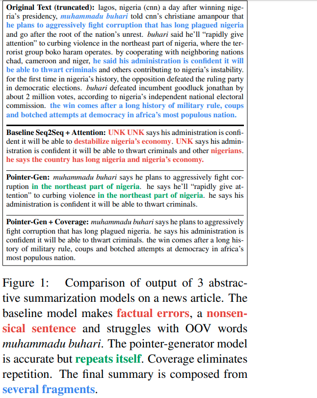
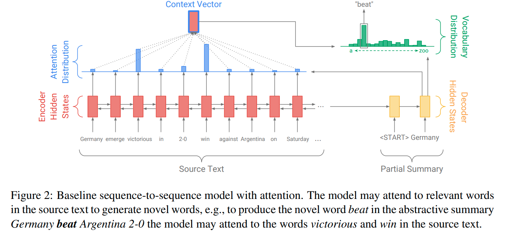

# Get To The Point: Summarization with Pointer-Generator Networks

[toc]

## PAPER: https://arxiv.org/abs/1704.04368
## CODE: http://www.github.com/abisee/pointer-generator

## Abstract
#### 使用指针来对原词进行复制，对字典外词语有效
#### 使用覆盖度指标来避免重复

## 1 Introduction

- 长文本摘要更具有挑战性
  - 高阶抽象来避免重复
  - 更有用

## 2 Our Models
### 2.1 Sequence-to-sequence attentional model
基础seq2seq+attention模型
#### 
