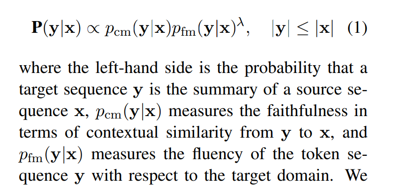
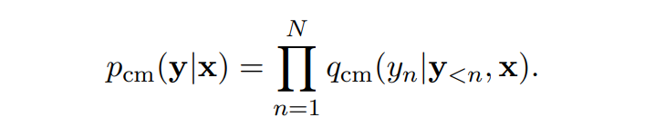
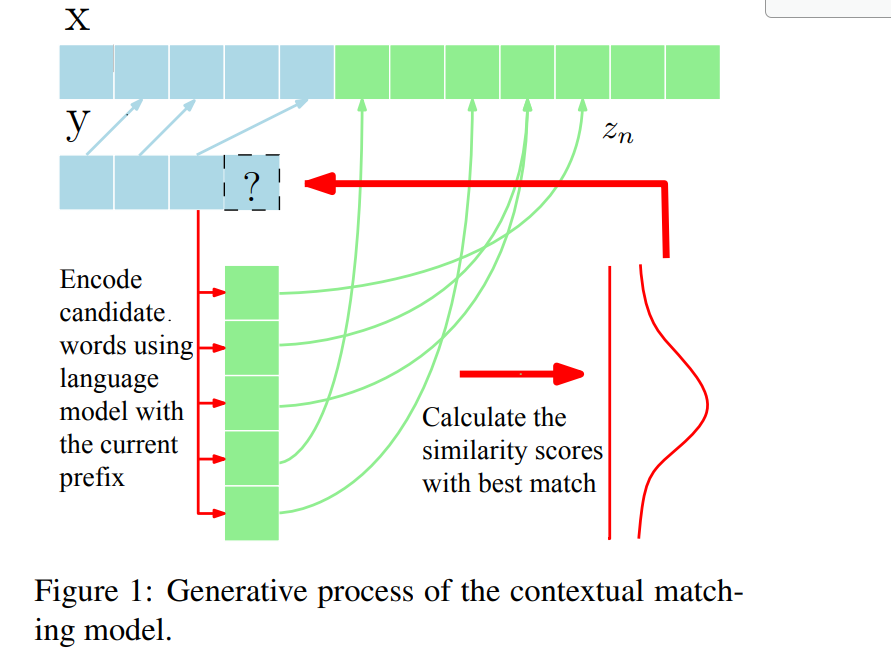
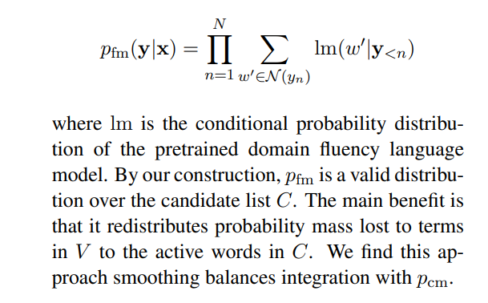
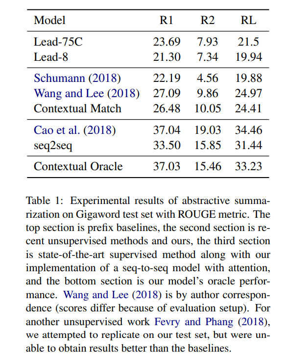
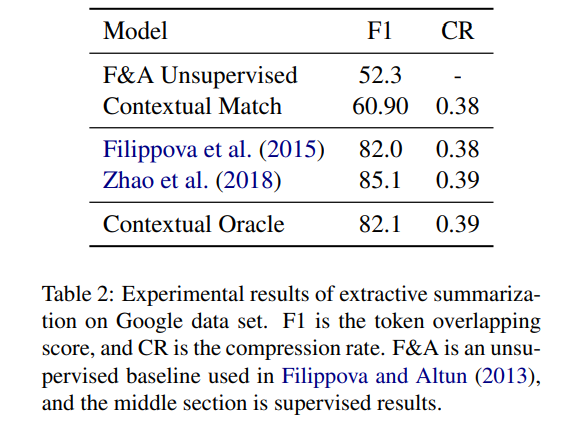
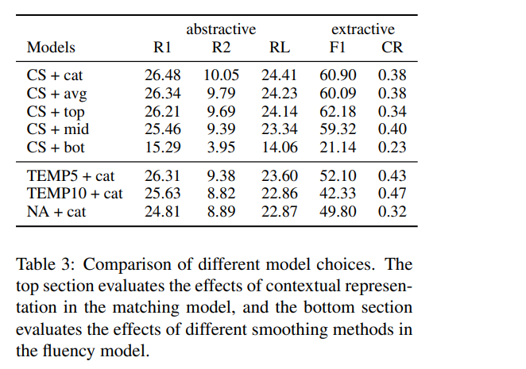
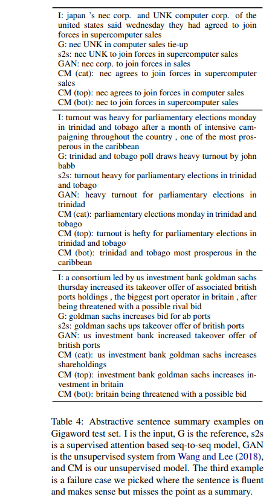
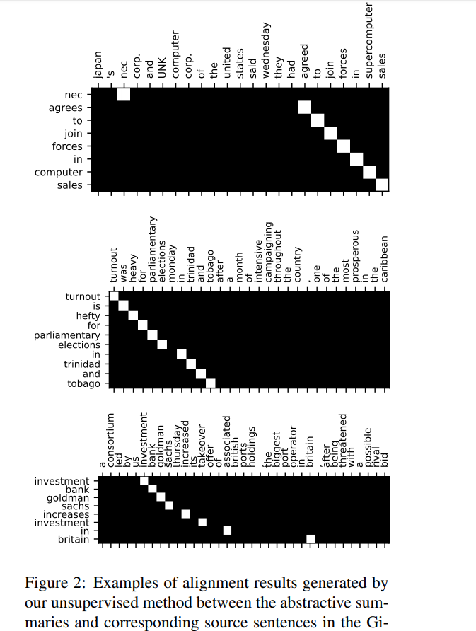

# Simple Unsupervised Summarization by Contextual Matching
[toc]

- https://arxiv.org/abs/1907.13337
- https://github.com/jzhou316/Unsupervised-Sentence-Summarization.

## Abstract
- 只使用语言模型的非监督方法
- 两个语言模型
  - 通用、领域特定的
  - 使用productof-experts准则足以通过连续上文匹配控制输出的流畅性

## 1 Introduction
- 当前主要方法使用监督学习
- 本文方法
  - 使用通用预训练语言模型来加强句子前缀之间的上下文匹配
  - 使用smoothed problem specific target语言模型来指导生成过程的流畅性
  - 合并两者目标为product-of-experts objective

## 2 Model Description
摘要两个目标
- Faithfulness，意思上要接近
- Fluency，领域内语法正确以及有意义

y考虑为所有可能的ｙ，其toｋｅｎ为x决定的候选LIST
对于生成摘要：C表示x中所有词语在预训练语言模型中的K最近词
对于抽取摘要：C表示x的词语集合

### 2.1 Contextual Matching Model

生成过程
- 第一步: 使用贪心法来计算 $$w ∈ C, s_w = max_{j≥1} S(x_{1:j} , w) $$
  针对每个词语w，计算其与前缀的句子的相似度，使用softmax进行归一　$$q_{cm}(y_1 = w|x)$$　
  $$z_1 = \argmax_{j≥1} S(x_{1:j} , y_1)$$
- 迭代 $$s_w = max_{j>z_{n−1}} S(x+{1:j} , [y_{1:n−1}, w])$$
- 结束：ｘ尾部

### 2.2 Domain Fluency Model
- 目的： 学习更短的句子说法
- 该语言模型中其输出不显式依赖于x，而是隐式依赖于x的词语集合
- 问题：预训练语言模型的字典V与候选词C之间的不匹配
  - kernel smoothing
    - 将源中的w`映射到C中w使其距离不大于其他词, 完整的词汇表空间被分为 |C| 个分离的区域，Voronoi cell
    - For each word type w ∈ C, we define N (w) to be the Voronoi cell formed around it
 

### 2.3 Summary Generation
- 使用Beam Search来进行查找，使用一个特殊开始字符
- 使用长度惩罚进行重排
  $$lp(y) = |y| + α $$

## 3 Experimental Setup
-  ELMo 进行通用的语言模型训练
   -  512, 字嵌入+２层LSTM
-  流畅度语言模型在一个摘要的数据集上进行训练
   -  2LSTM, 1024, Dropout0.5, SGD

- 生成
  - English Gigaword 通用语言模型
  - pfm 使用3.8 million headlines训练
  - λ = 0.11
  - beam = 10
  - K = 6
- 抽取
  - Google data
  - pfm on 200K compressed sentences
- α: -0.1 to 0.1

## 4 Results and Analysis
结果
: 
 

分析
: 
: - cluster smoothing (CS) approach with softmax temperature (TEMPx with x being the temperature) 
: - vary the 3-layer representation out of ELMo forward language model to do contextual matching (bot/mid/top: bottom/middle/top layer only, avg: average of 3 layers, cat: concatenation of all layers)

样本
: 

样本对齐分析
: 
