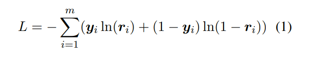
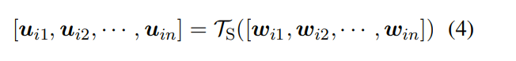
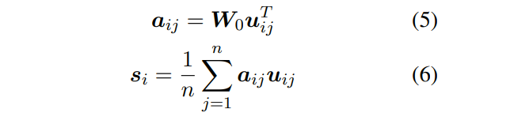
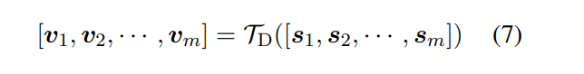
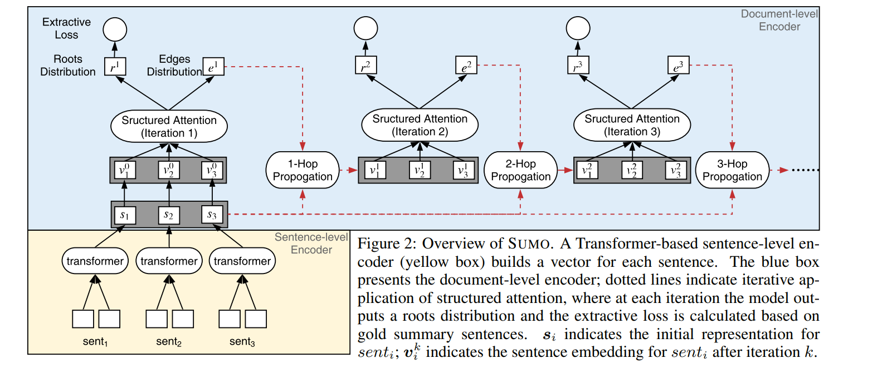

# Single Document Summarization as Tree Induction
[toc]

https://www.aclweb.org/anthology/N19-1173.pdf
https://github. com/nlpyang/SUMO
https://cloud.tencent.com/developer/article/1557845

## Abstract
本文提出了一种端到端的抽取式文本摘要模型(Structured Summarization Model, SUMO)，将单文档抽取式摘要看作一个树归纳问题。将输入文档归纳为一个多根树，每个树根是组成摘要的句子，树根的子树则是与树根的摘要句内容相关或者解释摘要句的句子。通过不断迭代细化逐渐构成摘要。

## 1 Introduction
- 当前抽取摘要系统的实现方法
    -  (Bahdanau et al., 2015) 将抽取作为序列标注问题
    -  (Nallapati et al., 2017; Cheng and Lapata, 2016) 用神经网络将每句话进行特征表示
    - (Hirao et al., 2013; Yoshida et al., 2014) 使用依赖树来建模文章并将摘要问题看着树剪枝
    - (Gerani et al. (2014)) 使用树来进行评论摘要
- 结构学习
    - (Kim et al., 2017; Liu and Lapata, 2018) 使用注意力机制进行结构组成
    - (Yogatama et al., 2017; Williams et al., 2018) 强化学习
    - (Niculae et al., 2018) 对所有可能结构进行优化
    - (Liu and Lapata (2018) ) 对文章使用结构依赖树结构进行表示

## 2 Model Description
### 2.1 Baseline Model
 loss function
 : 其中y表示句子是否被选取，r表示计算概率

使用Transformer对词语进行编码

使用权重POOL对句子进行编码

使用Transformer对句子进行编码

最后对输出进行概率计算

### 2.2 Structured Summarization Model
- 在baseline的Transformer模型中，使用基于softmax的multi-head attention对句子间的关系进行建模，但这只捕获了浅层结构信息。我们的摘要模型SUMO (Structured Summarization Model)，它将句子分为有摘要价值的和没有摘要价值的，同时将源文档的结构归纳为一个多根树
- 该模型与baseline的Transformer model具有相同的sentence-level encoder(TS)(图2的底部框)，但在doc-level encoder上两个重要方面有所不同
    - 使用结构化注意力(structured attention)来建模底层树的根(总结句)
    - 通过迭代改进，从过去的猜测中逐步推断出更复杂的结构

## 3 Experiments

### 3.1 Summarization Datasets

### 3.2 Implementation Details

### 3.3 Automatic Evaluation

### 3.4 Human Evaluation

### 3.5 Evaluation of the Induced Structures

## 4 Conclusions
