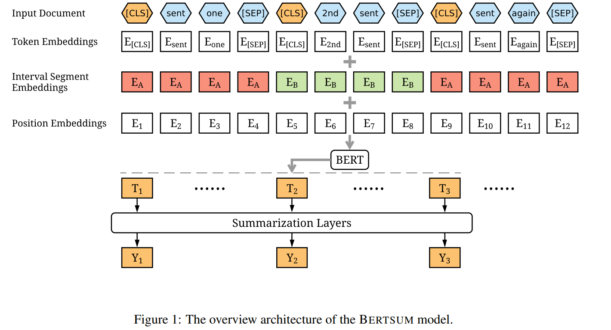
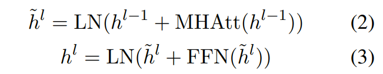
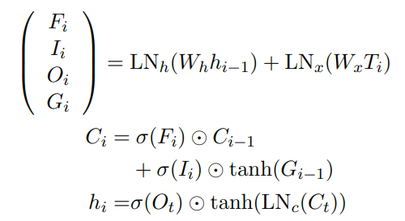
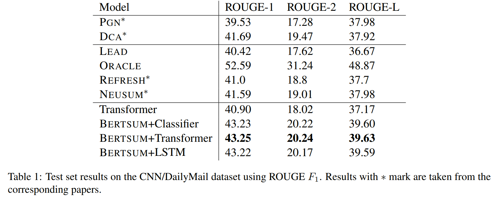
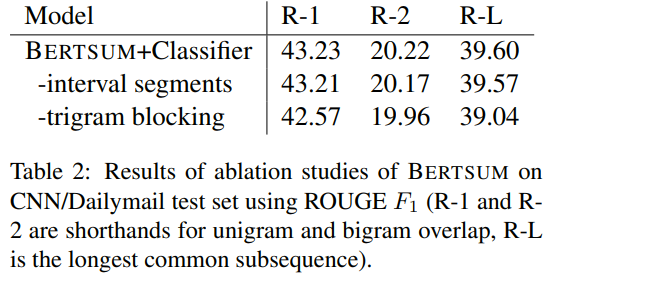
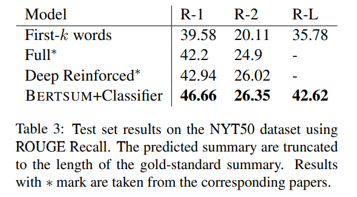

# Fine-tune BERT for Extractive Summarization
[toc]

## PAPER: https://arxiv.org/abs/1903.10318v2
## CODE: https://github.com/nlpyang/BertSum

## 1. Introduction

## 2. Methodology
### 抽象为序列标注问题 [sent1, sent2, · · · , sentm] -> [1/0, ...]
### 对多个句子进行编码
#### 
相当于修改BERT结构输入每句话千米添加一个CLS的输入，然后对应输出结构上为句子的向量，然后输入根据该向量进行序列标注， T作为句子的表示进行输出
#### Interval Segment Embeddings，句子分割向量，Ea和Eb基于奇偶进行赋值

### 摘要层进行 Fine-tuning
#### LOSS： Binary Classification Entropy of Yi， 与BERT联合训练
#### 简单模型： $\hat Y_i = sigmoid(W_oT_i + b_o)$
#### Inter-sentence Transformer:
##### 
##### $\hat Y_i = sigmoid(W_oT_i + b_o)$
- h0 = PosEmb(T) and T are the sentence vectors output by BERT, PosEmb is the function of adding positional embeddings (indicating the position of each sentence) to T
- LN is the layer normalization operation
- MHAtt is the multi-head attention operation
- 测试了 L = 1, 2, 3 and 2 结果最好

#### LSTM:
##### pergate layer normalization
##### 
- Fi, Ii, Oi are forget gates, input gates,output gates;
- Gi is the hidden vector and Ci is the memory vector; 
- hi is the output vector;
- LNh, LNx, LNc are there difference layer normalization operations
##### $\hat Y_i = sigmoid(W_oT_i + b_o)$

## 3. Experiments
- ‘bert-base-uncased’∗ version of BERT
- jointly fine-tuned. Adam with β1 = 0.9, β2 = 0.999
- Learning rate schedule is following with warming-up on first 10,000 steps: $$lr = 2e^{−3}· min(step^{−0.5}, step · warmup^{−1.5})$$
- trained for 50,000 steps,  gradient accumulation per two steps, which makes the batch size approximately equal to 36
- Model checkpoints are saved and evaluated on the validation set every 1,000 steps
- top-3 checkpoints based on their evaluation losses on the validations set 进行测试，测试结果中rank，选择top-3
- 测试集处理：根据ROUGE最大来找出与生成式摘要最匹配的抽取式摘要

### Trigram Blocking 降低冗余
如果摘要S，句子C存在共同的Trigram，则不处理该句子，直接跳过，比MMR更简单

## 4. Experimental Results
### CNN/Dailymail
#### Transform > Classifier > LSTM

### NYT: limited-length recall evaluation

## 5. Conclusion
