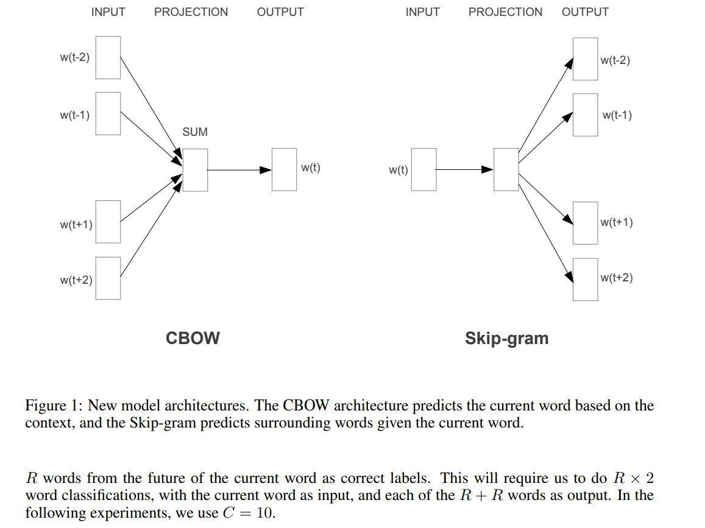
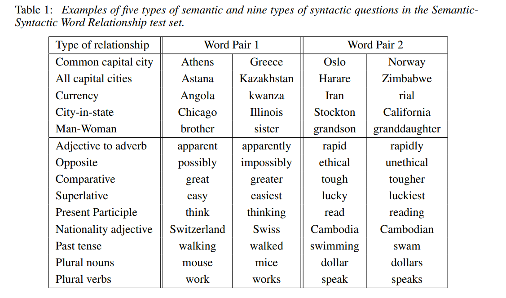
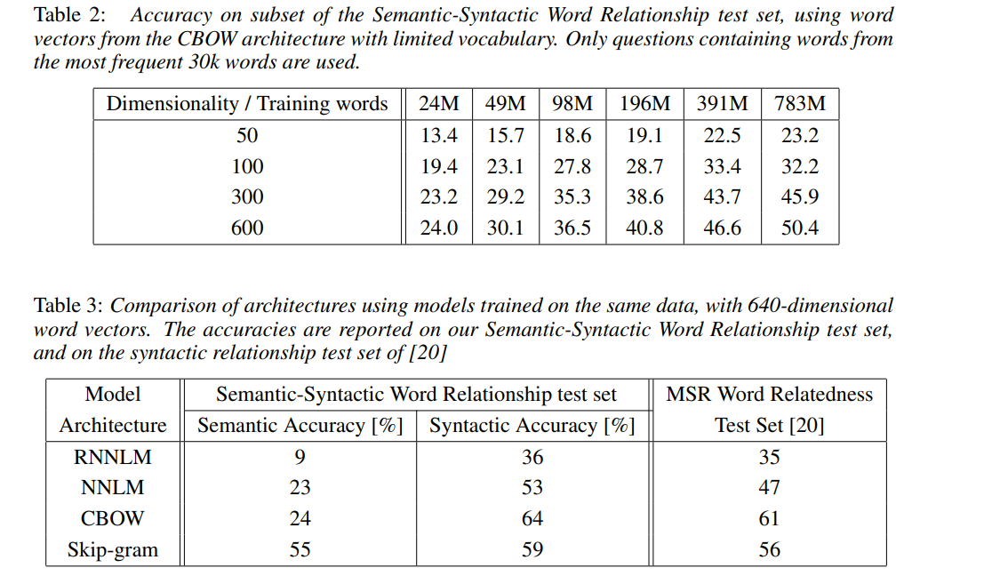
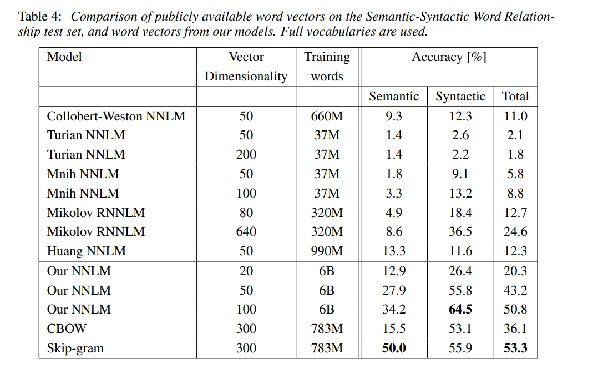
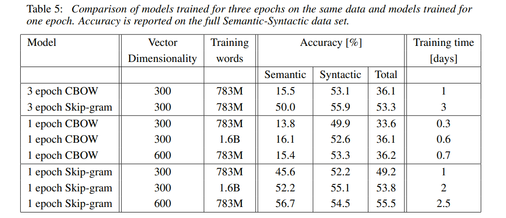
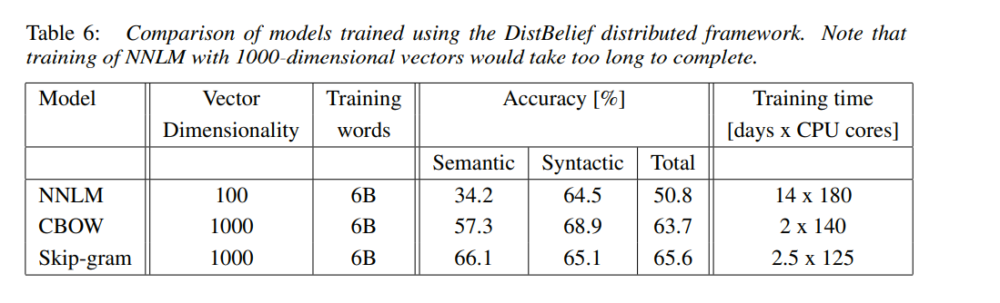
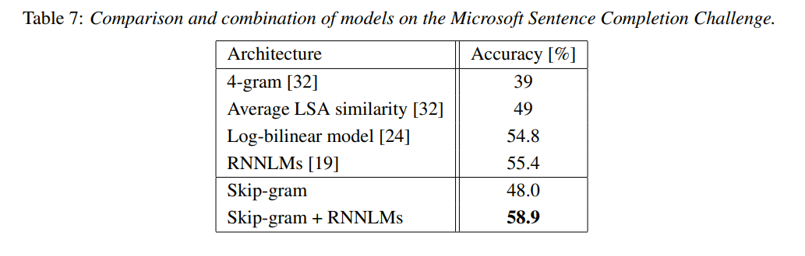
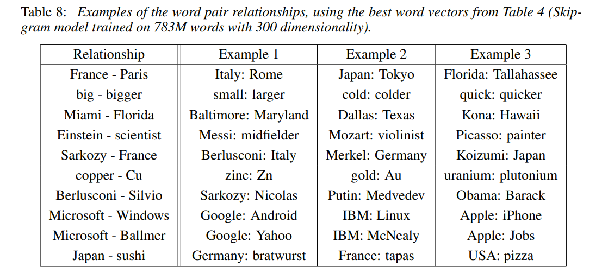

# Efficient Estimation of Word Representations in Vector Space

[toc]

- https://arxiv.org/pdf/1301.3781.pdf

## Abstract
- 两个新颖的模型架构用来计算大规模数据集中的连续词向量表示

## 1 Introduction
- 当前很多的自然语言处理系统或技术都把词当做原子单元—词表示就是词在字典中的索引，这导致了在词和词之间不能描述相似度的问题
    - 因为大规模数据集上应用简单模型得到的结果优于在小规模数据集上应用复杂模型的结果，具体表现在：简单性，鲁棒性，可观测性
    - 万亿级别的词上的N元模型（N-gram）
- 简单模型在很多任务上都有限制：语料数量限制，如自动语音识别和机器翻译
- 用词的分布式表示是最成功的概念，比如说基于神经网络的语言模型明显地优于N元模型

### 1.1 Goals of the Paper
- 学习高质量词向量的技术，这个技术能够应用在十亿级别的数据集，百万级别的词汇量上
- 相似的词之间距离更近，而且词有多种相似度，如词类比
- 开发新的模型体系结构来最大化这些向量操作的准确性，以保留词之间的线性规律性。我们设计了一个新的综合测试集用于测量语法和语义规则，并且结果显示许多这样的规律可以高准确度地学习

### 1.2 Previous Work
- 一个用于估计神经网语言模型的非常流行框架模型NNLM由Bengio提出，这个模型用一个带有线性投影层和非线性隐藏层的前馈神经网络训练得到词向量和一个统计语言模型。

## 2 Model Architectures
- 历史： 潜在语义分析 (LSA)和潜在狄利克雷分配(LDA)，Latent Semantic Analysis (LSA) and Latent Dirichlet Allocation (LDA)
- 训练复杂度正比于：O=E×T×Q ，E是指训练的迭代次数，T是训练集中词的数量，Q将在之后的模型框架中具体定义。E的一般选择范围是3-50，T可达到十亿量级，所有模型均使用随机梯度下降和反向传播进行训练

### 2.1 Feedforward Neural Net Language Model (NNLM)
- 在输入层，前N个词使用 独热(one-hot)编码,V是指词典中词的数量；接着输入层被投影到到投影层P,该投影层的维度是N×D，共享同一个的投影矩阵，因为在任何给定时间只有N个输入有效，所以投影层的组成是性价比相对较高的操作
- 投影层和隐藏层之间的计算变得复杂，因为投影层上的值是稠密的。一个通常的选择是N取10,那么投影层可能包含500-2000个数，与此同时，隐藏层通常有500-1000个数，而且隐藏层用来对词典中的所有词计算概率分布的，这导致输出层含有V个数（V是词典中词的个数）
- 计算复杂度为：Q =N×D+N×D×H+H×V

### 2.2 Recurrent Neural Net Language Model (RNNLM)
- 理论上比起浅层神经网络，循环神经网络可以有效地表征更复杂的模式，循环神经网络模型没有投影层，只有输入层，隐藏层、输出层。使用时间延迟连接将隐藏层和自身连接的循环矩阵是这类模型的特殊之处，这允许循环模型形成某种短期记忆，因为来自过去的信息可以由隐藏层状态表示，隐藏层状态根据当前输入和上一时间中隐藏层的状态得到更新
- 复杂度为: Q=H×H+H×V, 项H×V能够通过使用层次softmax降低至H×log2(V)，复杂度主要取决于H×H

### 2.3 Parallel Training of Neural Networks
- 在DistBelief的大规模分布式框架之上实现了几个模型，包括本文提出的前馈神经网络语言模型和本论文提出的新模型。该框架允许我们并行地运行同一模型的多个副本，并且每个副本都通过保留所有参数的中央服务器同步地进行梯度更新。对于这种并行训练，我们使用称为Adagrad的自适应学习速率程序使用小批量且异步的梯度下降。在此框架下，通常使用100个或更多的模型副本，每个副本在数据中心的不同机器上使用多个CPU内核

## 3 New Log-linear Models
- 大部分复杂性是由模型中的非线性隐藏层引起的。虽然这正是使得神经网络如此有吸引力的地方，但我们决定探索可能无法像神经网络那样精确地表示数据的较简单模型，不过可以对更多数据进行有效地训练
- 神经网络语言模型可以分两步成功训练：首先，使用简单模型学习连续词向量，然后使用N元神经网络语言模型在这些分布式词表示上进行训练

### 3.1 Continuous Bag-of-Words Model
- 类似于前馈神经网络语言模型，其中非线性隐藏层被移除并且投影层由所有词共享（不仅仅是投影矩阵），因此所有词都被投影到相同的位置（它们的向量被平均）。 我们称这种架构为词袋模型，因为词的顺序不影响投影
- 训练的复杂度为：Q= N×D+D×log2(V) 
- CBOW，不同于标准的词袋模型，它使用上下文的连续的分布表示

### 3.2 Continuous Skip-gram Model
- 试图优化一个基于同一个句子中的其他词的词分类器；更精确的说，我们使用当前词作为带有连续的投影层的对数线性分类器的输入，然后预测当前词之前和之后一定范围内的词
- 增加范围能够提升词向量的质量，但同时也增加了计算复杂度。因为距离当前词远的词通常不如距离它近的词更相关，所以在我们的训练集中通过采样更少的那些距离当前词远的词从而赋给它们更小的权重
- 训练复杂度为: Q=C×（D+D×log2(V))
- C是词与词之间的最大距离，对于每个训练中的词，随机地从1到C中选择一个数字R，然后使用当前词的前R个词和后R个词作为当前词的正确标签。对R×2个单词做分类，分类器的输入为当前词，当前词的前R个词和后R个词作为输出

## 4 Results
- 之前的论文通常会使用表格展示样本词和与它最相似的词，在直观上体会词向量的质量
- 将词向量应用于更复杂的相似度任务中更具挑战性
- 词类比，可以使用简单向量相加来实现（注意：查找最接近的，并且不选择自身单词）

### 4.1 Task Description

### 4.2 Maximization of Accuracy
- 使用谷歌新闻进行训练，60亿单词，字典限制为100万
- 使用更多的数据或者更大的维度都能提高准确度

### 4.3 Comparison of Model Architectures

### 4.4 Large Scale Parallel Training of Models

### 4.5 Microsoft Research Sentence Completion Challenge

## 5 Examples of the Learned Relationships
- 通过减去两个单词向量来定义关系，并将结果添加到另一个单词中。例如，巴黎 - 法国 + 意大利 = 罗马。可以看出，虽然显然还有很大的进一步改进空间，但准确性还是相当不错的（请注意，使用我们的准确度度量假设完全匹配，表8中的结果只会得到约60％的分数）
- 提供多个关系的例子。通过使用十个例子而不是一个来形成关系向量（我们将各个向量平均到一起），我们发现，在语义语法测试中，我们的最佳模型的准确性提高了约10％
- 可以通过词向量完成其他任务，如把列表中的无关词语删除，可以计算均值词向量，然后查找距离最远的词向量

## 6 Conclusion
- 比起流行的神经网络模型（前馈和循环），使用非常简单的模型架构训练高质量的词向量是可能做到的。由于计算复杂度的大幅度降低，从大规模数据集上训练非常精确的高维词向量是可能的
- 词向量可以成功地应用于知识库中事实的自动扩展，并且还可以用于验证已有事实的正确性。词向量用于机器翻译的实验结果看起来也很有前景

## 7 Follow-Up Work
- 开源了单机多线程C ++代码，用于计算词向量，同时使用CBOW模型和Skip-gram模型
- 开源了140多万个表示命名实体的向量，这是在超过1000亿词的语料上训练得到的
