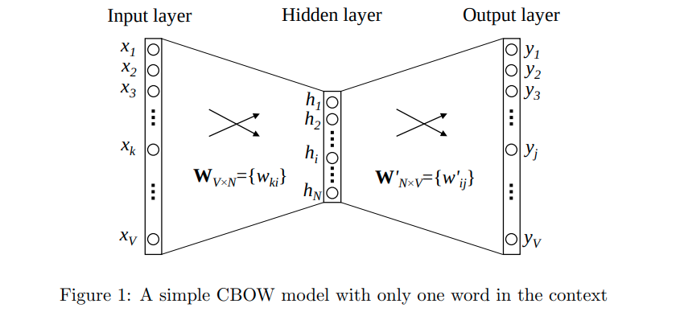
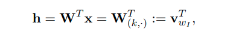
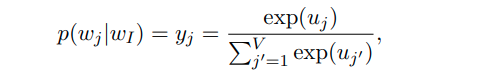
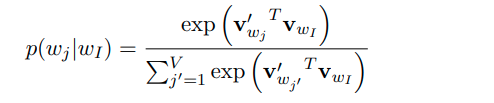
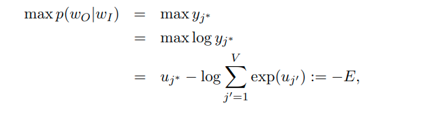

# Word2vec Parameter Learning Explained

[toc]

- https://arxiv.org/pdf/1411.2738.pdf
## Abstract
- 这篇论文详细地推导和解释了word2vec模型的参数更新公式，包括：CBOW（continuous bag-of-word）模型和SG（skip-gram）模型，以及两种参数优化技术：hierarchical softmax 和 negative sampling
- 
## 1 Continuous Bag-of-Word Model
### 1.1 One-word context
- 从CBOW模型的最简单版本开始介绍——One-word context。即我们假定context（预测目标单词的上下文信息）只有一个单词，也就是说One-word context 模型是在只要一个上下文单词（one context word）的情况下来预测一个目标单词（one target word）的

- 假设文本词汇量的大小为V,隐藏层的大小为N，相邻层的神经元是全连接的。输入层是一个用one-hot方式编码的单词向量x=(x1,...,xV)，其中只有一个为1，其余均为0
- 从输入层到 隐藏层的权重值可以用一个V×N维的矩阵W来表示，即

h向量完全是从W矩阵第k行复制过来的（同vωI均为N维向量）。vωI即为输入单词ωI的一种向量表示（其实就是输入向量）

- 隐藏层到输出层，同样连接权重用一个新的N × V矩阵W′={ω′ij}来表示,可以为词表中的每一个单词都计算出一个得分 μj, 第j列向量，其实就是单词w的输出向量
$$μ_j = v_{ωj}^{'T}h$$

- 合并两个公式有

#### Update equation for hidden→output weigh
- 预测其实际输出单词（即上下文信息的中心词ωO的条件概率

E为该模型的损失函数（我们需要找出它的最小值）,该损失函数可以理解为一种特殊情形下的交叉熵计算

### 1.2 Multi-word context

## 2 Skip-Gram Model

## 3 Optimizing Computational Efficiency

### 3.1 Hierarchical Softmax

### 3.2 Negative Sampling

