# Glove: Global Vectors for Word Representation
[toc]

论文链接：https://www.aclweb.org/anthology/D14-1162
Github: https://github.com/stanfordnlp/GloVe

### 1 Introduction
- 词向量模型对细粒度的语义和句法有较好的表达
- 两个主要方向
  - 全局矩阵分解模型——latent semantic analysis (LSA)
过多的基于统计学信息，导致在词类类比任务上表现不好
  - 基于上下文的窗口模型——skip-gram model
依赖上下文信息过多，导致无法有效获取全局信息

- Glove 模型的本质就是融合了当时最新的全局矩阵分解方法（Matrix Factorization）和局部文本框捕捉方法（代表word2vec）,也就是全局词向量表达。该模型利用了全局词词共现矩阵中的非0数据来训练，而非只用了某词的局部窗口信息
- 本文采用的词-词共现矩阵比起词-文档矩阵更加稠密，模型中对低频词和高频词的影响做了一定地弱化处理

### 2 Related Work
Matrix Factorization Methods
: HAL, PPMI, PCA(HPCA)

Shallow Window-Based Methods
: CBOW, Skip-gram

- 问题点：两者优化的目标不一样
  - 优化矩阵还原，因此对于高频值更加友好，另外部分算法采用全文档作为窗口，建模的为主题信息
  - 优化窗口内词语共现，因此更加容易捕捉周边词语的细节信息，对 Local 语义更加友好

### 3 The GloVe Model
如何从统计信息中产生语义，以及向量是如何表示该语义的
- X 词词共现矩阵
- $X_{ij}$ 词 j 在词 i 的窗口中出现的次数
- $X_i$ 词 i 的所有窗口词出现的次数总和 $\sum_k X_{ik}$
- $P_{ij}$ 词 j 在词 i 的窗口词中出现的概率 $X_{ij} / X_i$

对于任意的词i和词j，假如有第三个词k，如果词k与词i相比于词k与词j有更深的关联，则我们从常理上来说，可以非常轻易的得出一个结论  $P_{ik} > P_{jk}$ 且这个比值较大，反之亦然。若词k与他们两者的关系都不大，则我们不难想象，$P_{ik}\eqsim P_{jk}$
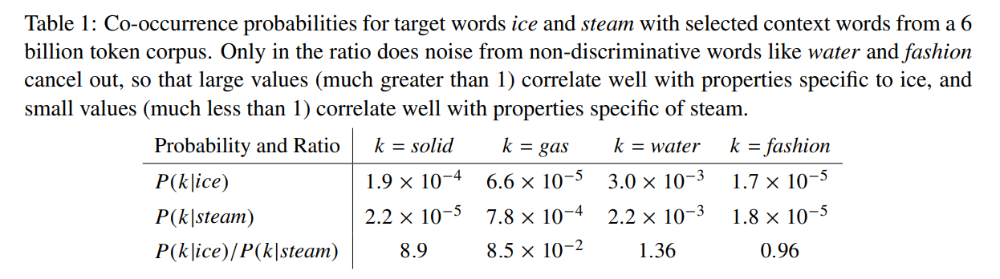

为了反应上面的结论，使用一个公式来表达
$$F(w_i, w_j, \hat w_k) = \frac{P_{ik}}{P_{jk}}$$
向量空间本质都是线性的，所以最普通的做法就是，俩个词向量做差，来求解其关系，因此，上式可变为
$$F(w_i - w_j, \hat w_k) = \frac{P_{ik}}{P_{jk}}$$
左边是向量的计算，而右边得出的值是一个标量，因此我们做一套点积运算
$$F((w_i - w_j)^T \hat w_k) = \frac{P_{ik}}{P_{jk}}$$
外面套了一层指数运算（将差形式转换为商形式），因此，使得
$$\frac{F((w_i )^T \hat w_k)}{F((w_j)^T \hat w_k)}= \frac{P_{ik}}{P_{jk}}$$
进而
$$F((w_i )^T \hat w_k) = P_{ik} = \frac{X_{ik}}{X_i}$$
取对数有
$$(w_i )^T \hat w_k = \log P_{ik} = \log{X_{ik}} - \log {X_i}$$
由于左边为对称的，即 $(w_i )^T \hat w_k = (w_k )^T \hat w_i$, 为了满足对称性以及去除与k独立的Xi问题，引入两个偏置项 $$w_i^T\hat w_k + b_i + \hat b_k = log(X_{ik})$$

这样的处理存在一个弊端，即对于一个词，他的每一个共现词都享有相同的权重来决定该词的词向量，而这在常理上的理解是不合理的，因此，作者引入了一种带权的最小二乘法来解决这种问题，最终的损失函数就为
$$J = \sum_{i,j=1}^V f(X_{ij})(w_i^T\hat w_j+ b_i + \hat b_k - log(X_{ij}))^2$$

#### 3.1 Relationship to Other Models
Skip-gram 的损失函数
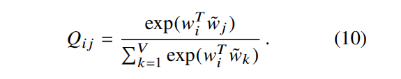
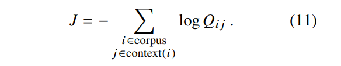

如果先进行汇总则训练更加有效
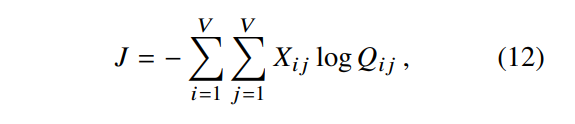

使用$X_i, X_{ij}以及P_{ij}$进行重写
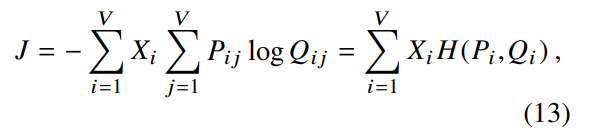

使用最小二乘法目标来替换上面的交叉熵
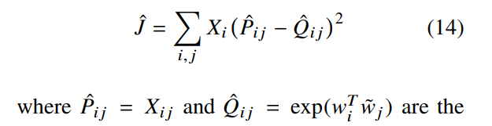

Xij很大难以优化，因此采用log进行减少
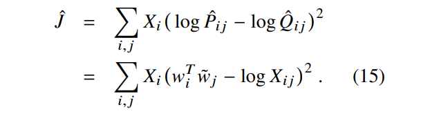

权重函数
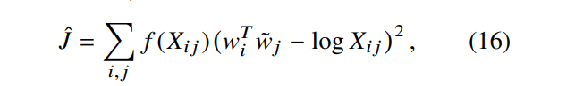

#### 3.2 Complexity of the model
- 略

### 4 Experiments

#### 4.1 Evaluation methods
- Word analogies.
- Word similarity
- Named entity recognition

#### 4.2 Corpora and training details

#### 4.3 Results
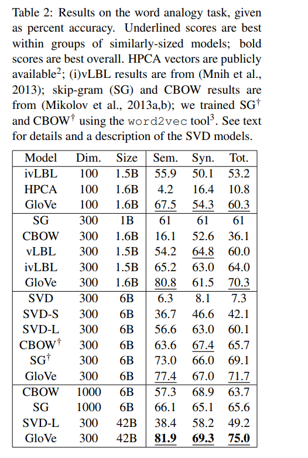
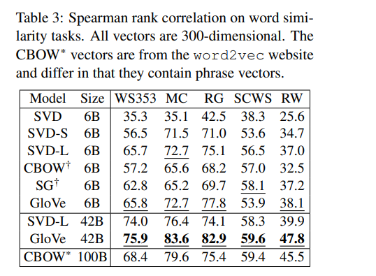
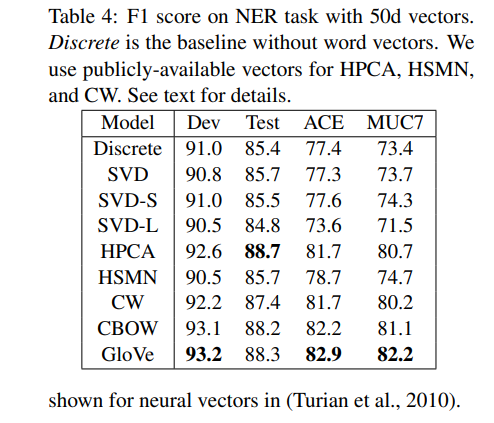

#### 4.4 Model Analysis: Vector Length and Context Size
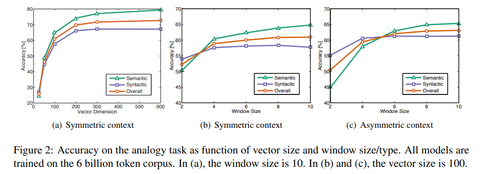

#### 4.5 Model Analysis: Corpus Size
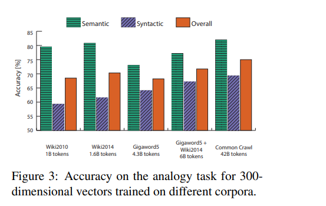
可以与语料类型、任务类型（词类比：城市地点）、时效性等相关

#### 4.6 Model Analysis: Run-time
- 略

#### 4.7 Model Analysis: Comparison with word2vec
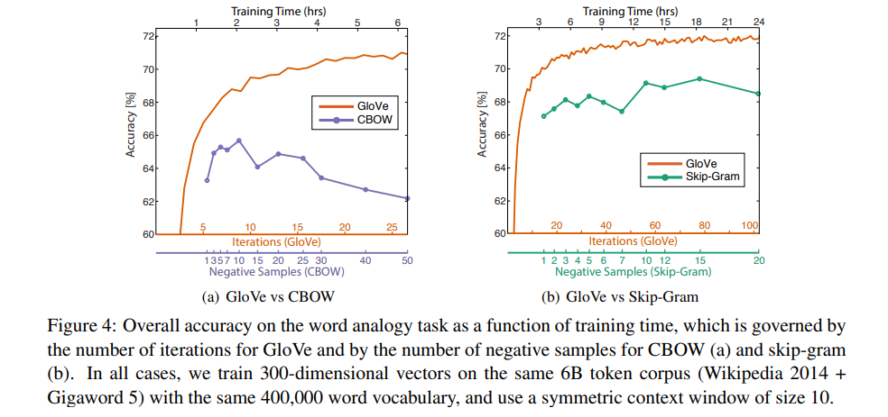

### 5 Conclusion
- 略
